<div align="center">
  


# AI TrendHub – The Pulse of Artificial Intelligence

> 💡 **Specializing in AI:** This dashboard focuses exclusively on the rapidly evolving AI ecosystem, tracking the most impactful projects across engines, agents, and generative tools.

</div>

---

### 🔍 Search

- **In this README:** Use <kbd>Ctrl</kbd>+<kbd>F</kbd> (Windows/Linux) or <kbd>Cmd</kbd>+<kbd>F</kbd> (Mac) to find repos or section names.
- **From the terminal:** Run <code>python3 -m GitTrendHub.cli search "keyword"</code> from the repo root (e.g. <code>python3 -m GitTrendHub.cli search llama</code>). Requires a recent run of <code>python3 update_readme.py</code> to generate the index.

---

<h2 id='contents'>📑 Table of Contents</h2>

| # | Section | Repos | What you'll find |
|:--:|---|:--:|---|
| 1 | [🤖 LLM Engines & Platforms](#llm_engines) | 40 | Local and cloud LLM runtimes, inference servers, open-source model launchers |
| 2 | [🛠️ AI Agents & Orchestration](#agents) | 39 | Autonomous agents, multi-agent orchestration, browser and tool integration |
| 3 | [💻 AI-Powered CLI & DevTools](#cli_tools) | 38 | AI pair programming in terminal and IDE, code automation, CLI tools |
| 4 | [🎨 Generative Art & Vision](#art_vision) | 56 | Image and video generation, diffusion models, generative AI UI and APIs |
| 5 | [🧠 Research & Core Frameworks](#frameworks) | 52 | ML/NLP frameworks, agent platforms, research-grade core libraries |

**Other Sections**
- [🤝 Community & Participation](#how-to-contribute) — How to contribute, PR guide, community
- [🌐 AI Resource Navigator](#ai-resource-navigator) — Curated links: trends, news, tool discovery
- [📝 Data Summary](#data-summary) — Data source and last generated timestamp

---

<h2 id='llm_engines'>🤖 LLM Engines & Platforms</h2>
<p> Section color</p>


<table width="100%" cellpadding="0" cellspacing="0">
  <tr>
    <td width="58%" valign="top">
      <div>
        <a href="https://github.com/vllm-project/vllm"></a>
      </div>
      <p style="line-height: 1.5;">vLLM: high-throughput LLM serving that squeezes every GPU<br>cycle.<br>&nbsp;<br>&nbsp;</p>
    </td>
    <td width="42%" valign="middle" align="center">
      <a href="https://github.com/vllm-project/vllm">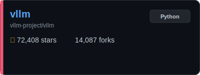</a>
    </td>
  </tr>
  <tr>
    <td colspan="2" align="right">
      <a href="#llm_engines"><kbd>🤖 Back to Section</kbd></a> · <a href="#contents"><kbd>📑 Contents</kbd></a>
    </td>
  </tr>
</table>
<div style="height: 16px;"></div>


<table width="100%" cellpadding="0" cellspacing="0">
  <tr>
    <td width="58%" valign="top">
      <div>
        <a href="https://github.com/ray-project/ray"></a>
      </div>
      <p style="line-height: 1.5;">Ray: distributed runtime that turns one laptop script into a<br>cluster job.<br>&nbsp;<br>&nbsp;</p>
    </td>
    <td width="42%" valign="middle" align="center">
      <a href="https://github.com/ray-project/ray">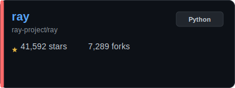</a>
    </td>
  </tr>
  <tr>
    <td colspan="2" align="right">
      <a href="#llm_engines"><kbd>🤖 Back to Section</kbd></a> · <a href="#contents"><kbd>📑 Contents</kbd></a>
    </td>
  </tr>
</table>
<div style="height: 16px;"></div>


<table width="100%" cellpadding="0" cellspacing="0">
  <tr>
    <td width="58%" valign="top">
      <div>
        <a href="https://github.com/labring/FastGPT"></a>
      </div>
      <p style="line-height: 1.5;">LLM knowledge platform with data processing, RAG retrieval,<br>and visual workflows.<br>&nbsp;<br>&nbsp;</p>
    </td>
    <td width="42%" valign="middle" align="center">
      <a href="https://github.com/labring/FastGPT">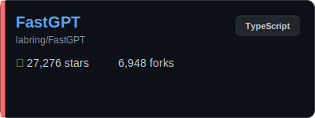</a>
    </td>
  </tr>
  <tr>
    <td colspan="2" align="right">
      <a href="#llm_engines"><kbd>🤖 Back to Section</kbd></a> · <a href="#contents"><kbd>📑 Contents</kbd></a>
    </td>
  </tr>
</table>
<div style="height: 16px;"></div>


<table width="100%" cellpadding="0" cellspacing="0">
  <tr>
    <td width="58%" valign="top">
      <div>
        <a href="https://github.com/sgl-project/sglang"></a>
      </div>
      <p style="line-height: 1.5;">SGLang: high-performance serving framework for LLMs and<br>multimodal models.<br>&nbsp;<br>&nbsp;</p>
    </td>
    <td width="42%" valign="middle" align="center">
      <a href="https://github.com/sgl-project/sglang">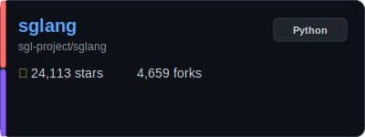</a>
    </td>
  </tr>
  <tr>
    <td colspan="2" align="right">
      <a href="#llm_engines"><kbd>🤖 Back to Section</kbd></a> · <a href="#contents"><kbd>📑 Contents</kbd></a>
    </td>
  </tr>
</table>
<div style="height: 16px;"></div>


<table width="100%" cellpadding="0" cellspacing="0">
  <tr>
    <td width="58%" valign="top">
      <div>
        <a href="https://github.com/mlc-ai/mlc-llm"></a>
      </div>
      <p style="line-height: 1.5;">MLC-LLM: compile LLMs to run fast anywhere you can ship a<br>runtime.<br>&nbsp;<br>&nbsp;</p>
    </td>
    <td width="42%" valign="middle" align="center">
      <a href="https://github.com/mlc-ai/mlc-llm">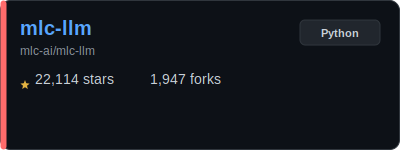</a>
    </td>
  </tr>
  <tr>
    <td colspan="2" align="right">
      <a href="#llm_engines"><kbd>🤖 Back to Section</kbd></a> · <a href="#contents"><kbd>📑 Contents</kbd></a>
    </td>
  </tr>
</table>
<div style="height: 16px;"></div>


<table width="100%" cellpadding="0" cellspacing="0">
  <tr>
    <td width="58%" valign="top">
      <div>
        <a href="https://github.com/google/adk-python"></a>
      </div>
      <p style="line-height: 1.5;">Google ADK (Python): code-first toolkit to build, eval, and<br>deploy AI agents.<br>&nbsp;<br>&nbsp;</p>
    </td>
    <td width="42%" valign="middle" align="center">
      <a href="https://github.com/google/adk-python">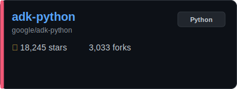</a>
    </td>
  </tr>
  <tr>
    <td colspan="2" align="right">
      <a href="#llm_engines"><kbd>🤖 Back to Section</kbd></a> · <a href="#contents"><kbd>📑 Contents</kbd></a>
    </td>
  </tr>
</table>
<div style="height: 16px;"></div>


<table width="100%" cellpadding="0" cellspacing="0">
  <tr>
    <td width="58%" valign="top">
      <div>
        <a href="https://github.com/botpress/botpress"></a>
      </div>
      <p style="line-height: 1.5;">Botpress: open-source hub to build and deploy LLM agents.<br>&nbsp;<br>&nbsp;<br>&nbsp;</p>
    </td>
    <td width="42%" valign="middle" align="center">
      <a href="https://github.com/botpress/botpress">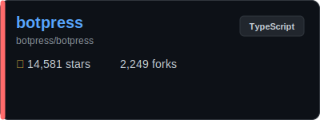</a>
    </td>
  </tr>
  <tr>
    <td colspan="2" align="right">
      <a href="#llm_engines"><kbd>🤖 Back to Section</kbd></a> · <a href="#contents"><kbd>📑 Contents</kbd></a>
    </td>
  </tr>
</table>
<div style="height: 16px;"></div>


<table width="100%" cellpadding="0" cellspacing="0">
  <tr>
    <td width="58%" valign="top">
      <div>
        <a href="https://github.com/Lightning-AI/litgpt"></a>
      </div>
      <p style="line-height: 1.5;">LitGPT: lightweight training and serving recipes for modern<br>LLMs.<br>&nbsp;<br>&nbsp;</p>
    </td>
    <td width="42%" valign="middle" align="center">
      <a href="https://github.com/Lightning-AI/litgpt">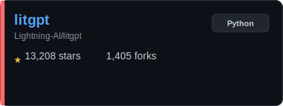</a>
    </td>
  </tr>
  <tr>
    <td colspan="2" align="right">
      <a href="#llm_engines"><kbd>🤖 Back to Section</kbd></a> · <a href="#contents"><kbd>📑 Contents</kbd></a>
    </td>
  </tr>
</table>
<div style="height: 16px;"></div>


<table width="100%" cellpadding="0" cellspacing="0">
  <tr>
    <td width="58%" valign="top">
      <div>
        <a href="https://github.com/NVIDIA/TensorRT-LLM"></a>
      </div>
      <p style="line-height: 1.5;">Python API to define LLMs and run fast NVIDIA GPU inference<br>with TensorRT-LLM.<br>&nbsp;<br>&nbsp;</p>
    </td>
    <td width="42%" valign="middle" align="center">
      <a href="https://github.com/NVIDIA/TensorRT-LLM">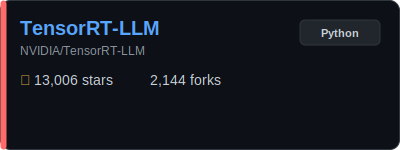</a>
    </td>
  </tr>
  <tr>
    <td colspan="2" align="right">
      <a href="#llm_engines"><kbd>🤖 Back to Section</kbd></a> · <a href="#contents"><kbd>📑 Contents</kbd></a>
    </td>
  </tr>
</table>
<div style="height: 16px;"></div>


<table width="100%" cellpadding="0" cellspacing="0">
  <tr>
    <td width="58%" valign="top">
      <div>
        <a href="https://github.com/microsoft/promptflow"></a>
      </div>
      <p style="line-height: 1.5;">Promptflow: build, test, and monitor LLM apps end-to-end.<br>&nbsp;<br>&nbsp;<br>&nbsp;</p>
    </td>
    <td width="42%" valign="middle" align="center">
      <a href="https://github.com/microsoft/promptflow">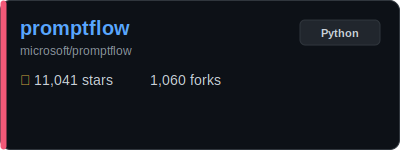</a>
    </td>
  </tr>
  <tr>
    <td colspan="2" align="right">
      <a href="#llm_engines"><kbd>🤖 Back to Section</kbd></a> · <a href="#contents"><kbd>📑 Contents</kbd></a>
    </td>
  </tr>
</table>
<div style="height: 16px;"></div>


<table width="100%" cellpadding="0" cellspacing="0">
  <tr>
    <td width="58%" valign="top">
      <div>
        <a href="https://github.com/Netflix/metaflow"></a>
      </div>
      <p style="line-height: 1.5;">Metaflow: Netflix-grade ML orchestration for humans who just<br>want to ship.<br>&nbsp;<br>&nbsp;</p>
    </td>
    <td width="42%" valign="middle" align="center">
      <a href="https://github.com/Netflix/metaflow">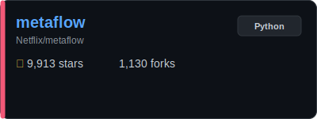</a>
    </td>
  </tr>
  <tr>
    <td colspan="2" align="right">
      <a href="#llm_engines"><kbd>🤖 Back to Section</kbd></a> · <a href="#contents"><kbd>📑 Contents</kbd></a>
    </td>
  </tr>
</table>
<div style="height: 16px;"></div>


<table width="100%" cellpadding="0" cellspacing="0">
  <tr>
    <td width="58%" valign="top">
      <div>
        <a href="https://github.com/krillinai/KrillinAI"></a>
      </div>
      <p style="line-height: 1.5;">LLM-powered video translation and dubbing with one-click<br>pipeline and many languages.<br>&nbsp;<br>&nbsp;</p>
    </td>
    <td width="42%" valign="middle" align="center">
      <a href="https://github.com/krillinai/KrillinAI">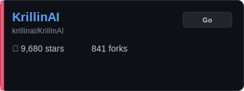</a>
    </td>
  </tr>
  <tr>
    <td colspan="2" align="right">
      <a href="#llm_engines"><kbd>🤖 Back to Section</kbd></a> · <a href="#contents"><kbd>📑 Contents</kbd></a>
    </td>
  </tr>
</table>
<div style="height: 16px;"></div>


<table width="100%" cellpadding="0" cellspacing="0">
  <tr>
    <td width="58%" valign="top">
      <div>
        <a href="https://github.com/xorbitsai/inference"></a>
      </div>
      <p style="line-height: 1.5;">Xinference: swap GPT for open models via one unified,<br>production-ready API.<br>&nbsp;<br>&nbsp;</p>
    </td>
    <td width="42%" valign="middle" align="center">
      <a href="https://github.com/xorbitsai/inference">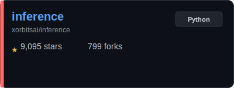</a>
    </td>
  </tr>
  <tr>
    <td colspan="2" align="right">
      <a href="#llm_engines"><kbd>🤖 Back to Section</kbd></a> · <a href="#contents"><kbd>📑 Contents</kbd></a>
    </td>
  </tr>
</table>
<div style="height: 16px;"></div>


<table width="100%" cellpadding="0" cellspacing="0">
  <tr>
    <td width="58%" valign="top">
      <div>
        <a href="https://github.com/oumi-ai/oumi"></a>
      </div>
      <p style="line-height: 1.5;">Oumi: fine-tune, evaluate, and deploy open-source LLMs and<br>VLMs.<br>&nbsp;<br>&nbsp;</p>
    </td>
    <td width="42%" valign="middle" align="center">
      <a href="https://github.com/oumi-ai/oumi">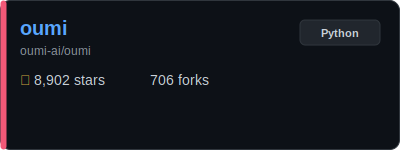</a>
    </td>
  </tr>
  <tr>
    <td colspan="2" align="right">
      <a href="#llm_engines"><kbd>🤖 Back to Section</kbd></a> · <a href="#contents"><kbd>📑 Contents</kbd></a>
    </td>
  </tr>
</table>
<div style="height: 16px;"></div>


<table width="100%" cellpadding="0" cellspacing="0">
  <tr>
    <td width="58%" valign="top">
      <div>
        <a href="https://github.com/Tiiny-AI/PowerInfer"></a>
      </div>
      <p style="line-height: 1.5;">PowerInfer: high-speed local LLM serving.<br>&nbsp;<br>&nbsp;<br>&nbsp;</p>
    </td>
    <td width="42%" valign="middle" align="center">
      <a href="https://github.com/Tiiny-AI/PowerInfer">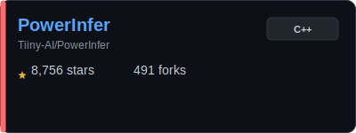</a>
    </td>
  </tr>
  <tr>
    <td colspan="2" align="right">
      <a href="#llm_engines"><kbd>🤖 Back to Section</kbd></a> · <a href="#contents"><kbd>📑 Contents</kbd></a>
    </td>
  </tr>
</table>
<div style="height: 16px;"></div>


<table width="100%" cellpadding="0" cellspacing="0">
  <tr>
    <td width="58%" valign="top">
      <div>
        <a href="https://github.com/NexaAI/nexa-sdk"></a>
      </div>
      <p style="line-height: 1.5;">Run frontier LLMs/VLMs on GPU/NPU/CPU across PC, mobile, and<br>Linux/IoT.<br>&nbsp;<br>&nbsp;</p>
    </td>
    <td width="42%" valign="middle" align="center">
      <a href="https://github.com/NexaAI/nexa-sdk">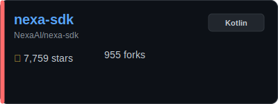</a>
    </td>
  </tr>
  <tr>
    <td colspan="2" align="right">
      <a href="#llm_engines"><kbd>🤖 Back to Section</kbd></a> · <a href="#contents"><kbd>📑 Contents</kbd></a>
    </td>
  </tr>
</table>
<div style="height: 16px;"></div>


<table width="100%" cellpadding="0" cellspacing="0">
  <tr>
    <td width="58%" valign="top">
      <div>
        <a href="https://github.com/InternLM/lmdeploy"></a>
      </div>
      <p style="line-height: 1.5;">LMDeploy: compress, deploy, and serve LLMs with one toolkit.<br>&nbsp;<br>&nbsp;<br>&nbsp;</p>
    </td>
    <td width="42%" valign="middle" align="center">
      <a href="https://github.com/InternLM/lmdeploy">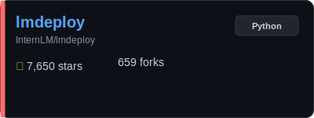</a>
    </td>
  </tr>
  <tr>
    <td colspan="2" align="right">
      <a href="#llm_engines"><kbd>🤖 Back to Section</kbd></a> · <a href="#contents"><kbd>📑 Contents</kbd></a>
    </td>
  </tr>
</table>
<div style="height: 16px;"></div>


<table width="100%" cellpadding="0" cellspacing="0">
  <tr>
    <td width="58%" valign="top">
      <div>
        <a href="https://github.com/google/adk-go"></a>
      </div>
      <p style="line-height: 1.5;">Google ADK (Go): code-first toolkit to build, eval, and<br>deploy AI agents.<br>&nbsp;<br>&nbsp;</p>
    </td>
    <td width="42%" valign="middle" align="center">
      <a href="https://github.com/google/adk-go">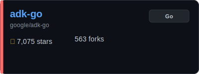</a>
    </td>
  </tr>
  <tr>
    <td colspan="2" align="right">
      <a href="#llm_engines"><kbd>🤖 Back to Section</kbd></a> · <a href="#contents"><kbd>📑 Contents</kbd></a>
    </td>
  </tr>
</table>
<div style="height: 16px;"></div>


<table width="100%" cellpadding="0" cellspacing="0">
  <tr>
    <td width="58%" valign="top">
      <div>
        <a href="https://github.com/Zipstack/unstract"></a>
      </div>
      <p style="line-height: 1.5;">Unstract: LLM-driven data extraction for APIs and ETL<br>pipelines.<br>&nbsp;<br>&nbsp;</p>
    </td>
    <td width="42%" valign="middle" align="center">
      <a href="https://github.com/Zipstack/unstract">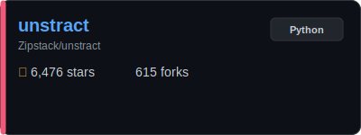</a>
    </td>
  </tr>
  <tr>
    <td colspan="2" align="right">
      <a href="#llm_engines"><kbd>🤖 Back to Section</kbd></a> · <a href="#contents"><kbd>📑 Contents</kbd></a>
    </td>
  </tr>
</table>
<div style="height: 16px;"></div>


<table width="100%" cellpadding="0" cellspacing="0">
  <tr>
    <td width="58%" valign="top">
      <div>
        <a href="https://github.com/osaurus-ai/osaurus"></a>
      </div>
      <p style="line-height: 1.5;">Osaurus: macOS edge runtime for local/cloud models with MCP<br>tool sharing.<br>&nbsp;<br>&nbsp;</p>
    </td>
    <td width="42%" valign="middle" align="center">
      <a href="https://github.com/osaurus-ai/osaurus">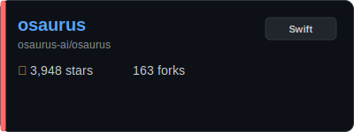</a>
    </td>
  </tr>
  <tr>
    <td colspan="2" align="right">
      <a href="#llm_engines"><kbd>🤖 Back to Section</kbd></a> · <a href="#contents"><kbd>📑 Contents</kbd></a>
    </td>
  </tr>
</table>
<div style="height: 16px;"></div>


<table width="100%" cellpadding="0" cellspacing="0">
  <tr>
    <td width="58%" valign="top">
      <div>
        <a href="https://github.com/ModelTC/LightLLM"></a>
      </div>
      <p style="line-height: 1.5;">Lightweight, scalable LLM inference server focused on speed.<br>&nbsp;<br>&nbsp;<br>&nbsp;</p>
    </td>
    <td width="42%" valign="middle" align="center">
      <a href="https://github.com/ModelTC/LightLLM">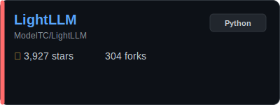</a>
    </td>
  </tr>
  <tr>
    <td colspan="2" align="right">
      <a href="#llm_engines"><kbd>🤖 Back to Section</kbd></a> · <a href="#contents"><kbd>📑 Contents</kbd></a>
    </td>
  </tr>
</table>
<div style="height: 16px;"></div>


<table width="100%" cellpadding="0" cellspacing="0">
  <tr>
    <td width="58%" valign="top">
      <div>
        <a href="https://github.com/PaddlePaddle/FastDeploy"></a>
      </div>
      <p style="line-height: 1.5;">FastDeploy: high-performance deployment toolkit for LLMs and<br>VLMs.<br>&nbsp;<br>&nbsp;</p>
    </td>
    <td width="42%" valign="middle" align="center">
      <a href="https://github.com/PaddlePaddle/FastDeploy">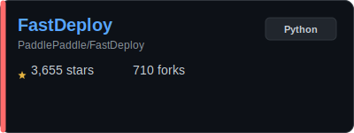</a>
    </td>
  </tr>
  <tr>
    <td colspan="2" align="right">
      <a href="#llm_engines"><kbd>🤖 Back to Section</kbd></a> · <a href="#contents"><kbd>📑 Contents</kbd></a>
    </td>
  </tr>
</table>
<div style="height: 16px;"></div>


<table width="100%" cellpadding="0" cellspacing="0">
  <tr>
    <td width="58%" valign="top">
      <div>
        <a href="https://github.com/NVIDIA/TransformerEngine"></a>
      </div>
      <p style="line-height: 1.5;">NVIDIA library for faster Transformer training/inference<br>with FP8/FP4 on new GPUs.<br>&nbsp;<br>&nbsp;</p>
    </td>
    <td width="42%" valign="middle" align="center">
      <a href="https://github.com/NVIDIA/TransformerEngine">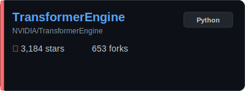</a>
    </td>
  </tr>
  <tr>
    <td colspan="2" align="right">
      <a href="#llm_engines"><kbd>🤖 Back to Section</kbd></a> · <a href="#contents"><kbd>📑 Contents</kbd></a>
    </td>
  </tr>
</table>
<div style="height: 16px;"></div>


<table width="100%" cellpadding="0" cellspacing="0">
  <tr>
    <td width="58%" valign="top">
      <div>
        <a href="https://github.com/vllm-project/llm-compressor"></a>
      </div>
      <p style="line-height: 1.5;">LLM Compressor: shrink models for faster vLLM serving.<br>&nbsp;<br>&nbsp;<br>&nbsp;</p>
    </td>
    <td width="42%" valign="middle" align="center">
      <a href="https://github.com/vllm-project/llm-compressor">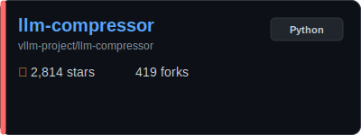</a>
    </td>
  </tr>
  <tr>
    <td colspan="2" align="right">
      <a href="#llm_engines"><kbd>🤖 Back to Section</kbd></a> · <a href="#contents"><kbd>📑 Contents</kbd></a>
    </td>
  </tr>
</table>
<div style="height: 16px;"></div>


<table width="100%" cellpadding="0" cellspacing="0">
  <tr>
    <td width="58%" valign="top">
      <div>
        <a href="https://github.com/michaelfeil/infinity"></a>
      </div>
      <p style="line-height: 1.5;">Infinity: high-throughput embedding and rerank serving<br>engine.<br>&nbsp;<br>&nbsp;</p>
    </td>
    <td width="42%" valign="middle" align="center">
      <a href="https://github.com/michaelfeil/infinity">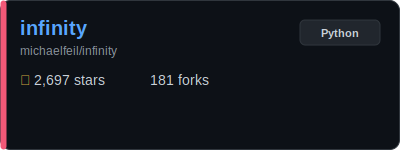</a>
    </td>
  </tr>
  <tr>
    <td colspan="2" align="right">
      <a href="#llm_engines"><kbd>🤖 Back to Section</kbd></a> · <a href="#contents"><kbd>📑 Contents</kbd></a>
    </td>
  </tr>
</table>
<div style="height: 16px;"></div>


<table width="100%" cellpadding="0" cellspacing="0">
  <tr>
    <td width="58%" valign="top">
      <div>
        <a href="https://github.com/containers/ramalama"></a>
      </div>
      <p style="line-height: 1.5;">Container-friendly local model serving with a<br>developer-first CLI.<br>&nbsp;<br>&nbsp;</p>
    </td>
    <td width="42%" valign="middle" align="center">
      <a href="https://github.com/containers/ramalama">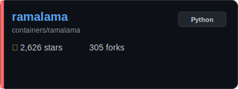</a>
    </td>
  </tr>
  <tr>
    <td colspan="2" align="right">
      <a href="#llm_engines"><kbd>🤖 Back to Section</kbd></a> · <a href="#contents"><kbd>📑 Contents</kbd></a>
    </td>
  </tr>
</table>
<div style="height: 16px;"></div>


<table width="100%" cellpadding="0" cellspacing="0">
  <tr>
    <td width="58%" valign="top">
      <div>
        <a href="https://github.com/xdit-project/xDiT"></a>
      </div>
      <p style="line-height: 1.5;">xDiT: massively parallel inference engine for diffusion<br>transformers.<br>&nbsp;<br>&nbsp;</p>
    </td>
    <td width="42%" valign="middle" align="center">
      <a href="https://github.com/xdit-project/xDiT">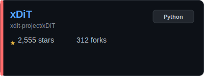</a>
    </td>
  </tr>
  <tr>
    <td colspan="2" align="right">
      <a href="#llm_engines"><kbd>🤖 Back to Section</kbd></a> · <a href="#contents"><kbd>📑 Contents</kbd></a>
    </td>
  </tr>
</table>
<div style="height: 16px;"></div>


<table width="100%" cellpadding="0" cellspacing="0">
  <tr>
    <td width="58%" valign="top">
      <div>
        <a href="https://github.com/langchain-ai/langserve"></a>
      </div>
      <p style="line-height: 1.5;">LangServe: turn LangChain logic into a production API.<br>&nbsp;<br>&nbsp;<br>&nbsp;</p>
    </td>
    <td width="42%" valign="middle" align="center">
      <a href="https://github.com/langchain-ai/langserve">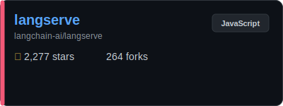</a>
    </td>
  </tr>
  <tr>
    <td colspan="2" align="right">
      <a href="#llm_engines"><kbd>🤖 Back to Section</kbd></a> · <a href="#contents"><kbd>📑 Contents</kbd></a>
    </td>
  </tr>
</table>
<div style="height: 16px;"></div>


<table width="100%" cellpadding="0" cellspacing="0">
  <tr>
    <td width="58%" valign="top">
      <div>
        <a href="https://github.com/NVIDIA/Model-Optimizer"></a>
      </div>
      <p style="line-height: 1.5;">Unified model optimization<br>(quantize/prune/distill/spec-decode) for faster inference.<br>&nbsp;<br>&nbsp;</p>
    </td>
    <td width="42%" valign="middle" align="center">
      <a href="https://github.com/NVIDIA/Model-Optimizer">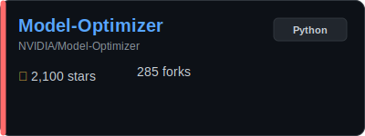</a>
    </td>
  </tr>
  <tr>
    <td colspan="2" align="right">
      <a href="#llm_engines"><kbd>🤖 Back to Section</kbd></a> · <a href="#contents"><kbd>📑 Contents</kbd></a>
    </td>
  </tr>
</table>
<div style="height: 16px;"></div>


<table width="100%" cellpadding="0" cellspacing="0">
  <tr>
    <td width="58%" valign="top">
      <div>
        <a href="https://github.com/run-llama/llama_deploy"></a>
      </div>
      <p style="line-height: 1.5;">Llama Deploy: microservices to run LlamaIndex agents at<br>scale.<br>&nbsp;<br>&nbsp;</p>
    </td>
    <td width="42%" valign="middle" align="center">
      <a href="https://github.com/run-llama/llama_deploy">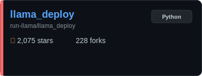</a>
    </td>
  </tr>
  <tr>
    <td colspan="2" align="right">
      <a href="#llm_engines"><kbd>🤖 Back to Section</kbd></a> · <a href="#contents"><kbd>📑 Contents</kbd></a>
    </td>
  </tr>
</table>
<div style="height: 16px;"></div>


<table width="100%" cellpadding="0" cellspacing="0">
  <tr>
    <td width="58%" valign="top">
      <div>
        <a href="https://github.com/google/adk-java"></a>
      </div>
      <p style="line-height: 1.5;">Google ADK (Java): code-first toolkit to build, eval, and<br>deploy AI agents.<br>&nbsp;<br>&nbsp;</p>
    </td>
    <td width="42%" valign="middle" align="center">
      <a href="https://github.com/google/adk-java">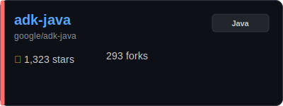</a>
    </td>
  </tr>
  <tr>
    <td colspan="2" align="right">
      <a href="#llm_engines"><kbd>🤖 Back to Section</kbd></a> · <a href="#contents"><kbd>📑 Contents</kbd></a>
    </td>
  </tr>
</table>
<div style="height: 16px;"></div>


<table width="100%" cellpadding="0" cellspacing="0">
  <tr>
    <td width="58%" valign="top">
      <div>
        <a href="https://github.com/SmythOS/sre"></a>
      </div>
      <p style="line-height: 1.5;">Open-source runtime to build, run, and manage agentic AI<br>across local/cloud/edge.<br>&nbsp;<br>&nbsp;</p>
    </td>
    <td width="42%" valign="middle" align="center">
      <a href="https://github.com/SmythOS/sre">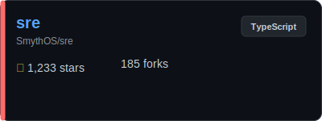</a>
    </td>
  </tr>
  <tr>
    <td colspan="2" align="right">
      <a href="#llm_engines"><kbd>🤖 Back to Section</kbd></a> · <a href="#contents"><kbd>📑 Contents</kbd></a>
    </td>
  </tr>
</table>
<div style="height: 16px;"></div>


<table width="100%" cellpadding="0" cellspacing="0">
  <tr>
    <td width="58%" valign="top">
      <div>
        <a href="https://github.com/GradientHQ/parallax"></a>
      </div>
      <p style="line-height: 1.5;">Parallax: distributed model serving to build your own AI<br>cluster.<br>&nbsp;<br>&nbsp;</p>
    </td>
    <td width="42%" valign="middle" align="center">
      <a href="https://github.com/GradientHQ/parallax">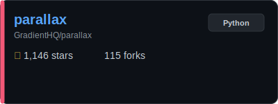</a>
    </td>
  </tr>
  <tr>
    <td colspan="2" align="right">
      <a href="#llm_engines"><kbd>🤖 Back to Section</kbd></a> · <a href="#contents"><kbd>📑 Contents</kbd></a>
    </td>
  </tr>
</table>
<div style="height: 16px;"></div>


<table width="100%" cellpadding="0" cellspacing="0">
  <tr>
    <td width="58%" valign="top">
      <div>
        <a href="https://github.com/google/adk-js"></a>
      </div>
      <p style="line-height: 1.5;">Google ADK (JS): code-first toolkit to build, eval, and<br>deploy AI agents.<br>&nbsp;<br>&nbsp;</p>
    </td>
    <td width="42%" valign="middle" align="center">
      <a href="https://github.com/google/adk-js">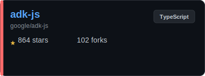</a>
    </td>
  </tr>
  <tr>
    <td colspan="2" align="right">
      <a href="#llm_engines"><kbd>🤖 Back to Section</kbd></a> · <a href="#contents"><kbd>📑 Contents</kbd></a>
    </td>
  </tr>
</table>
<div style="height: 16px;"></div>


<table width="100%" cellpadding="0" cellspacing="0">
  <tr>
    <td width="58%" valign="top">
      <div>
        <a href="https://github.com/xpander-ai/xpander.ai"></a>
      </div>
      <p style="line-height: 1.5;">xpander.ai: runtime and control plane to build and ship<br>agents fast.<br>&nbsp;<br>&nbsp;</p>
    </td>
    <td width="42%" valign="middle" align="center">
      <a href="https://github.com/xpander-ai/xpander.ai">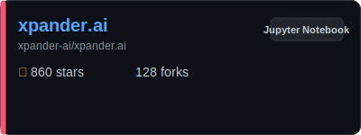</a>
    </td>
  </tr>
  <tr>
    <td colspan="2" align="right">
      <a href="#llm_engines"><kbd>🤖 Back to Section</kbd></a> · <a href="#contents"><kbd>📑 Contents</kbd></a>
    </td>
  </tr>
</table>
<div style="height: 16px;"></div>


<table width="100%" cellpadding="0" cellspacing="0">
  <tr>
    <td width="58%" valign="top">
      <div>
        <a href="https://github.com/sgl-project/SpecForge"></a>
      </div>
      <p style="line-height: 1.5;">SpecForge: train speculative-decoding models for SGLang<br>serving.<br>&nbsp;<br>&nbsp;</p>
    </td>
    <td width="42%" valign="middle" align="center">
      <a href="https://github.com/sgl-project/SpecForge">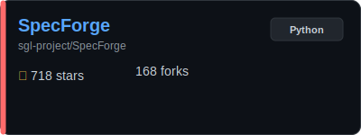</a>
    </td>
  </tr>
  <tr>
    <td colspan="2" align="right">
      <a href="#llm_engines"><kbd>🤖 Back to Section</kbd></a> · <a href="#contents"><kbd>📑 Contents</kbd></a>
    </td>
  </tr>
</table>
<div style="height: 16px;"></div>


<table width="100%" cellpadding="0" cellspacing="0">
  <tr>
    <td width="58%" valign="top">
      <div>
        <a href="https://github.com/tile-ai/TileRT"></a>
      </div>
      <p style="line-height: 1.5;">TileRT: ultra-low-latency LLM inference runtime.<br>&nbsp;<br>&nbsp;<br>&nbsp;</p>
    </td>
    <td width="42%" valign="middle" align="center">
      <a href="https://github.com/tile-ai/TileRT">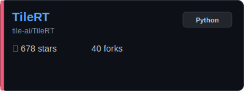</a>
    </td>
  </tr>
  <tr>
    <td colspan="2" align="right">
      <a href="#llm_engines"><kbd>🤖 Back to Section</kbd></a> · <a href="#contents"><kbd>📑 Contents</kbd></a>
    </td>
  </tr>
</table>
<div style="height: 16px;"></div>


<table width="100%" cellpadding="0" cellspacing="0">
  <tr>
    <td width="58%" valign="top">
      <div>
        <a href="https://github.com/yassa9/qwen600"></a>
      </div>
      <p style="line-height: 1.5;">qwen600: tiny CUDA-only Qwen3-0.6B inference engine.<br>&nbsp;<br>&nbsp;<br>&nbsp;</p>
    </td>
    <td width="42%" valign="middle" align="center">
      <a href="https://github.com/yassa9/qwen600">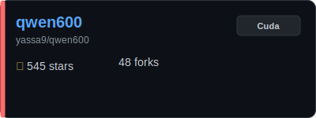</a>
    </td>
  </tr>
  <tr>
    <td colspan="2" align="right">
      <a href="#llm_engines"><kbd>🤖 Back to Section</kbd></a> · <a href="#contents"><kbd>📑 Contents</kbd></a>
    </td>
  </tr>
</table>
<div style="height: 16px;"></div>


<table width="100%" cellpadding="0" cellspacing="0">
  <tr>
    <td width="58%" valign="top">
      <div>
        <a href="https://github.com/waybarrios/vllm-mlx"></a>
      </div>
      <p style="line-height: 1.5;">OpenAI-style server for Apple Silicon running LLM/VLMs on<br>MLX.<br>&nbsp;<br>&nbsp;</p>
    </td>
    <td width="42%" valign="middle" align="center">
      <a href="https://github.com/waybarrios/vllm-mlx">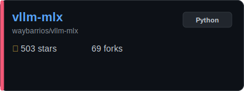</a>
    </td>
  </tr>
  <tr>
    <td colspan="2" align="right">
      <a href="#llm_engines"><kbd>🤖 Back to Section</kbd></a> · <a href="#contents"><kbd>📑 Contents</kbd></a>
    </td>
  </tr>
</table>
<div style="height: 16px;"></div>


<table width="100%" cellpadding="0" cellspacing="0">
  <tr>
    <td width="58%" valign="top">
      <div>
        <a href="https://github.com/milanm/AutoGrad-Engine"></a>
      </div>
      <p style="line-height: 1.5;">AutoGrad-Engine: a full GPT model in about 600 lines of pure<br>C#.<br>&nbsp;<br>&nbsp;</p>
    </td>
    <td width="42%" valign="middle" align="center">
      <a href="https://github.com/milanm/AutoGrad-Engine">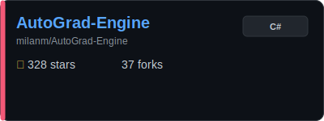</a>
    </td>
  </tr>
  <tr>
    <td colspan="2" align="right">
      <a href="#llm_engines"><kbd>🤖 Back to Section</kbd></a> · <a href="#contents"><kbd>📑 Contents</kbd></a>
    </td>
  </tr>
</table>
<div style="height: 16px;"></div>

<h2 id='agents'>🛠️ AI Agents & Orchestration</h2>
<p> Section color</p>


<table width="100%" cellpadding="0" cellspacing="0">
  <tr>
    <td width="58%" valign="top">
      <div>
        <a href="https://github.com/langchain-ai/langchain"></a>
      </div>
      <p style="line-height: 1.5;">LangChain: huge integration hub for LLM apps, tools, and<br>agents.<br>&nbsp;<br>&nbsp;</p>
    </td>
    <td width="42%" valign="middle" align="center">
      <a href="https://github.com/langchain-ai/langchain"></a>
    </td>
  </tr>
  <tr>
    <td colspan="2" align="right">
      <a href="#agents"><kbd>🛠️ Back to Section</kbd></a> · <a href="#contents"><kbd>📑 Contents</kbd></a>
    </td>
  </tr>
</table>
<div style="height: 16px;"></div>


<table width="100%" cellpadding="0" cellspacing="0">
  <tr>
    <td width="58%" valign="top">
      <div>
        <a href="https://github.com/FoundationAgents/MetaGPT"></a>
      </div>
      <p style="line-height: 1.5;">MetaGPT: multi-agent framework that turns specs into working<br>software.<br>&nbsp;<br>&nbsp;</p>
    </td>
    <td width="42%" valign="middle" align="center">
      <a href="https://github.com/FoundationAgents/MetaGPT"></a>
    </td>
  </tr>
  <tr>
    <td colspan="2" align="right">
      <a href="#agents"><kbd>🛠️ Back to Section</kbd></a> · <a href="#contents"><kbd>📑 Contents</kbd></a>
    </td>
  </tr>
</table>
<div style="height: 16px;"></div>


<table width="100%" cellpadding="0" cellspacing="0">
  <tr>
    <td width="58%" valign="top">
      <div>
        <a href="https://github.com/cline/cline"></a>
      </div>
      <p style="line-height: 1.5;">IDE-native autonomous coding agent with safe, step-by-step<br>permissions.<br>&nbsp;<br>&nbsp;</p>
    </td>
    <td width="42%" valign="middle" align="center">
      <a href="https://github.com/cline/cline">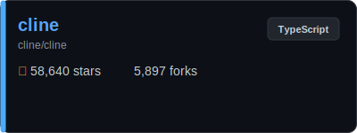</a>
    </td>
  </tr>
  <tr>
    <td colspan="2" align="right">
      <a href="#agents"><kbd>🛠️ Back to Section</kbd></a> · <a href="#contents"><kbd>📑 Contents</kbd></a>
    </td>
  </tr>
</table>
<div style="height: 16px;"></div>


<table width="100%" cellpadding="0" cellspacing="0">
  <tr>
    <td width="58%" valign="top">
      <div>
        <a href="https://github.com/microsoft/autogen"></a>
      </div>
      <p style="line-height: 1.5;">AutoGen: multi-agent collaboration framework for complex<br>tasks.<br>&nbsp;<br>&nbsp;</p>
    </td>
    <td width="42%" valign="middle" align="center">
      <a href="https://github.com/microsoft/autogen"></a>
    </td>
  </tr>
  <tr>
    <td colspan="2" align="right">
      <a href="#agents"><kbd>🛠️ Back to Section</kbd></a> · <a href="#contents"><kbd>📑 Contents</kbd></a>
    </td>
  </tr>
</table>
<div style="height: 16px;"></div>


<table width="100%" cellpadding="0" cellspacing="0">
  <tr>
    <td width="58%" valign="top">
      <div>
        <a href="https://github.com/crewAIInc/crewAI"></a>
      </div>
      <p style="line-height: 1.5;">Multi-agent orchestration for role-based collaboration on<br>complex tasks.<br>&nbsp;<br>&nbsp;</p>
    </td>
    <td width="42%" valign="middle" align="center">
      <a href="https://github.com/crewAIInc/crewAI">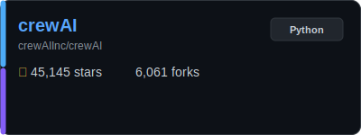</a>
    </td>
  </tr>
  <tr>
    <td colspan="2" align="right">
      <a href="#agents"><kbd>🛠️ Back to Section</kbd></a> · <a href="#contents"><kbd>📑 Contents</kbd></a>
    </td>
  </tr>
</table>
<div style="height: 16px;"></div>


<table width="100%" cellpadding="0" cellspacing="0">
  <tr>
    <td width="58%" valign="top">
      <div>
        <a href="https://github.com/CherryHQ/cherry-studio"></a>
      </div>
      <p style="line-height: 1.5;">Cherry Studio: AI productivity hub with chat, agents, and<br>300+ assistants.<br>&nbsp;<br>&nbsp;</p>
    </td>
    <td width="42%" valign="middle" align="center">
      <a href="https://github.com/CherryHQ/cherry-studio">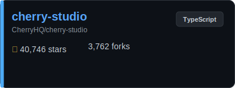</a>
    </td>
  </tr>
  <tr>
    <td colspan="2" align="right">
      <a href="#agents"><kbd>🛠️ Back to Section</kbd></a> · <a href="#contents"><kbd>📑 Contents</kbd></a>
    </td>
  </tr>
</table>
<div style="height: 16px;"></div>


<table width="100%" cellpadding="0" cellspacing="0">
  <tr>
    <td width="58%" valign="top">
      <div>
        <a href="https://github.com/khoj-ai/khoj"></a>
      </div>
      <p style="line-height: 1.5;">Self-hosted AI second brain for web/docs search, custom<br>agents, and automations.<br>&nbsp;<br>&nbsp;</p>
    </td>
    <td width="42%" valign="middle" align="center">
      <a href="https://github.com/khoj-ai/khoj">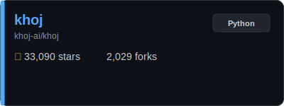</a>
    </td>
  </tr>
  <tr>
    <td colspan="2" align="right">
      <a href="#agents"><kbd>🛠️ Back to Section</kbd></a> · <a href="#contents"><kbd>📑 Contents</kbd></a>
    </td>
  </tr>
</table>
<div style="height: 16px;"></div>


<table width="100%" cellpadding="0" cellspacing="0">
  <tr>
    <td width="58%" valign="top">
      <div>
        <a href="https://github.com/wshobson/agents"></a>
      </div>
      <p style="line-height: 1.5;">Agents for Claude Code: structured automation and<br>multi-agent orchestration.<br>&nbsp;<br>&nbsp;</p>
    </td>
    <td width="42%" valign="middle" align="center">
      <a href="https://github.com/wshobson/agents">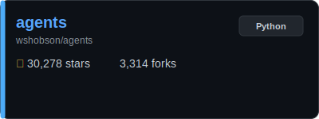</a>
    </td>
  </tr>
  <tr>
    <td colspan="2" align="right">
      <a href="#agents"><kbd>🛠️ Back to Section</kbd></a> · <a href="#contents"><kbd>📑 Contents</kbd></a>
    </td>
  </tr>
</table>
<div style="height: 16px;"></div>


<table width="100%" cellpadding="0" cellspacing="0">
  <tr>
    <td width="58%" valign="top">
      <div>
        <a href="https://github.com/langchain-ai/langgraph"></a>
      </div>
      <p style="line-height: 1.5;">LangGraph: stateful, cyclic workflows for agents.<br>&nbsp;<br>&nbsp;<br>&nbsp;</p>
    </td>
    <td width="42%" valign="middle" align="center">
      <a href="https://github.com/langchain-ai/langgraph">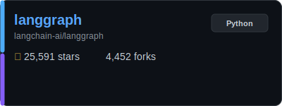</a>
    </td>
  </tr>
  <tr>
    <td colspan="2" align="right">
      <a href="#agents"><kbd>🛠️ Back to Section</kbd></a> · <a href="#contents"><kbd>📑 Contents</kbd></a>
    </td>
  </tr>
</table>
<div style="height: 16px;"></div>


<table width="100%" cellpadding="0" cellspacing="0">
  <tr>
    <td width="58%" valign="top">
      <div>
        <a href="https://github.com/assafelovic/gpt-researcher"></a>
      </div>
      <p style="line-height: 1.5;">GPT-Researcher: autonomous deep-research agent for any<br>topic.<br>&nbsp;<br>&nbsp;</p>
    </td>
    <td width="42%" valign="middle" align="center">
      <a href="https://github.com/assafelovic/gpt-researcher"></a>
    </td>
  </tr>
  <tr>
    <td colspan="2" align="right">
      <a href="#agents"><kbd>🛠️ Back to Section</kbd></a> · <a href="#contents"><kbd>📑 Contents</kbd></a>
    </td>
  </tr>
</table>
<div style="height: 16px;"></div>


<table width="100%" cellpadding="0" cellspacing="0">
  <tr>
    <td width="58%" valign="top">
      <div>
        <a href="https://github.com/Fosowl/agenticSeek"></a>
      </div>
      <p style="line-height: 1.5;">Fully local autonomous agent that browses and codes without<br>API bills.<br>&nbsp;<br>&nbsp;</p>
    </td>
    <td width="42%" valign="middle" align="center">
      <a href="https://github.com/Fosowl/agenticSeek">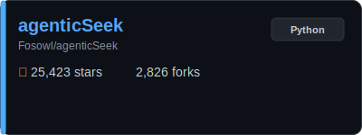</a>
    </td>
  </tr>
  <tr>
    <td colspan="2" align="right">
      <a href="#agents"><kbd>🛠️ Back to Section</kbd></a> · <a href="#contents"><kbd>📑 Contents</kbd></a>
    </td>
  </tr>
</table>
<div style="height: 16px;"></div>


<table width="100%" cellpadding="0" cellspacing="0">
  <tr>
    <td width="58%" valign="top">
      <div>
        <a href="https://github.com/zeroclaw-labs/zeroclaw"></a>
      </div>
      <p style="line-height: 1.5;">Zeroclaw: lightweight, fully autonomous assistant<br>infrastructure you can deploy anywhere.<br>&nbsp;<br>&nbsp;</p>
    </td>
    <td width="42%" valign="middle" align="center">
      <a href="https://github.com/zeroclaw-labs/zeroclaw">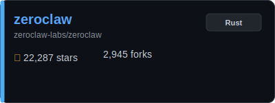</a>
    </td>
  </tr>
  <tr>
    <td colspan="2" align="right">
      <a href="#agents"><kbd>🛠️ Back to Section</kbd></a> · <a href="#contents"><kbd>📑 Contents</kbd></a>
    </td>
  </tr>
</table>
<div style="height: 16px;"></div>


<table width="100%" cellpadding="0" cellspacing="0">
  <tr>
    <td width="58%" valign="top">
      <div>
        <a href="https://github.com/zai-org/Open-AutoGLM"></a>
      </div>
      <p style="line-height: 1.5;">Open-AutoGLM: phone-agent model and framework for device<br>automation.<br>&nbsp;<br>&nbsp;</p>
    </td>
    <td width="42%" valign="middle" align="center">
      <a href="https://github.com/zai-org/Open-AutoGLM"></a>
    </td>
  </tr>
  <tr>
    <td colspan="2" align="right">
      <a href="#agents"><kbd>🛠️ Back to Section</kbd></a> · <a href="#contents"><kbd>📑 Contents</kbd></a>
    </td>
  </tr>
</table>
<div style="height: 16px;"></div>


<table width="100%" cellpadding="0" cellspacing="0">
  <tr>
    <td width="58%" valign="top">
      <div>
        <a href="https://github.com/mastra-ai/mastra"></a>
      </div>
      <p style="line-height: 1.5;">Mastra: modern TypeScript framework for building AI apps and<br>agents.<br>&nbsp;<br>&nbsp;</p>
    </td>
    <td width="42%" valign="middle" align="center">
      <a href="https://github.com/mastra-ai/mastra"></a>
    </td>
  </tr>
  <tr>
    <td colspan="2" align="right">
      <a href="#agents"><kbd>🛠️ Back to Section</kbd></a> · <a href="#contents"><kbd>📑 Contents</kbd></a>
    </td>
  </tr>
</table>
<div style="height: 16px;"></div>


<table width="100%" cellpadding="0" cellspacing="0">
  <tr>
    <td width="58%" valign="top">
      <div>
        <a href="https://github.com/vercel-labs/agent-browser"></a>
      </div>
      <p style="line-height: 1.5;">Agent Browser: give your AI eyes and clicks to navigate the<br>web.<br>&nbsp;<br>&nbsp;</p>
    </td>
    <td width="42%" valign="middle" align="center">
      <a href="https://github.com/vercel-labs/agent-browser">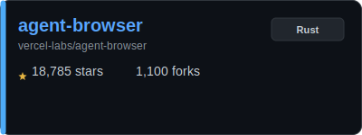</a>
    </td>
  </tr>
  <tr>
    <td colspan="2" align="right">
      <a href="#agents"><kbd>🛠️ Back to Section</kbd></a> · <a href="#contents"><kbd>📑 Contents</kbd></a>
    </td>
  </tr>
</table>
<div style="height: 16px;"></div>


<table width="100%" cellpadding="0" cellspacing="0">
  <tr>
    <td width="58%" valign="top">
      <div>
        <a href="https://github.com/ruvnet/ruflo"></a>
      </div>
      <p style="line-height: 1.5;">Claude-focused orchestration for multi-agent swarms,<br>workflows, and RAG systems.<br>&nbsp;<br>&nbsp;</p>
    </td>
    <td width="42%" valign="middle" align="center">
      <a href="https://github.com/ruvnet/ruflo"></a>
    </td>
  </tr>
  <tr>
    <td colspan="2" align="right">
      <a href="#agents"><kbd>🛠️ Back to Section</kbd></a> · <a href="#contents"><kbd>📑 Contents</kbd></a>
    </td>
  </tr>
</table>
<div style="height: 16px;"></div>


<table width="100%" cellpadding="0" cellspacing="0">
  <tr>
    <td width="58%" valign="top">
      <div>
        <a href="https://github.com/openai/openai-agents-python"></a>
      </div>
      <p style="line-height: 1.5;">OpenAI Agents SDK: lightweight framework for multi-agent<br>workflows.<br>&nbsp;<br>&nbsp;</p>
    </td>
    <td width="42%" valign="middle" align="center">
      <a href="https://github.com/openai/openai-agents-python"></a>
    </td>
  </tr>
  <tr>
    <td colspan="2" align="right">
      <a href="#agents"><kbd>🛠️ Back to Section</kbd></a> · <a href="#contents"><kbd>📑 Contents</kbd></a>
    </td>
  </tr>
</table>
<div style="height: 16px;"></div>


<table width="100%" cellpadding="0" cellspacing="0">
  <tr>
    <td width="58%" valign="top">
      <div>
        <a href="https://github.com/humanlayer/12-factor-agents"></a>
      </div>
      <p style="line-height: 1.5;">12-Factor Agents: practical principles for production-grade<br>agents.<br>&nbsp;<br>&nbsp;</p>
    </td>
    <td width="42%" valign="middle" align="center">
      <a href="https://github.com/humanlayer/12-factor-agents">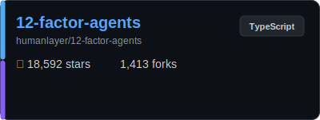</a>
    </td>
  </tr>
  <tr>
    <td colspan="2" align="right">
      <a href="#agents"><kbd>🛠️ Back to Section</kbd></a> · <a href="#contents"><kbd>📑 Contents</kbd></a>
    </td>
  </tr>
</table>
<div style="height: 16px;"></div>


<table width="100%" cellpadding="0" cellspacing="0">
  <tr>
    <td width="58%" valign="top">
      <div>
        <a href="https://github.com/emcie-co/parlant"></a>
      </div>
      <p style="line-height: 1.5;">Control layer for customer-facing agents - context<br>engineering for safer dialogs.<br>&nbsp;<br>&nbsp;</p>
    </td>
    <td width="42%" valign="middle" align="center">
      <a href="https://github.com/emcie-co/parlant"></a>
    </td>
  </tr>
  <tr>
    <td colspan="2" align="right">
      <a href="#agents"><kbd>🛠️ Back to Section</kbd></a> · <a href="#contents"><kbd>📑 Contents</kbd></a>
    </td>
  </tr>
</table>
<div style="height: 16px;"></div>


<table width="100%" cellpadding="0" cellspacing="0">
  <tr>
    <td width="58%" valign="top">
      <div>
        <a href="https://github.com/elizaOS/eliza"></a>
      </div>
      <p style="line-height: 1.5;">Eliza: autonomous on-chain agent with a social personality.<br>&nbsp;<br>&nbsp;<br>&nbsp;</p>
    </td>
    <td width="42%" valign="middle" align="center">
      <a href="https://github.com/elizaOS/eliza"></a>
    </td>
  </tr>
  <tr>
    <td colspan="2" align="right">
      <a href="#agents"><kbd>🛠️ Back to Section</kbd></a> · <a href="#contents"><kbd>📑 Contents</kbd></a>
    </td>
  </tr>
</table>
<div style="height: 16px;"></div>


<table width="100%" cellpadding="0" cellspacing="0">
  <tr>
    <td width="58%" valign="top">
      <div>
        <a href="https://github.com/virattt/dexter"></a>
      </div>
      <p style="line-height: 1.5;">Dexter: autonomous agent for deep financial research.<br>&nbsp;<br>&nbsp;<br>&nbsp;</p>
    </td>
    <td width="42%" valign="middle" align="center">
      <a href="https://github.com/virattt/dexter"></a>
    </td>
  </tr>
  <tr>
    <td colspan="2" align="right">
      <a href="#agents"><kbd>🛠️ Back to Section</kbd></a> · <a href="#contents"><kbd>📑 Contents</kbd></a>
    </td>
  </tr>
</table>
<div style="height: 16px;"></div>


<table width="100%" cellpadding="0" cellspacing="0">
  <tr>
    <td width="58%" valign="top">
      <div>
        <a href="https://github.com/raga-ai-hub/RagaAI-Catalyst"></a>
      </div>
      <p style="line-height: 1.5;">SDK for agent/LLM observability: tracing, debugging, and<br>analytics dashboards.<br>&nbsp;<br>&nbsp;</p>
    </td>
    <td width="42%" valign="middle" align="center">
      <a href="https://github.com/raga-ai-hub/RagaAI-Catalyst"></a>
    </td>
  </tr>
  <tr>
    <td colspan="2" align="right">
      <a href="#agents"><kbd>🛠️ Back to Section</kbd></a> · <a href="#contents"><kbd>📑 Contents</kbd></a>
    </td>
  </tr>
</table>
<div style="height: 16px;"></div>


<table width="100%" cellpadding="0" cellspacing="0">
  <tr>
    <td width="58%" valign="top">
      <div>
        <a href="https://github.com/agent0ai/agent-zero"></a>
      </div>
      <p style="line-height: 1.5;">Agent Zero: full-OS autonomous agent for power users.<br>&nbsp;<br>&nbsp;<br>&nbsp;</p>
    </td>
    <td width="42%" valign="middle" align="center">
      <a href="https://github.com/agent0ai/agent-zero"></a>
    </td>
  </tr>
  <tr>
    <td colspan="2" align="right">
      <a href="#agents"><kbd>🛠️ Back to Section</kbd></a> · <a href="#contents"><kbd>📑 Contents</kbd></a>
    </td>
  </tr>
</table>
<div style="height: 16px;"></div>


<table width="100%" cellpadding="0" cellspacing="0">
  <tr>
    <td width="58%" valign="top">
      <div>
        <a href="https://github.com/pydantic/pydantic-ai"></a>
      </div>
      <p style="line-height: 1.5;">PydanticAI: typed agent logic with strict validation.<br>&nbsp;<br>&nbsp;<br>&nbsp;</p>
    </td>
    <td width="42%" valign="middle" align="center">
      <a href="https://github.com/pydantic/pydantic-ai"></a>
    </td>
  </tr>
  <tr>
    <td colspan="2" align="right">
      <a href="#agents"><kbd>🛠️ Back to Section</kbd></a> · <a href="#contents"><kbd>📑 Contents</kbd></a>
    </td>
  </tr>
</table>
<div style="height: 16px;"></div>


<table width="100%" cellpadding="0" cellspacing="0">
  <tr>
    <td width="58%" valign="top">
      <div>
        <a href="https://github.com/Tencent/WeKnora"></a>
      </div>
      <p style="line-height: 1.5;">WeKnora: RAG framework for deep document understanding and<br>retrieval.<br>&nbsp;<br>&nbsp;</p>
    </td>
    <td width="42%" valign="middle" align="center">
      <a href="https://github.com/Tencent/WeKnora"></a>
    </td>
  </tr>
  <tr>
    <td colspan="2" align="right">
      <a href="#agents"><kbd>🛠️ Back to Section</kbd></a> · <a href="#contents"><kbd>📑 Contents</kbd></a>
    </td>
  </tr>
</table>
<div style="height: 16px;"></div>


<table width="100%" cellpadding="0" cellspacing="0">
  <tr>
    <td width="58%" valign="top">
      <div>
        <a href="https://github.com/nanobrowser/nanobrowser"></a>
      </div>
      <p style="line-height: 1.5;">NanoBrowser: open-source Chrome extension for LLM web<br>automation.<br>&nbsp;<br>&nbsp;</p>
    </td>
    <td width="42%" valign="middle" align="center">
      <a href="https://github.com/nanobrowser/nanobrowser"></a>
    </td>
  </tr>
  <tr>
    <td colspan="2" align="right">
      <a href="#agents"><kbd>🛠️ Back to Section</kbd></a> · <a href="#contents"><kbd>📑 Contents</kbd></a>
    </td>
  </tr>
</table>
<div style="height: 16px;"></div>


<table width="100%" cellpadding="0" cellspacing="0">
  <tr>
    <td width="58%" valign="top">
      <div>
        <a href="https://github.com/snarktank/ralph"></a>
      </div>
      <p style="line-height: 1.5;">Ralph: autonomous agent loop that runs your PRD to<br>completion.<br>&nbsp;<br>&nbsp;</p>
    </td>
    <td width="42%" valign="middle" align="center">
      <a href="https://github.com/snarktank/ralph"></a>
    </td>
  </tr>
  <tr>
    <td colspan="2" align="right">
      <a href="#agents"><kbd>🛠️ Back to Section</kbd></a> · <a href="#contents"><kbd>📑 Contents</kbd></a>
    </td>
  </tr>
</table>
<div style="height: 16px;"></div>


<table width="100%" cellpadding="0" cellspacing="0">
  <tr>
    <td width="58%" valign="top">
      <div>
        <a href="https://github.com/iflytek/astron-agent"></a>
      </div>
      <p style="line-height: 1.5;">Astron-Agent: enterprise workflow platform for building<br>agent swarms.<br>&nbsp;<br>&nbsp;</p>
    </td>
    <td width="42%" valign="middle" align="center">
      <a href="https://github.com/iflytek/astron-agent"></a>
    </td>
  </tr>
  <tr>
    <td colspan="2" align="right">
      <a href="#agents"><kbd>🛠️ Back to Section</kbd></a> · <a href="#contents"><kbd>📑 Contents</kbd></a>
    </td>
  </tr>
</table>
<div style="height: 16px;"></div>


<table width="100%" cellpadding="0" cellspacing="0">
  <tr>
    <td width="58%" valign="top">
      <div>
        <a href="https://github.com/mcp-use/mcp-use"></a>
      </div>
      <p style="line-height: 1.5;">mcp-use: full-stack framework for building MCP apps.<br>&nbsp;<br>&nbsp;<br>&nbsp;</p>
    </td>
    <td width="42%" valign="middle" align="center">
      <a href="https://github.com/mcp-use/mcp-use"></a>
    </td>
  </tr>
  <tr>
    <td colspan="2" align="right">
      <a href="#agents"><kbd>🛠️ Back to Section</kbd></a> · <a href="#contents"><kbd>📑 Contents</kbd></a>
    </td>
  </tr>
</table>
<div style="height: 16px;"></div>


<table width="100%" cellpadding="0" cellspacing="0">
  <tr>
    <td width="58%" valign="top">
      <div>
        <a href="https://github.com/vxcontrol/pentagi"></a>
      </div>
      <p style="line-height: 1.5;">Pentagi: autonomous agents for penetration testing<br>workflows.<br>&nbsp;<br>&nbsp;</p>
    </td>
    <td width="42%" valign="middle" align="center">
      <a href="https://github.com/vxcontrol/pentagi"></a>
    </td>
  </tr>
  <tr>
    <td colspan="2" align="right">
      <a href="#agents"><kbd>🛠️ Back to Section</kbd></a> · <a href="#contents"><kbd>📑 Contents</kbd></a>
    </td>
  </tr>
</table>
<div style="height: 16px;"></div>


<table width="100%" cellpadding="0" cellspacing="0">
  <tr>
    <td width="58%" valign="top">
      <div>
        <a href="https://github.com/openai/symphony"></a>
      </div>
      <p style="line-height: 1.5;">Symphony: run projects as isolated agent runs instead of<br>babysitting tasks.<br>&nbsp;<br>&nbsp;</p>
    </td>
    <td width="42%" valign="middle" align="center">
      <a href="https://github.com/openai/symphony"></a>
    </td>
  </tr>
  <tr>
    <td colspan="2" align="right">
      <a href="#agents"><kbd>🛠️ Back to Section</kbd></a> · <a href="#contents"><kbd>📑 Contents</kbd></a>
    </td>
  </tr>
</table>
<div style="height: 16px;"></div>


<table width="100%" cellpadding="0" cellspacing="0">
  <tr>
    <td width="58%" valign="top">
      <div>
        <a href="https://github.com/Yeachan-Heo/oh-my-claudecode"></a>
      </div>
      <p style="line-height: 1.5;">Oh-My-ClaudeCode: team-friendly multi-agent orchestration<br>for Claude Code.<br>&nbsp;<br>&nbsp;</p>
    </td>
    <td width="42%" valign="middle" align="center">
      <a href="https://github.com/Yeachan-Heo/oh-my-claudecode"></a>
    </td>
  </tr>
  <tr>
    <td colspan="2" align="right">
      <a href="#agents"><kbd>🛠️ Back to Section</kbd></a> · <a href="#contents"><kbd>📑 Contents</kbd></a>
    </td>
  </tr>
</table>
<div style="height: 16px;"></div>


<table width="100%" cellpadding="0" cellspacing="0">
  <tr>
    <td width="58%" valign="top">
      <div>
        <a href="https://github.com/microsoft/agent-framework"></a>
      </div>
      <p style="line-height: 1.5;">Microsoft Agent Framework: build and orchestrate agents in<br>Python/.NET.<br>&nbsp;<br>&nbsp;</p>
    </td>
    <td width="42%" valign="middle" align="center">
      <a href="https://github.com/microsoft/agent-framework"></a>
    </td>
  </tr>
  <tr>
    <td colspan="2" align="right">
      <a href="#agents"><kbd>🛠️ Back to Section</kbd></a> · <a href="#contents"><kbd>📑 Contents</kbd></a>
    </td>
  </tr>
</table>
<div style="height: 16px;"></div>


<table width="100%" cellpadding="0" cellspacing="0">
  <tr>
    <td width="58%" valign="top">
      <div>
        <a href="https://github.com/0x4m4/hexstrike-ai"></a>
      </div>
      <p style="line-height: 1.5;">MCP server that lets agents run 150+ security tools for<br>automated pentesting.<br>&nbsp;<br>&nbsp;</p>
    </td>
    <td width="42%" valign="middle" align="center">
      <a href="https://github.com/0x4m4/hexstrike-ai"></a>
    </td>
  </tr>
  <tr>
    <td colspan="2" align="right">
      <a href="#agents"><kbd>🛠️ Back to Section</kbd></a> · <a href="#contents"><kbd>📑 Contents</kbd></a>
    </td>
  </tr>
</table>
<div style="height: 16px;"></div>


<table width="100%" cellpadding="0" cellspacing="0">
  <tr>
    <td width="58%" valign="top">
      <div>
        <a href="https://github.com/VoltAgent/voltagent"></a>
      </div>
      <p style="line-height: 1.5;">VoltAgent: TypeScript agent engineering platform for<br>production apps.<br>&nbsp;<br>&nbsp;</p>
    </td>
    <td width="42%" valign="middle" align="center">
      <a href="https://github.com/VoltAgent/voltagent"></a>
    </td>
  </tr>
  <tr>
    <td colspan="2" align="right">
      <a href="#agents"><kbd>🛠️ Back to Section</kbd></a> · <a href="#contents"><kbd>📑 Contents</kbd></a>
    </td>
  </tr>
</table>
<div style="height: 16px;"></div>


<table width="100%" cellpadding="0" cellspacing="0">
  <tr>
    <td width="58%" valign="top">
      <div>
        <a href="https://github.com/MemMachine/MemMachine"></a>
      </div>
      <p style="line-height: 1.5;">Interoperable memory layer for agents: store, retrieve, and<br>share state.<br>&nbsp;<br>&nbsp;</p>
    </td>
    <td width="42%" valign="middle" align="center">
      <a href="https://github.com/MemMachine/MemMachine"></a>
    </td>
  </tr>
  <tr>
    <td colspan="2" align="right">
      <a href="#agents"><kbd>🛠️ Back to Section</kbd></a> · <a href="#contents"><kbd>📑 Contents</kbd></a>
    </td>
  </tr>
</table>
<div style="height: 16px;"></div>


<table width="100%" cellpadding="0" cellspacing="0">
  <tr>
    <td width="58%" valign="top">
      <div>
        <a href="https://github.com/ComposioHQ/agent-orchestrator"></a>
      </div>
      <p style="line-height: 1.5;">Parallel coding-agent orchestrator with planning, CI fixes,<br>and merge handling.<br>&nbsp;<br>&nbsp;</p>
    </td>
    <td width="42%" valign="middle" align="center">
      <a href="https://github.com/ComposioHQ/agent-orchestrator"></a>
    </td>
  </tr>
  <tr>
    <td colspan="2" align="right">
      <a href="#agents"><kbd>🛠️ Back to Section</kbd></a> · <a href="#contents"><kbd>📑 Contents</kbd></a>
    </td>
  </tr>
</table>
<div style="height: 16px;"></div>


<table width="100%" cellpadding="0" cellspacing="0">
  <tr>
    <td width="58%" valign="top">
      <div>
        <a href="https://github.com/ruc-datalab/DeepAnalyze"></a>
      </div>
      <p style="line-height: 1.5;">DeepAnalyze: agentic data-science assistant for automated<br>analysis.<br>&nbsp;<br>&nbsp;</p>
    </td>
    <td width="42%" valign="middle" align="center">
      <a href="https://github.com/ruc-datalab/DeepAnalyze"></a>
    </td>
  </tr>
  <tr>
    <td colspan="2" align="right">
      <a href="#agents"><kbd>🛠️ Back to Section</kbd></a> · <a href="#contents"><kbd>📑 Contents</kbd></a>
    </td>
  </tr>
</table>
<div style="height: 16px;"></div>


<table width="100%" cellpadding="0" cellspacing="0">
  <tr>
    <td width="58%" valign="top">
      <div>
        <a href="https://github.com/VibiumDev/vibium"></a>
      </div>
      <p style="line-height: 1.5;">Vibium: low-latency agent runtime built for speed junkies.<br>&nbsp;<br>&nbsp;<br>&nbsp;</p>
    </td>
    <td width="42%" valign="middle" align="center">
      <a href="https://github.com/VibiumDev/vibium"></a>
    </td>
  </tr>
  <tr>
    <td colspan="2" align="right">
      <a href="#agents"><kbd>🛠️ Back to Section</kbd></a> · <a href="#contents"><kbd>📑 Contents</kbd></a>
    </td>
  </tr>
</table>
<div style="height: 16px;"></div>

<h2 id='cli_tools'>💻 AI-Powered CLI & DevTools</h2>
<p> Section color</p>


<table width="100%" cellpadding="0" cellspacing="0">
  <tr>
    <td width="58%" valign="top">
      <div>
        <a href="https://github.com/warpdotdev/Warp"></a>
      </div>
      <p style="line-height: 1.5;">Warp: the agentic terminal for fast, multi-agent<br>development.<br>&nbsp;<br>&nbsp;</p>
    </td>
    <td width="42%" valign="middle" align="center">
      <a href="https://github.com/warpdotdev/Warp"></a>
    </td>
  </tr>
  <tr>
    <td colspan="2" align="right">
      <a href="#cli_tools"><kbd>💻 Back to Section</kbd></a> · <a href="#contents"><kbd>📑 Contents</kbd></a>
    </td>
  </tr>
</table>
<div style="height: 16px;"></div>


<table width="100%" cellpadding="0" cellspacing="0">
  <tr>
    <td width="58%" valign="top">
      <div>
        <a href="https://github.com/farion1231/cc-switch"></a>
      </div>
      <p style="line-height: 1.5;">cc-switch: desktop switchboard for Claude Code, Codex,<br>OpenCode, Gemini.<br>&nbsp;<br>&nbsp;</p>
    </td>
    <td width="42%" valign="middle" align="center">
      <a href="https://github.com/farion1231/cc-switch"></a>
    </td>
  </tr>
  <tr>
    <td colspan="2" align="right">
      <a href="#cli_tools"><kbd>💻 Back to Section</kbd></a> · <a href="#contents"><kbd>📑 Contents</kbd></a>
    </td>
  </tr>
</table>
<div style="height: 16px;"></div>


<table width="100%" cellpadding="0" cellspacing="0">
  <tr>
    <td width="58%" valign="top">
      <div>
        <a href="https://github.com/plandex-ai/plandex"></a>
      </div>
      <p style="line-height: 1.5;">Plandex: open-source AI coding agent built for real-world<br>repos.<br>&nbsp;<br>&nbsp;</p>
    </td>
    <td width="42%" valign="middle" align="center">
      <a href="https://github.com/plandex-ai/plandex"></a>
    </td>
  </tr>
  <tr>
    <td colspan="2" align="right">
      <a href="#cli_tools"><kbd>💻 Back to Section</kbd></a> · <a href="#contents"><kbd>📑 Contents</kbd></a>
    </td>
  </tr>
</table>
<div style="height: 16px;"></div>


<table width="100%" cellpadding="0" cellspacing="0">
  <tr>
    <td width="58%" valign="top">
      <div>
        <a href="https://github.com/sigoden/aichat"></a>
      </div>
      <p style="line-height: 1.5;">aichat: full-stack LLM CLI with chat, tools, and RAG built<br>in.<br>&nbsp;<br>&nbsp;</p>
    </td>
    <td width="42%" valign="middle" align="center">
      <a href="https://github.com/sigoden/aichat"></a>
    </td>
  </tr>
  <tr>
    <td colspan="2" align="right">
      <a href="#cli_tools"><kbd>💻 Back to Section</kbd></a> · <a href="#contents"><kbd>📑 Contents</kbd></a>
    </td>
  </tr>
</table>
<div style="height: 16px;"></div>


<table width="100%" cellpadding="0" cellspacing="0">
  <tr>
    <td width="58%" valign="top">
      <div>
        <a href="https://github.com/GoogleCloudPlatform/kubectl-ai"></a>
      </div>
      <p style="line-height: 1.5;">kubectl-ai: talk to Kubernetes like a human and get real<br>commands.<br>&nbsp;<br>&nbsp;</p>
    </td>
    <td width="42%" valign="middle" align="center">
      <a href="https://github.com/GoogleCloudPlatform/kubectl-ai"></a>
    </td>
  </tr>
  <tr>
    <td colspan="2" align="right">
      <a href="#cli_tools"><kbd>💻 Back to Section</kbd></a> · <a href="#contents"><kbd>📑 Contents</kbd></a>
    </td>
  </tr>
</table>
<div style="height: 16px;"></div>


<table width="100%" cellpadding="0" cellspacing="0">
  <tr>
    <td width="58%" valign="top">
      <div>
        <a href="https://github.com/Maciek-roboblog/Claude-Code-Usage-Monitor"></a>
      </div>
      <p style="line-height: 1.5;">Claude Code Usage Monitor: real-time usage and prediction<br>alerts.<br>&nbsp;<br>&nbsp;</p>
    </td>
    <td width="42%" valign="middle" align="center">
      <a href="https://github.com/Maciek-roboblog/Claude-Code-Usage-Monitor"></a>
    </td>
  </tr>
  <tr>
    <td colspan="2" align="right">
      <a href="#cli_tools"><kbd>💻 Back to Section</kbd></a> · <a href="#contents"><kbd>📑 Contents</kbd></a>
    </td>
  </tr>
</table>
<div style="height: 16px;"></div>


<table width="100%" cellpadding="0" cellspacing="0">
  <tr>
    <td width="58%" valign="top">
      <div>
        <a href="https://github.com/purocean/yn"></a>
      </div>
      <p style="line-height: 1.5;">Extensible Markdown editor with AI copilot, versioning, mind<br>maps, and macros.<br>&nbsp;<br>&nbsp;</p>
    </td>
    <td width="42%" valign="middle" align="center">
      <a href="https://github.com/purocean/yn"></a>
    </td>
  </tr>
  <tr>
    <td colspan="2" align="right">
      <a href="#cli_tools"><kbd>💻 Back to Section</kbd></a> · <a href="#contents"><kbd>📑 Contents</kbd></a>
    </td>
  </tr>
</table>
<div style="height: 16px;"></div>


<table width="100%" cellpadding="0" cellspacing="0">
  <tr>
    <td width="58%" valign="top">
      <div>
        <a href="https://github.com/smtg-ai/claude-squad"></a>
      </div>
      <p style="line-height: 1.5;">claude-squad: manage multiple terminal agents from one<br>place.<br>&nbsp;<br>&nbsp;</p>
    </td>
    <td width="42%" valign="middle" align="center">
      <a href="https://github.com/smtg-ai/claude-squad"></a>
    </td>
  </tr>
  <tr>
    <td colspan="2" align="right">
      <a href="#cli_tools"><kbd>💻 Back to Section</kbd></a> · <a href="#contents"><kbd>📑 Contents</kbd></a>
    </td>
  </tr>
</table>
<div style="height: 16px;"></div>


<table width="100%" cellpadding="0" cellspacing="0">
  <tr>
    <td width="58%" valign="top">
      <div>
        <a href="https://github.com/superset-sh/superset"></a>
      </div>
      <p style="line-height: 1.5;">Superset: IDE to run an army of local coding agents.<br>&nbsp;<br>&nbsp;<br>&nbsp;</p>
    </td>
    <td width="42%" valign="middle" align="center">
      <a href="https://github.com/superset-sh/superset"></a>
    </td>
  </tr>
  <tr>
    <td colspan="2" align="right">
      <a href="#cli_tools"><kbd>💻 Back to Section</kbd></a> · <a href="#contents"><kbd>📑 Contents</kbd></a>
    </td>
  </tr>
</table>
<div style="height: 16px;"></div>


<table width="100%" cellpadding="0" cellspacing="0">
  <tr>
    <td width="58%" valign="top">
      <div>
        <a href="https://github.com/manaflow-ai/cmux"></a>
      </div>
      <p style="line-height: 1.5;">cmux: Ghostty-based macOS terminal with vertical tabs for<br>agent work.<br>&nbsp;<br>&nbsp;</p>
    </td>
    <td width="42%" valign="middle" align="center">
      <a href="https://github.com/manaflow-ai/cmux"></a>
    </td>
  </tr>
  <tr>
    <td colspan="2" align="right">
      <a href="#cli_tools"><kbd>💻 Back to Section</kbd></a> · <a href="#contents"><kbd>📑 Contents</kbd></a>
    </td>
  </tr>
</table>
<div style="height: 16px;"></div>


<table width="100%" cellpadding="0" cellspacing="0">
  <tr>
    <td width="58%" valign="top">
      <div>
        <a href="https://github.com/smallcloudai/refact"></a>
      </div>
      <p style="line-height: 1.5;">AI agent that plans and executes engineering tasks<br>end-to-end.<br>&nbsp;<br>&nbsp;</p>
    </td>
    <td width="42%" valign="middle" align="center">
      <a href="https://github.com/smallcloudai/refact"></a>
    </td>
  </tr>
  <tr>
    <td colspan="2" align="right">
      <a href="#cli_tools"><kbd>💻 Back to Section</kbd></a> · <a href="#contents"><kbd>📑 Contents</kbd></a>
    </td>
  </tr>
</table>
<div style="height: 16px;"></div>


<table width="100%" cellpadding="0" cellspacing="0">
  <tr>
    <td width="58%" valign="top">
      <div>
        <a href="https://github.com/PeonPing/peon-ping"></a>
      </div>
      <p style="line-height: 1.5;">peon-ping: Warcraft-style voice alerts for your coding<br>agents.<br>&nbsp;<br>&nbsp;</p>
    </td>
    <td width="42%" valign="middle" align="center">
      <a href="https://github.com/PeonPing/peon-ping"></a>
    </td>
  </tr>
  <tr>
    <td colspan="2" align="right">
      <a href="#cli_tools"><kbd>💻 Back to Section</kbd></a> · <a href="#contents"><kbd>📑 Contents</kbd></a>
    </td>
  </tr>
</table>
<div style="height: 16px;"></div>


<table width="100%" cellpadding="0" cellspacing="0">
  <tr>
    <td width="58%" valign="top">
      <div>
        <a href="https://github.com/tw93/Kaku"></a>
      </div>
      <p style="line-height: 1.5;">Kaku: fast, out-of-the-box terminal built for AI coding.<br>&nbsp;<br>&nbsp;<br>&nbsp;</p>
    </td>
    <td width="42%" valign="middle" align="center">
      <a href="https://github.com/tw93/Kaku"></a>
    </td>
  </tr>
  <tr>
    <td colspan="2" align="right">
      <a href="#cli_tools"><kbd>💻 Back to Section</kbd></a> · <a href="#contents"><kbd>📑 Contents</kbd></a>
    </td>
  </tr>
</table>
<div style="height: 16px;"></div>


<table width="100%" cellpadding="0" cellspacing="0">
  <tr>
    <td width="58%" valign="top">
      <div>
        <a href="https://github.com/generalaction/emdash"></a>
      </div>
      <p style="line-height: 1.5;">Emdash: open-source agentic dev environment for parallel<br>agents.<br>&nbsp;<br>&nbsp;</p>
    </td>
    <td width="42%" valign="middle" align="center">
      <a href="https://github.com/generalaction/emdash"></a>
    </td>
  </tr>
  <tr>
    <td colspan="2" align="right">
      <a href="#cli_tools"><kbd>💻 Back to Section</kbd></a> · <a href="#contents"><kbd>📑 Contents</kbd></a>
    </td>
  </tr>
</table>
<div style="height: 16px;"></div>


<table width="100%" cellpadding="0" cellspacing="0">
  <tr>
    <td width="58%" valign="top">
      <div>
        <a href="https://github.com/jamubc/gemini-mcp-tool"></a>
      </div>
      <p style="line-height: 1.5;">MCP server that plugs Gemini CLI into assistants for<br>huge-context analysis.<br>&nbsp;<br>&nbsp;</p>
    </td>
    <td width="42%" valign="middle" align="center">
      <a href="https://github.com/jamubc/gemini-mcp-tool"></a>
    </td>
  </tr>
  <tr>
    <td colspan="2" align="right">
      <a href="#cli_tools"><kbd>💻 Back to Section</kbd></a> · <a href="#contents"><kbd>📑 Contents</kbd></a>
    </td>
  </tr>
</table>
<div style="height: 16px;"></div>


<table width="100%" cellpadding="0" cellspacing="0">
  <tr>
    <td width="58%" valign="top">
      <div>
        <a href="https://github.com/greggh/claude-code.nvim"></a>
      </div>
      <p style="line-height: 1.5;">claude-code.nvim: Neovim integration for Claude Code.<br>&nbsp;<br>&nbsp;<br>&nbsp;</p>
    </td>
    <td width="42%" valign="middle" align="center">
      <a href="https://github.com/greggh/claude-code.nvim"></a>
    </td>
  </tr>
  <tr>
    <td colspan="2" align="right">
      <a href="#cli_tools"><kbd>💻 Back to Section</kbd></a> · <a href="#contents"><kbd>📑 Contents</kbd></a>
    </td>
  </tr>
</table>
<div style="height: 16px;"></div>


<table width="100%" cellpadding="0" cellspacing="0">
  <tr>
    <td width="58%" valign="top">
      <div>
        <a href="https://github.com/microsoft/responsible-ai-toolbox"></a>
      </div>
      <p style="line-height: 1.5;">Responsible AI Toolbox: UIs and libs to explore models/data<br>and assess AI systems.<br>&nbsp;<br>&nbsp;</p>
    </td>
    <td width="42%" valign="middle" align="center">
      <a href="https://github.com/microsoft/responsible-ai-toolbox"></a>
    </td>
  </tr>
  <tr>
    <td colspan="2" align="right">
      <a href="#cli_tools"><kbd>💻 Back to Section</kbd></a> · <a href="#contents"><kbd>📑 Contents</kbd></a>
    </td>
  </tr>
</table>
<div style="height: 16px;"></div>


<table width="100%" cellpadding="0" cellspacing="0">
  <tr>
    <td width="58%" valign="top">
      <div>
        <a href="https://github.com/can1357/oh-my-pi"></a>
      </div>
      <p style="line-height: 1.5;">oh-my-pi: terminal coding agent with hash-anchored edits and<br>tools.<br>&nbsp;<br>&nbsp;</p>
    </td>
    <td width="42%" valign="middle" align="center">
      <a href="https://github.com/can1357/oh-my-pi"></a>
    </td>
  </tr>
  <tr>
    <td colspan="2" align="right">
      <a href="#cli_tools"><kbd>💻 Back to Section</kbd></a> · <a href="#contents"><kbd>📑 Contents</kbd></a>
    </td>
  </tr>
</table>
<div style="height: 16px;"></div>


<table width="100%" cellpadding="0" cellspacing="0">
  <tr>
    <td width="58%" valign="top">
      <div>
        <a href="https://github.com/XiaomingX/indie-hacker-tools-plus"></a>
      </div>
      <p style="line-height: 1.5;">indie-hacker-tools-plus: multilingual tools for builders and<br>marketers.<br>&nbsp;<br>&nbsp;</p>
    </td>
    <td width="42%" valign="middle" align="center">
      <a href="https://github.com/XiaomingX/indie-hacker-tools-plus"></a>
    </td>
  </tr>
  <tr>
    <td colspan="2" align="right">
      <a href="#cli_tools"><kbd>💻 Back to Section</kbd></a> · <a href="#contents"><kbd>📑 Contents</kbd></a>
    </td>
  </tr>
</table>
<div style="height: 16px;"></div>


<table width="100%" cellpadding="0" cellspacing="0">
  <tr>
    <td width="58%" valign="top">
      <div>
        <a href="https://github.com/Nano-Collective/nanocoder"></a>
      </div>
      <p style="line-height: 1.5;">Nanocoder: local-first coding agent that lives in your<br>terminal.<br>&nbsp;<br>&nbsp;</p>
    </td>
    <td width="42%" valign="middle" align="center">
      <a href="https://github.com/Nano-Collective/nanocoder"></a>
    </td>
  </tr>
  <tr>
    <td colspan="2" align="right">
      <a href="#cli_tools"><kbd>💻 Back to Section</kbd></a> · <a href="#contents"><kbd>📑 Contents</kbd></a>
    </td>
  </tr>
</table>
<div style="height: 16px;"></div>


<table width="100%" cellpadding="0" cellspacing="0">
  <tr>
    <td width="58%" valign="top">
      <div>
        <a href="https://github.com/asheshgoplani/agent-deck"></a>
      </div>
      <p style="line-height: 1.5;">agent-deck: TUI session manager for multiple coding agents.<br>&nbsp;<br>&nbsp;<br>&nbsp;</p>
    </td>
    <td width="42%" valign="middle" align="center">
      <a href="https://github.com/asheshgoplani/agent-deck"></a>
    </td>
  </tr>
  <tr>
    <td colspan="2" align="right">
      <a href="#cli_tools"><kbd>💻 Back to Section</kbd></a> · <a href="#contents"><kbd>📑 Contents</kbd></a>
    </td>
  </tr>
</table>
<div style="height: 16px;"></div>


<table width="100%" cellpadding="0" cellspacing="0">
  <tr>
    <td width="58%" valign="top">
      <div>
        <a href="https://github.com/cyberark/FuzzyAI"></a>
      </div>
      <p style="line-height: 1.5;">Automated LLM fuzzing to uncover jailbreaks and weaknesses<br>in APIs.<br>&nbsp;<br>&nbsp;</p>
    </td>
    <td width="42%" valign="middle" align="center">
      <a href="https://github.com/cyberark/FuzzyAI"></a>
    </td>
  </tr>
  <tr>
    <td colspan="2" align="right">
      <a href="#cli_tools"><kbd>💻 Back to Section</kbd></a> · <a href="#contents"><kbd>📑 Contents</kbd></a>
    </td>
  </tr>
</table>
<div style="height: 16px;"></div>


<table width="100%" cellpadding="0" cellspacing="0">
  <tr>
    <td width="58%" valign="top">
      <div>
        <a href="https://github.com/CodeGraphContext/CodeGraphContext"></a>
      </div>
      <p style="line-height: 1.5;">CodeGraphContext: MCP server and CLI that build a code graph<br>for context.<br>&nbsp;<br>&nbsp;</p>
    </td>
    <td width="42%" valign="middle" align="center">
      <a href="https://github.com/CodeGraphContext/CodeGraphContext"></a>
    </td>
  </tr>
  <tr>
    <td colspan="2" align="right">
      <a href="#cli_tools"><kbd>💻 Back to Section</kbd></a> · <a href="#contents"><kbd>📑 Contents</kbd></a>
    </td>
  </tr>
</table>
<div style="height: 16px;"></div>


<table width="100%" cellpadding="0" cellspacing="0">
  <tr>
    <td width="58%" valign="top">
      <div>
        <a href="https://github.com/SaladDay/cc-switch-cli"></a>
      </div>
      <p style="line-height: 1.5;">cc-switch-cli: CLI switcher for Claude Code, Codex, Gemini.<br>&nbsp;<br>&nbsp;<br>&nbsp;</p>
    </td>
    <td width="42%" valign="middle" align="center">
      <a href="https://github.com/SaladDay/cc-switch-cli"></a>
    </td>
  </tr>
  <tr>
    <td colspan="2" align="right">
      <a href="#cli_tools"><kbd>💻 Back to Section</kbd></a> · <a href="#contents"><kbd>📑 Contents</kbd></a>
    </td>
  </tr>
</table>
<div style="height: 16px;"></div>


<table width="100%" cellpadding="0" cellspacing="0">
  <tr>
    <td width="58%" valign="top">
      <div>
        <a href="https://github.com/ClickHouse/mcp-clickhouse"></a>
      </div>
      <p style="line-height: 1.5;">mcp-clickhouse: bring ClickHouse analytics to agents via<br>MCP.<br>&nbsp;<br>&nbsp;</p>
    </td>
    <td width="42%" valign="middle" align="center">
      <a href="https://github.com/ClickHouse/mcp-clickhouse"></a>
    </td>
  </tr>
  <tr>
    <td colspan="2" align="right">
      <a href="#cli_tools"><kbd>💻 Back to Section</kbd></a> · <a href="#contents"><kbd>📑 Contents</kbd></a>
    </td>
  </tr>
</table>
<div style="height: 16px;"></div>


<table width="100%" cellpadding="0" cellspacing="0">
  <tr>
    <td width="58%" valign="top">
      <div>
        <a href="https://github.com/vybestack/llxprt-code"></a>
      </div>
      <p style="line-height: 1.5;">llxprt-code: multi-provider AI coding CLI.<br>&nbsp;<br>&nbsp;<br>&nbsp;</p>
    </td>
    <td width="42%" valign="middle" align="center">
      <a href="https://github.com/vybestack/llxprt-code"></a>
    </td>
  </tr>
  <tr>
    <td colspan="2" align="right">
      <a href="#cli_tools"><kbd>💻 Back to Section</kbd></a> · <a href="#contents"><kbd>📑 Contents</kbd></a>
    </td>
  </tr>
</table>
<div style="height: 16px;"></div>


<table width="100%" cellpadding="0" cellspacing="0">
  <tr>
    <td width="58%" valign="top">
      <div>
        <a href="https://github.com/sudo-tee/opencode.nvim"></a>
      </div>
      <p style="line-height: 1.5;">opencode.nvim: Neovim frontend for the opencode terminal<br>agent.<br>&nbsp;<br>&nbsp;</p>
    </td>
    <td width="42%" valign="middle" align="center">
      <a href="https://github.com/sudo-tee/opencode.nvim"></a>
    </td>
  </tr>
  <tr>
    <td colspan="2" align="right">
      <a href="#cli_tools"><kbd>💻 Back to Section</kbd></a> · <a href="#contents"><kbd>📑 Contents</kbd></a>
    </td>
  </tr>
</table>
<div style="height: 16px;"></div>


<table width="100%" cellpadding="0" cellspacing="0">
  <tr>
    <td width="58%" valign="top">
      <div>
        <a href="https://github.com/ovh/shai"></a>
      </div>
      <p style="line-height: 1.5;">shai: Rust-built terminal coding agent and pair-programming<br>buddy.<br>&nbsp;<br>&nbsp;</p>
    </td>
    <td width="42%" valign="middle" align="center">
      <a href="https://github.com/ovh/shai"></a>
    </td>
  </tr>
  <tr>
    <td colspan="2" align="right">
      <a href="#cli_tools"><kbd>💻 Back to Section</kbd></a> · <a href="#contents"><kbd>📑 Contents</kbd></a>
    </td>
  </tr>
</table>
<div style="height: 16px;"></div>


<table width="100%" cellpadding="0" cellspacing="0">
  <tr>
    <td width="58%" valign="top">
      <div>
        <a href="https://github.com/jonigl/mcp-client-for-ollama"></a>
      </div>
      <p style="line-height: 1.5;">TUI client for MCP servers via Ollama: multi-server, agent<br>mode, tools, streaming.<br>&nbsp;<br>&nbsp;</p>
    </td>
    <td width="42%" valign="middle" align="center">
      <a href="https://github.com/jonigl/mcp-client-for-ollama"></a>
    </td>
  </tr>
  <tr>
    <td colspan="2" align="right">
      <a href="#cli_tools"><kbd>💻 Back to Section</kbd></a> · <a href="#contents"><kbd>📑 Contents</kbd></a>
    </td>
  </tr>
</table>
<div style="height: 16px;"></div>


<table width="100%" cellpadding="0" cellspacing="0">
  <tr>
    <td width="58%" valign="top">
      <div>
        <a href="https://github.com/probelabs/probe"></a>
      </div>
      <p style="line-height: 1.5;">Semantic code search using ripgrep + tree-sitter, built for<br>AI assistants.<br>&nbsp;<br>&nbsp;</p>
    </td>
    <td width="42%" valign="middle" align="center">
      <a href="https://github.com/probelabs/probe"></a>
    </td>
  </tr>
  <tr>
    <td colspan="2" align="right">
      <a href="#cli_tools"><kbd>💻 Back to Section</kbd></a> · <a href="#contents"><kbd>📑 Contents</kbd></a>
    </td>
  </tr>
</table>
<div style="height: 16px;"></div>


<table width="100%" cellpadding="0" cellspacing="0">
  <tr>
    <td width="58%" valign="top">
      <div>
        <a href="https://github.com/harshkedia177/axon"></a>
      </div>
      <p style="line-height: 1.5;">Axon: graph-powered code intelligence exposed via MCP and<br>CLI.<br>&nbsp;<br>&nbsp;</p>
    </td>
    <td width="42%" valign="middle" align="center">
      <a href="https://github.com/harshkedia177/axon"></a>
    </td>
  </tr>
  <tr>
    <td colspan="2" align="right">
      <a href="#cli_tools"><kbd>💻 Back to Section</kbd></a> · <a href="#contents"><kbd>📑 Contents</kbd></a>
    </td>
  </tr>
</table>
<div style="height: 16px;"></div>


<table width="100%" cellpadding="0" cellspacing="0">
  <tr>
    <td width="58%" valign="top">
      <div>
        <a href="https://github.com/SPThole/CoexistAI"></a>
      </div>
      <p style="line-height: 1.5;">Modular research assistant wiring LLMs to web, Reddit,<br>YouTube, and maps.<br>&nbsp;<br>&nbsp;</p>
    </td>
    <td width="42%" valign="middle" align="center">
      <a href="https://github.com/SPThole/CoexistAI"></a>
    </td>
  </tr>
  <tr>
    <td colspan="2" align="right">
      <a href="#cli_tools"><kbd>💻 Back to Section</kbd></a> · <a href="#contents"><kbd>📑 Contents</kbd></a>
    </td>
  </tr>
</table>
<div style="height: 16px;"></div>


<table width="100%" cellpadding="0" cellspacing="0">
  <tr>
    <td width="58%" valign="top">
      <div>
        <a href="https://github.com/0xranx/OpenContext"></a>
      </div>
      <p style="line-height: 1.5;">Personal context store for coding agents with skills/tools<br>and a desktop UI.<br>&nbsp;<br>&nbsp;</p>
    </td>
    <td width="42%" valign="middle" align="center">
      <a href="https://github.com/0xranx/OpenContext"></a>
    </td>
  </tr>
  <tr>
    <td colspan="2" align="right">
      <a href="#cli_tools"><kbd>💻 Back to Section</kbd></a> · <a href="#contents"><kbd>📑 Contents</kbd></a>
    </td>
  </tr>
</table>
<div style="height: 16px;"></div>


<table width="100%" cellpadding="0" cellspacing="0">
  <tr>
    <td width="58%" valign="top">
      <div>
        <a href="https://github.com/neiii/bridle"></a>
      </div>
      <p style="line-height: 1.5;">Bridle: TUI/CLI config manager for agentic harnesses.<br>&nbsp;<br>&nbsp;<br>&nbsp;</p>
    </td>
    <td width="42%" valign="middle" align="center">
      <a href="https://github.com/neiii/bridle"></a>
    </td>
  </tr>
  <tr>
    <td colspan="2" align="right">
      <a href="#cli_tools"><kbd>💻 Back to Section</kbd></a> · <a href="#contents"><kbd>📑 Contents</kbd></a>
    </td>
  </tr>
</table>
<div style="height: 16px;"></div>


<table width="100%" cellpadding="0" cellspacing="0">
  <tr>
    <td width="58%" valign="top">
      <div>
        <a href="https://github.com/chenhg5/cc-connect"></a>
      </div>
      <p style="line-height: 1.5;">Bridge local coding agents to chat apps<br>(Slack/Discord/Lark/etc.) for remote control.<br>&nbsp;<br>&nbsp;</p>
    </td>
    <td width="42%" valign="middle" align="center">
      <a href="https://github.com/chenhg5/cc-connect"></a>
    </td>
  </tr>
  <tr>
    <td colspan="2" align="right">
      <a href="#cli_tools"><kbd>💻 Back to Section</kbd></a> · <a href="#contents"><kbd>📑 Contents</kbd></a>
    </td>
  </tr>
</table>
<div style="height: 16px;"></div>


<table width="100%" cellpadding="0" cellspacing="0">
  <tr>
    <td width="58%" valign="top">
      <div>
        <a href="https://github.com/nwiizo/tfmcp"></a>
      </div>
      <p style="line-height: 1.5;">Terraform MCP CLI so assistants can read plans, apply<br>configs, and manage state.<br>&nbsp;<br>&nbsp;</p>
    </td>
    <td width="42%" valign="middle" align="center">
      <a href="https://github.com/nwiizo/tfmcp"></a>
    </td>
  </tr>
  <tr>
    <td colspan="2" align="right">
      <a href="#cli_tools"><kbd>💻 Back to Section</kbd></a> · <a href="#contents"><kbd>📑 Contents</kbd></a>
    </td>
  </tr>
</table>
<div style="height: 16px;"></div>


<table width="100%" cellpadding="0" cellspacing="0">
  <tr>
    <td width="58%" valign="top">
      <div>
        <a href="https://github.com/fynnfluegge/agtx"></a>
      </div>
      <p style="line-height: 1.5;">agtx: spec-driven multi-session coding orchestration in the<br>terminal.<br>&nbsp;<br>&nbsp;</p>
    </td>
    <td width="42%" valign="middle" align="center">
      <a href="https://github.com/fynnfluegge/agtx"></a>
    </td>
  </tr>
  <tr>
    <td colspan="2" align="right">
      <a href="#cli_tools"><kbd>💻 Back to Section</kbd></a> · <a href="#contents"><kbd>📑 Contents</kbd></a>
    </td>
  </tr>
</table>
<div style="height: 16px;"></div>


<table width="100%" cellpadding="0" cellspacing="0">
  <tr>
    <td width="58%" valign="top">
      <div>
        <a href="https://github.com/context-hub/generator"></a>
      </div>
      <p style="line-height: 1.5;">CTX auto-collects codebase context into shareable docs for<br>LLMs.<br>&nbsp;<br>&nbsp;</p>
    </td>
    <td width="42%" valign="middle" align="center">
      <a href="https://github.com/context-hub/generator"></a>
    </td>
  </tr>
  <tr>
    <td colspan="2" align="right">
      <a href="#cli_tools"><kbd>💻 Back to Section</kbd></a> · <a href="#contents"><kbd>📑 Contents</kbd></a>
    </td>
  </tr>
</table>
<div style="height: 16px;"></div>

<h2 id='art_vision'>🎨 Generative Art & Vision</h2>
<p> Section color</p>


<table width="100%" cellpadding="0" cellspacing="0">
  <tr>
    <td width="58%" valign="top">
      <div>
        <a href="https://github.com/AUTOMATIC1111/stable-diffusion-webui"></a>
      </div>
      <p style="line-height: 1.5;">Feature-rich Stable Diffusion web UI - the Swiss-army<br>dashboard for SD.<br>&nbsp;<br>&nbsp;</p>
    </td>
    <td width="42%" valign="middle" align="center">
      <a href="https://github.com/AUTOMATIC1111/stable-diffusion-webui"></a>
    </td>
  </tr>
  <tr>
    <td colspan="2" align="right">
      <a href="#art_vision"><kbd>🎨 Back to Section</kbd></a> · <a href="#contents"><kbd>📑 Contents</kbd></a>
    </td>
  </tr>
</table>
<div style="height: 16px;"></div>


<table width="100%" cellpadding="0" cellspacing="0">
  <tr>
    <td width="58%" valign="top">
      <div>
        <a href="https://github.com/huggingface/diffusers"></a>
      </div>
      <p style="line-height: 1.5;">Diffusers: PyTorch diffusion library for image, video, and<br>audio.<br>&nbsp;<br>&nbsp;</p>
    </td>
    <td width="42%" valign="middle" align="center">
      <a href="https://github.com/huggingface/diffusers"></a>
    </td>
  </tr>
  <tr>
    <td colspan="2" align="right">
      <a href="#art_vision"><kbd>🎨 Back to Section</kbd></a> · <a href="#contents"><kbd>📑 Contents</kbd></a>
    </td>
  </tr>
</table>
<div style="height: 16px;"></div>


<table width="100%" cellpadding="0" cellspacing="0">
  <tr>
    <td width="58%" valign="top">
      <div>
        <a href="https://github.com/invoke-ai/InvokeAI"></a>
      </div>
      <p style="line-height: 1.5;">Stable Diffusion creative engine with a pro-grade web UI and<br>workflows.<br>&nbsp;<br>&nbsp;</p>
    </td>
    <td width="42%" valign="middle" align="center">
      <a href="https://github.com/invoke-ai/InvokeAI"></a>
    </td>
  </tr>
  <tr>
    <td colspan="2" align="right">
      <a href="#art_vision"><kbd>🎨 Back to Section</kbd></a> · <a href="#contents"><kbd>📑 Contents</kbd></a>
    </td>
  </tr>
</table>
<div style="height: 16px;"></div>


<table width="100%" cellpadding="0" cellspacing="0">
  <tr>
    <td width="58%" valign="top">
      <div>
        <a href="https://github.com/camenduru/stable-diffusion-webui-colab"></a>
      </div>
      <p style="line-height: 1.5;">SD WebUI Colab: run Stable Diffusion in Colab when your GPU<br>taps out.<br>&nbsp;<br>&nbsp;</p>
    </td>
    <td width="42%" valign="middle" align="center">
      <a href="https://github.com/camenduru/stable-diffusion-webui-colab"></a>
    </td>
  </tr>
  <tr>
    <td colspan="2" align="right">
      <a href="#art_vision"><kbd>🎨 Back to Section</kbd></a> · <a href="#contents"><kbd>📑 Contents</kbd></a>
    </td>
  </tr>
</table>
<div style="height: 16px;"></div>


<table width="100%" cellpadding="0" cellspacing="0">
  <tr>
    <td width="58%" valign="top">
      <div>
        <a href="https://github.com/zai-org/CogVideo"></a>
      </div>
      <p style="line-height: 1.5;">CogVideo: text- and image-to-video generation models.<br>&nbsp;<br>&nbsp;<br>&nbsp;</p>
    </td>
    <td width="42%" valign="middle" align="center">
      <a href="https://github.com/zai-org/CogVideo"></a>
    </td>
  </tr>
  <tr>
    <td colspan="2" align="right">
      <a href="#art_vision"><kbd>🎨 Back to Section</kbd></a> · <a href="#contents"><kbd>📑 Contents</kbd></a>
    </td>
  </tr>
</table>
<div style="height: 16px;"></div>


<table width="100%" cellpadding="0" cellspacing="0">
  <tr>
    <td width="58%" valign="top">
      <div>
        <a href="https://github.com/duixcom/Duix-Avatar"></a>
      </div>
      <p style="line-height: 1.5;">Duix-Avatar: open-source toolkit for offline AI avatars and<br>cloning.<br>&nbsp;<br>&nbsp;</p>
    </td>
    <td width="42%" valign="middle" align="center">
      <a href="https://github.com/duixcom/Duix-Avatar"></a>
    </td>
  </tr>
  <tr>
    <td colspan="2" align="right">
      <a href="#art_vision"><kbd>🎨 Back to Section</kbd></a> · <a href="#contents"><kbd>📑 Contents</kbd></a>
    </td>
  </tr>
</table>
<div style="height: 16px;"></div>


<table width="100%" cellpadding="0" cellspacing="0">
  <tr>
    <td width="58%" valign="top">
      <div>
        <a href="https://github.com/Tencent-Hunyuan/HunyuanVideo"></a>
      </div>
      <p style="line-height: 1.5;">HunyuanVideo: large-scale video generation framework.<br>&nbsp;<br>&nbsp;<br>&nbsp;</p>
    </td>
    <td width="42%" valign="middle" align="center">
      <a href="https://github.com/Tencent-Hunyuan/HunyuanVideo"></a>
    </td>
  </tr>
  <tr>
    <td colspan="2" align="right">
      <a href="#art_vision"><kbd>🎨 Back to Section</kbd></a> · <a href="#contents"><kbd>📑 Contents</kbd></a>
    </td>
  </tr>
</table>
<div style="height: 16px;"></div>


<table width="100%" cellpadding="0" cellspacing="0">
  <tr>
    <td width="58%" valign="top">
      <div>
        <a href="https://github.com/easydiffusion/easydiffusion"></a>
      </div>
      <p style="line-height: 1.5;">One-click Stable Diffusion on PC with a simple browser UI.<br>&nbsp;<br>&nbsp;<br>&nbsp;</p>
    </td>
    <td width="42%" valign="middle" align="center">
      <a href="https://github.com/easydiffusion/easydiffusion"></a>
    </td>
  </tr>
  <tr>
    <td colspan="2" align="right">
      <a href="#art_vision"><kbd>🎨 Back to Section</kbd></a> · <a href="#contents"><kbd>📑 Contents</kbd></a>
    </td>
  </tr>
</table>
<div style="height: 16px;"></div>


<table width="100%" cellpadding="0" cellspacing="0">
  <tr>
    <td width="58%" valign="top">
      <div>
        <a href="https://github.com/FoundationVision/VAR"></a>
      </div>
      <p style="line-height: 1.5;">Autoregressive image generator that predicts visual tokens<br>instead of diffusion.<br>&nbsp;<br>&nbsp;</p>
    </td>
    <td width="42%" valign="middle" align="center">
      <a href="https://github.com/FoundationVision/VAR"></a>
    </td>
  </tr>
  <tr>
    <td colspan="2" align="right">
      <a href="#art_vision"><kbd>🎨 Back to Section</kbd></a> · <a href="#contents"><kbd>📑 Contents</kbd></a>
    </td>
  </tr>
</table>
<div style="height: 16px;"></div>


<table width="100%" cellpadding="0" cellspacing="0">
  <tr>
    <td width="58%" valign="top">
      <div>
        <a href="https://github.com/brycedrennan/imaginAIry"></a>
      </div>
      <p style="line-height: 1.5;">imaginAIry: batteries-included Python image generation<br>toolkit.<br>&nbsp;<br>&nbsp;</p>
    </td>
    <td width="42%" valign="middle" align="center">
      <a href="https://github.com/brycedrennan/imaginAIry"></a>
    </td>
  </tr>
  <tr>
    <td colspan="2" align="right">
      <a href="#art_vision"><kbd>🎨 Back to Section</kbd></a> · <a href="#contents"><kbd>📑 Contents</kbd></a>
    </td>
  </tr>
</table>
<div style="height: 16px;"></div>


<table width="100%" cellpadding="0" cellspacing="0">
  <tr>
    <td width="58%" valign="top">
      <div>
        <a href="https://github.com/Sygil-Dev/sygil-webui"></a>
      </div>
      <p style="line-height: 1.5;">Sygil WebUI: clean, no-headache Stable Diffusion interface.<br>&nbsp;<br>&nbsp;<br>&nbsp;</p>
    </td>
    <td width="42%" valign="middle" align="center">
      <a href="https://github.com/Sygil-Dev/sygil-webui"></a>
    </td>
  </tr>
  <tr>
    <td colspan="2" align="right">
      <a href="#art_vision"><kbd>🎨 Back to Section</kbd></a> · <a href="#contents"><kbd>📑 Contents</kbd></a>
    </td>
  </tr>
</table>
<div style="height: 16px;"></div>


<table width="100%" cellpadding="0" cellspacing="0">
  <tr>
    <td width="58%" valign="top">
      <div>
        <a href="https://github.com/TheLastBen/fast-stable-diffusion"></a>
      </div>
      <p style="line-height: 1.5;">fast-stable-diffusion: speed-tuned SD notebooks for quick<br>generation.<br>&nbsp;<br>&nbsp;</p>
    </td>
    <td width="42%" valign="middle" align="center">
      <a href="https://github.com/TheLastBen/fast-stable-diffusion"></a>
    </td>
  </tr>
  <tr>
    <td colspan="2" align="right">
      <a href="#art_vision"><kbd>🎨 Back to Section</kbd></a> · <a href="#contents"><kbd>📑 Contents</kbd></a>
    </td>
  </tr>
</table>
<div style="height: 16px;"></div>


<table width="100%" cellpadding="0" cellspacing="0">
  <tr>
    <td width="58%" valign="top">
      <div>
        <a href="https://github.com/MochiDiffusion/MochiDiffusion"></a>
      </div>
      <p style="line-height: 1.5;">Native Stable Diffusion for macOS using the Neural Engine.<br>&nbsp;<br>&nbsp;<br>&nbsp;</p>
    </td>
    <td width="42%" valign="middle" align="center">
      <a href="https://github.com/MochiDiffusion/MochiDiffusion"></a>
    </td>
  </tr>
  <tr>
    <td colspan="2" align="right">
      <a href="#art_vision"><kbd>🎨 Back to Section</kbd></a> · <a href="#contents"><kbd>📑 Contents</kbd></a>
    </td>
  </tr>
</table>
<div style="height: 16px;"></div>


<table width="100%" cellpadding="0" cellspacing="0">
  <tr>
    <td width="58%" valign="top">
      <div>
        <a href="https://github.com/LykosAI/StabilityMatrix"></a>
      </div>
      <p style="line-height: 1.5;">StabilityMatrix: cross-platform package manager for Stable<br>Diffusion.<br>&nbsp;<br>&nbsp;</p>
    </td>
    <td width="42%" valign="middle" align="center">
      <a href="https://github.com/LykosAI/StabilityMatrix"></a>
    </td>
  </tr>
  <tr>
    <td colspan="2" align="right">
      <a href="#art_vision"><kbd>🎨 Back to Section</kbd></a> · <a href="#contents"><kbd>📑 Contents</kbd></a>
    </td>
  </tr>
</table>
<div style="height: 16px;"></div>


<table width="100%" cellpadding="0" cellspacing="0">
  <tr>
    <td width="58%" valign="top">
      <div>
        <a href="https://github.com/QwenLM/Qwen-Image"></a>
      </div>
      <p style="line-height: 1.5;">Qwen-Image: foundation model for text rendering and image<br>editing.<br>&nbsp;<br>&nbsp;</p>
    </td>
    <td width="42%" valign="middle" align="center">
      <a href="https://github.com/QwenLM/Qwen-Image"></a>
    </td>
  </tr>
  <tr>
    <td colspan="2" align="right">
      <a href="#art_vision"><kbd>🎨 Back to Section</kbd></a> · <a href="#contents"><kbd>📑 Contents</kbd></a>
    </td>
  </tr>
</table>
<div style="height: 16px;"></div>


<table width="100%" cellpadding="0" cellspacing="0">
  <tr>
    <td width="58%" valign="top">
      <div>
        <a href="https://github.com/leejet/stable-diffusion.cpp"></a>
      </div>
      <p style="line-height: 1.5;">stable-diffusion.cpp: run diffusion models in pure C/C++.<br>&nbsp;<br>&nbsp;<br>&nbsp;</p>
    </td>
    <td width="42%" valign="middle" align="center">
      <a href="https://github.com/leejet/stable-diffusion.cpp"></a>
    </td>
  </tr>
  <tr>
    <td colspan="2" align="right">
      <a href="#art_vision"><kbd>🎨 Back to Section</kbd></a> · <a href="#contents"><kbd>📑 Contents</kbd></a>
    </td>
  </tr>
</table>
<div style="height: 16px;"></div>


<table width="100%" cellpadding="0" cellspacing="0">
  <tr>
    <td width="58%" valign="top">
      <div>
        <a href="https://github.com/MeiGen-AI/InfiniteTalk"></a>
      </div>
      <p style="line-height: 1.5;">InfiniteTalk: unlimited-length talking-head video<br>generation.<br>&nbsp;<br>&nbsp;</p>
    </td>
    <td width="42%" valign="middle" align="center">
      <a href="https://github.com/MeiGen-AI/InfiniteTalk"></a>
    </td>
  </tr>
  <tr>
    <td colspan="2" align="right">
      <a href="#art_vision"><kbd>🎨 Back to Section</kbd></a> · <a href="#contents"><kbd>📑 Contents</kbd></a>
    </td>
  </tr>
</table>
<div style="height: 16px;"></div>


<table width="100%" cellpadding="0" cellspacing="0">
  <tr>
    <td width="58%" valign="top">
      <div>
        <a href="https://github.com/Tencent-Hunyuan/HunyuanVideo-1.5"></a>
      </div>
      <p style="line-height: 1.5;">HunyuanVideo-1.5: lightweight video generation model.<br>&nbsp;<br>&nbsp;<br>&nbsp;</p>
    </td>
    <td width="42%" valign="middle" align="center">
      <a href="https://github.com/Tencent-Hunyuan/HunyuanVideo-1.5"></a>
    </td>
  </tr>
  <tr>
    <td colspan="2" align="right">
      <a href="#art_vision"><kbd>🎨 Back to Section</kbd></a> · <a href="#contents"><kbd>📑 Contents</kbd></a>
    </td>
  </tr>
</table>
<div style="height: 16px;"></div>


<table width="100%" cellpadding="0" cellspacing="0">
  <tr>
    <td width="58%" valign="top">
      <div>
        <a href="https://github.com/VectorSpaceLab/OmniGen"></a>
      </div>
      <p style="line-height: 1.5;">Unified diffusion model for generation and editing in one<br>model.<br>&nbsp;<br>&nbsp;</p>
    </td>
    <td width="42%" valign="middle" align="center">
      <a href="https://github.com/VectorSpaceLab/OmniGen"></a>
    </td>
  </tr>
  <tr>
    <td colspan="2" align="right">
      <a href="#art_vision"><kbd>🎨 Back to Section</kbd></a> · <a href="#contents"><kbd>📑 Contents</kbd></a>
    </td>
  </tr>
</table>
<div style="height: 16px;"></div>


<table width="100%" cellpadding="0" cellspacing="0">
  <tr>
    <td width="58%" valign="top">
      <div>
        <a href="https://github.com/mcmonkeyprojects/SwarmUI"></a>
      </div>
      <p style="line-height: 1.5;">Modular, high-performance Stable Diffusion Web UI for power<br>users.<br>&nbsp;<br>&nbsp;</p>
    </td>
    <td width="42%" valign="middle" align="center">
      <a href="https://github.com/mcmonkeyprojects/SwarmUI"></a>
    </td>
  </tr>
  <tr>
    <td colspan="2" align="right">
      <a href="#art_vision"><kbd>🎨 Back to Section</kbd></a> · <a href="#contents"><kbd>📑 Contents</kbd></a>
    </td>
  </tr>
</table>
<div style="height: 16px;"></div>


<table width="100%" cellpadding="0" cellspacing="0">
  <tr>
    <td width="58%" valign="top">
      <div>
        <a href="https://github.com/genmoai/mochi"></a>
      </div>
      <p style="line-height: 1.5;">mochi: open-source video generation models from Genmo.<br>&nbsp;<br>&nbsp;<br>&nbsp;</p>
    </td>
    <td width="42%" valign="middle" align="center">
      <a href="https://github.com/genmoai/mochi"></a>
    </td>
  </tr>
  <tr>
    <td colspan="2" align="right">
      <a href="#art_vision"><kbd>🎨 Back to Section</kbd></a> · <a href="#contents"><kbd>📑 Contents</kbd></a>
    </td>
  </tr>
</table>
<div style="height: 16px;"></div>


<table width="100%" cellpadding="0" cellspacing="0">
  <tr>
    <td width="58%" valign="top">
      <div>
        <a href="https://github.com/YILS-LIN/short-video-factory"></a>
      </div>
      <p style="line-height: 1.5;">Automates short-video creation from ideas to clips - content<br>factory mode.<br>&nbsp;<br>&nbsp;</p>
    </td>
    <td width="42%" valign="middle" align="center">
      <a href="https://github.com/YILS-LIN/short-video-factory"></a>
    </td>
  </tr>
  <tr>
    <td colspan="2" align="right">
      <a href="#art_vision"><kbd>🎨 Back to Section</kbd></a> · <a href="#contents"><kbd>📑 Contents</kbd></a>
    </td>
  </tr>
</table>
<div style="height: 16px;"></div>


<table width="100%" cellpadding="0" cellspacing="0">
  <tr>
    <td width="58%" valign="top">
      <div>
        <a href="https://github.com/QwenLM/Qwen3-Omni"></a>
      </div>
      <p style="line-height: 1.5;">Qwen3 Omni: one model for text, audio, image, and video plus<br>realtime speech.<br>&nbsp;<br>&nbsp;</p>
    </td>
    <td width="42%" valign="middle" align="center">
      <a href="https://github.com/QwenLM/Qwen3-Omni"></a>
    </td>
  </tr>
  <tr>
    <td colspan="2" align="right">
      <a href="#art_vision"><kbd>🎨 Back to Section</kbd></a> · <a href="#contents"><kbd>📑 Contents</kbd></a>
    </td>
  </tr>
</table>
<div style="height: 16px;"></div>


<table width="100%" cellpadding="0" cellspacing="0">
  <tr>
    <td width="58%" valign="top">
      <div>
        <a href="https://github.com/Tencent-Hunyuan/Hunyuan3D-1"></a>
      </div>
      <p style="line-height: 1.5;">Hunyuan3D-1.0: unified text-to-3D and image-to-3D framework.<br>&nbsp;<br>&nbsp;<br>&nbsp;</p>
    </td>
    <td width="42%" valign="middle" align="center">
      <a href="https://github.com/Tencent-Hunyuan/Hunyuan3D-1"></a>
    </td>
  </tr>
  <tr>
    <td colspan="2" align="right">
      <a href="#art_vision"><kbd>🎨 Back to Section</kbd></a> · <a href="#contents"><kbd>📑 Contents</kbd></a>
    </td>
  </tr>
</table>
<div style="height: 16px;"></div>


<table width="100%" cellpadding="0" cellspacing="0">
  <tr>
    <td width="58%" valign="top">
      <div>
        <a href="https://github.com/Lightricks/ComfyUI-LTXVideo"></a>
      </div>
      <p style="line-height: 1.5;">ComfyUI nodes for LTXVideo - cinematic video workflows in a<br>graph.<br>&nbsp;<br>&nbsp;</p>
    </td>
    <td width="42%" valign="middle" align="center">
      <a href="https://github.com/Lightricks/ComfyUI-LTXVideo"></a>
    </td>
  </tr>
  <tr>
    <td colspan="2" align="right">
      <a href="#art_vision"><kbd>🎨 Back to Section</kbd></a> · <a href="#contents"><kbd>📑 Contents</kbd></a>
    </td>
  </tr>
</table>
<div style="height: 16px;"></div>


<table width="100%" cellpadding="0" cellspacing="0">
  <tr>
    <td width="58%" valign="top">
      <div>
        <a href="https://github.com/hao-ai-lab/FastVideo"></a>
      </div>
      <p style="line-height: 1.5;">FastVideo: unified training and inference for faster video<br>generation.<br>&nbsp;<br>&nbsp;</p>
    </td>
    <td width="42%" valign="middle" align="center">
      <a href="https://github.com/hao-ai-lab/FastVideo"></a>
    </td>
  </tr>
  <tr>
    <td colspan="2" align="right">
      <a href="#art_vision"><kbd>🎨 Back to Section</kbd></a> · <a href="#contents"><kbd>📑 Contents</kbd></a>
    </td>
  </tr>
</table>
<div style="height: 16px;"></div>


<table width="100%" cellpadding="0" cellspacing="0">
  <tr>
    <td width="58%" valign="top">
      <div>
        <a href="https://github.com/SamurAIGPT/AI-Youtube-Shorts-Generator"></a>
      </div>
      <p style="line-height: 1.5;">Auto-find highlights and crop videos into Shorts using GPT +<br>FFmpeg.<br>&nbsp;<br>&nbsp;</p>
    </td>
    <td width="42%" valign="middle" align="center">
      <a href="https://github.com/SamurAIGPT/AI-Youtube-Shorts-Generator"></a>
    </td>
  </tr>
  <tr>
    <td colspan="2" align="right">
      <a href="#art_vision"><kbd>🎨 Back to Section</kbd></a> · <a href="#contents"><kbd>📑 Contents</kbd></a>
    </td>
  </tr>
</table>
<div style="height: 16px;"></div>


<table width="100%" cellpadding="0" cellspacing="0">
  <tr>
    <td width="58%" valign="top">
      <div>
        <a href="https://github.com/Tencent-Hunyuan/HunyuanImage-3.0"></a>
      </div>
      <p style="line-height: 1.5;">HunyuanImage-3.0: native multimodal image generation model.<br>&nbsp;<br>&nbsp;<br>&nbsp;</p>
    </td>
    <td width="42%" valign="middle" align="center">
      <a href="https://github.com/Tencent-Hunyuan/HunyuanImage-3.0"></a>
    </td>
  </tr>
  <tr>
    <td colspan="2" align="right">
      <a href="#art_vision"><kbd>🎨 Back to Section</kbd></a> · <a href="#contents"><kbd>📑 Contents</kbd></a>
    </td>
  </tr>
</table>
<div style="height: 16px;"></div>


<table width="100%" cellpadding="0" cellspacing="0">
  <tr>
    <td width="58%" valign="top">
      <div>
        <a href="https://github.com/NVIDIA/NeMo-Retriever"></a>
      </div>
      <p style="line-height: 1.5;">NeMo Retriever: microservices to extract<br>text/tables/charts/images for gen AI.<br>&nbsp;<br>&nbsp;</p>
    </td>
    <td width="42%" valign="middle" align="center">
      <a href="https://github.com/NVIDIA/NeMo-Retriever"></a>
    </td>
  </tr>
  <tr>
    <td colspan="2" align="right">
      <a href="#art_vision"><kbd>🎨 Back to Section</kbd></a> · <a href="#contents"><kbd>📑 Contents</kbd></a>
    </td>
  </tr>
</table>
<div style="height: 16px;"></div>


<table width="100%" cellpadding="0" cellspacing="0">
  <tr>
    <td width="58%" valign="top">
      <div>
        <a href="https://github.com/MeiGen-AI/MultiTalk"></a>
      </div>
      <p style="line-height: 1.5;">MultiTalk: audio-driven multi-person conversational video<br>generation.<br>&nbsp;<br>&nbsp;</p>
    </td>
    <td width="42%" valign="middle" align="center">
      <a href="https://github.com/MeiGen-AI/MultiTalk"></a>
    </td>
  </tr>
  <tr>
    <td colspan="2" align="right">
      <a href="#art_vision"><kbd>🎨 Back to Section</kbd></a> · <a href="#contents"><kbd>📑 Contents</kbd></a>
    </td>
  </tr>
</table>
<div style="height: 16px;"></div>


<table width="100%" cellpadding="0" cellspacing="0">
  <tr>
    <td width="58%" valign="top">
      <div>
        <a href="https://github.com/HKUDS/ViMax"></a>
      </div>
      <p style="line-height: 1.5;">ViMax: agentic pipeline for end-to-end video generation.<br>&nbsp;<br>&nbsp;<br>&nbsp;</p>
    </td>
    <td width="42%" valign="middle" align="center">
      <a href="https://github.com/HKUDS/ViMax"></a>
    </td>
  </tr>
  <tr>
    <td colspan="2" align="right">
      <a href="#art_vision"><kbd>🎨 Back to Section</kbd></a> · <a href="#contents"><kbd>📑 Contents</kbd></a>
    </td>
  </tr>
</table>
<div style="height: 16px;"></div>


<table width="100%" cellpadding="0" cellspacing="0">
  <tr>
    <td width="58%" valign="top">
      <div>
        <a href="https://github.com/test-time-training/ttt-video-dit"></a>
      </div>
      <p style="line-height: 1.5;">TTT-Video-DiT: one-minute video generation via test-time<br>training.<br>&nbsp;<br>&nbsp;</p>
    </td>
    <td width="42%" valign="middle" align="center">
      <a href="https://github.com/test-time-training/ttt-video-dit"></a>
    </td>
  </tr>
  <tr>
    <td colspan="2" align="right">
      <a href="#art_vision"><kbd>🎨 Back to Section</kbd></a> · <a href="#contents"><kbd>📑 Contents</kbd></a>
    </td>
  </tr>
</table>
<div style="height: 16px;"></div>


<table width="100%" cellpadding="0" cellspacing="0">
  <tr>
    <td width="58%" valign="top">
      <div>
        <a href="https://github.com/showlab/Paper2Video"></a>
      </div>
      <p style="line-height: 1.5;">Turn papers into short videos with automatic summaries and<br>visuals.<br>&nbsp;<br>&nbsp;</p>
    </td>
    <td width="42%" valign="middle" align="center">
      <a href="https://github.com/showlab/Paper2Video"></a>
    </td>
  </tr>
  <tr>
    <td colspan="2" align="right">
      <a href="#art_vision"><kbd>🎨 Back to Section</kbd></a> · <a href="#contents"><kbd>📑 Contents</kbd></a>
    </td>
  </tr>
</table>
<div style="height: 16px;"></div>


<table width="100%" cellpadding="0" cellspacing="0">
  <tr>
    <td width="58%" valign="top">
      <div>
        <a href="https://github.com/vita-epfl/Stable-Video-Infinity"></a>
      </div>
      <p style="line-height: 1.5;">Stable-Video-Infinity: infinite-length video generation with<br>error recycling.<br>&nbsp;<br>&nbsp;</p>
    </td>
    <td width="42%" valign="middle" align="center">
      <a href="https://github.com/vita-epfl/Stable-Video-Infinity"></a>
    </td>
  </tr>
  <tr>
    <td colspan="2" align="right">
      <a href="#art_vision"><kbd>🎨 Back to Section</kbd></a> · <a href="#contents"><kbd>📑 Contents</kbd></a>
    </td>
  </tr>
</table>
<div style="height: 16px;"></div>


<table width="100%" cellpadding="0" cellspacing="0">
  <tr>
    <td width="58%" valign="top">
      <div>
        <a href="https://github.com/ModelTC/LightX2V"></a>
      </div>
      <p style="line-height: 1.5;">LightX2V: lightweight image-to-video generation.<br>&nbsp;<br>&nbsp;<br>&nbsp;</p>
    </td>
    <td width="42%" valign="middle" align="center">
      <a href="https://github.com/ModelTC/LightX2V"></a>
    </td>
  </tr>
  <tr>
    <td colspan="2" align="right">
      <a href="#art_vision"><kbd>🎨 Back to Section</kbd></a> · <a href="#contents"><kbd>📑 Contents</kbd></a>
    </td>
  </tr>
</table>
<div style="height: 16px;"></div>


<table width="100%" cellpadding="0" cellspacing="0">
  <tr>
    <td width="58%" valign="top">
      <div>
        <a href="https://github.com/zhouxiaoka/autoclip"></a>
      </div>
      <p style="line-height: 1.5;">AI editor that finds the best moments in long videos and<br>cuts them fast.<br>&nbsp;<br>&nbsp;</p>
    </td>
    <td width="42%" valign="middle" align="center">
      <a href="https://github.com/zhouxiaoka/autoclip"></a>
    </td>
  </tr>
  <tr>
    <td colspan="2" align="right">
      <a href="#art_vision"><kbd>🎨 Back to Section</kbd></a> · <a href="#contents"><kbd>📑 Contents</kbd></a>
    </td>
  </tr>
</table>
<div style="height: 16px;"></div>


<table width="100%" cellpadding="0" cellspacing="0">
  <tr>
    <td width="58%" valign="top">
      <div>
        <a href="https://github.com/showlab/Code2Video"></a>
      </div>
      <p style="line-height: 1.5;">Turn code into explainer videos - logic-to-visual<br>walkthroughs.<br>&nbsp;<br>&nbsp;</p>
    </td>
    <td width="42%" valign="middle" align="center">
      <a href="https://github.com/showlab/Code2Video"></a>
    </td>
  </tr>
  <tr>
    <td colspan="2" align="right">
      <a href="#art_vision"><kbd>🎨 Back to Section</kbd></a> · <a href="#contents"><kbd>📑 Contents</kbd></a>
    </td>
  </tr>
</table>
<div style="height: 16px;"></div>


<table width="100%" cellpadding="0" cellspacing="0">
  <tr>
    <td width="58%" valign="top">
      <div>
        <a href="https://github.com/Tencent-Hunyuan/HunyuanWorld-Voyager"></a>
      </div>
      <p style="line-height: 1.5;">Voyager: RGB-D video generation with real-time 3D<br>reconstruction.<br>&nbsp;<br>&nbsp;</p>
    </td>
    <td width="42%" valign="middle" align="center">
      <a href="https://github.com/Tencent-Hunyuan/HunyuanWorld-Voyager"></a>
    </td>
  </tr>
  <tr>
    <td colspan="2" align="right">
      <a href="#art_vision"><kbd>🎨 Back to Section</kbd></a> · <a href="#contents"><kbd>📑 Contents</kbd></a>
    </td>
  </tr>
</table>
<div style="height: 16px;"></div>


<table width="100%" cellpadding="0" cellspacing="0">
  <tr>
    <td width="58%" valign="top">
      <div>
        <a href="https://github.com/Tencent-Hunyuan/HunyuanVideo-Foley"></a>
      </div>
      <p style="line-height: 1.5;">HunyuanVideo-Foley: multimodal diffusion for high-fidelity<br>Foley audio.<br>&nbsp;<br>&nbsp;</p>
    </td>
    <td width="42%" valign="middle" align="center">
      <a href="https://github.com/Tencent-Hunyuan/HunyuanVideo-Foley"></a>
    </td>
  </tr>
  <tr>
    <td colspan="2" align="right">
      <a href="#art_vision"><kbd>🎨 Back to Section</kbd></a> · <a href="#contents"><kbd>📑 Contents</kbd></a>
    </td>
  </tr>
</table>
<div style="height: 16px;"></div>


<table width="100%" cellpadding="0" cellspacing="0">
  <tr>
    <td width="58%" valign="top">
      <div>
        <a href="https://github.com/Francis-Rings/StableAvatar"></a>
      </div>
      <p style="line-height: 1.5;">End-to-end video diffusion for long, audio-driven avatar<br>videos from a reference image.<br>&nbsp;<br>&nbsp;</p>
    </td>
    <td width="42%" valign="middle" align="center">
      <a href="https://github.com/Francis-Rings/StableAvatar"></a>
    </td>
  </tr>
  <tr>
    <td colspan="2" align="right">
      <a href="#art_vision"><kbd>🎨 Back to Section</kbd></a> · <a href="#contents"><kbd>📑 Contents</kbd></a>
    </td>
  </tr>
</table>
<div style="height: 16px;"></div>


<table width="100%" cellpadding="0" cellspacing="0">
  <tr>
    <td width="58%" valign="top">
      <div>
        <a href="https://github.com/Phantom-video/HuMo"></a>
      </div>
      <p style="line-height: 1.5;">HuMo: human-centric video generation with multimodal<br>conditioning.<br>&nbsp;<br>&nbsp;</p>
    </td>
    <td width="42%" valign="middle" align="center">
      <a href="https://github.com/Phantom-video/HuMo"></a>
    </td>
  </tr>
  <tr>
    <td colspan="2" align="right">
      <a href="#art_vision"><kbd>🎨 Back to Section</kbd></a> · <a href="#contents"><kbd>📑 Contents</kbd></a>
    </td>
  </tr>
</table>
<div style="height: 16px;"></div>


<table width="100%" cellpadding="0" cellspacing="0">
  <tr>
    <td width="58%" valign="top">
      <div>
        <a href="https://github.com/NVlabs/LongLive"></a>
      </div>
      <p style="line-height: 1.5;">LongLive: real-time interactive long-video generation.<br>&nbsp;<br>&nbsp;<br>&nbsp;</p>
    </td>
    <td width="42%" valign="middle" align="center">
      <a href="https://github.com/NVlabs/LongLive"></a>
    </td>
  </tr>
  <tr>
    <td colspan="2" align="right">
      <a href="#art_vision"><kbd>🎨 Back to Section</kbd></a> · <a href="#contents"><kbd>📑 Contents</kbd></a>
    </td>
  </tr>
</table>
<div style="height: 16px;"></div>


<table width="100%" cellpadding="0" cellspacing="0">
  <tr>
    <td width="58%" valign="top">
      <div>
        <a href="https://github.com/llmsresearch/paperbanana"></a>
      </div>
      <p style="line-height: 1.5;">PaperBanana OSS: auto-generate research figures, diagrams,<br>and slides.<br>&nbsp;<br>&nbsp;</p>
    </td>
    <td width="42%" valign="middle" align="center">
      <a href="https://github.com/llmsresearch/paperbanana"></a>
    </td>
  </tr>
  <tr>
    <td colspan="2" align="right">
      <a href="#art_vision"><kbd>🎨 Back to Section</kbd></a> · <a href="#contents"><kbd>📑 Contents</kbd></a>
    </td>
  </tr>
</table>
<div style="height: 16px;"></div>


<table width="100%" cellpadding="0" cellspacing="0">
  <tr>
    <td width="58%" valign="top">
      <div>
        <a href="https://github.com/alichherawalla/off-grid-mobile-ai"></a>
      </div>
      <p style="line-height: 1.5;">Offline mobile AI: chat, vision, and image gen on-device, no<br>internet required.<br>&nbsp;<br>&nbsp;</p>
    </td>
    <td width="42%" valign="middle" align="center">
      <a href="https://github.com/alichherawalla/off-grid-mobile-ai"></a>
    </td>
  </tr>
  <tr>
    <td colspan="2" align="right">
      <a href="#art_vision"><kbd>🎨 Back to Section</kbd></a> · <a href="#contents"><kbd>📑 Contents</kbd></a>
    </td>
  </tr>
</table>
<div style="height: 16px;"></div>


<table width="100%" cellpadding="0" cellspacing="0">
  <tr>
    <td width="58%" valign="top">
      <div>
        <a href="https://github.com/OpenMOSS/MOVA"></a>
      </div>
      <p style="line-height: 1.5;">MOVA: scalable synchronized audio-video generation.<br>&nbsp;<br>&nbsp;<br>&nbsp;</p>
    </td>
    <td width="42%" valign="middle" align="center">
      <a href="https://github.com/OpenMOSS/MOVA"></a>
    </td>
  </tr>
  <tr>
    <td colspan="2" align="right">
      <a href="#art_vision"><kbd>🎨 Back to Section</kbd></a> · <a href="#contents"><kbd>📑 Contents</kbd></a>
    </td>
  </tr>
</table>
<div style="height: 16px;"></div>


<table width="100%" cellpadding="0" cellspacing="0">
  <tr>
    <td width="58%" valign="top">
      <div>
        <a href="https://github.com/0xsline/StoryGen-Atelier"></a>
      </div>
      <p style="line-height: 1.5;">Storyboard-to-video pipeline: Gemini prompts, Veo clips,<br>ffmpeg stitching.<br>&nbsp;<br>&nbsp;</p>
    </td>
    <td width="42%" valign="middle" align="center">
      <a href="https://github.com/0xsline/StoryGen-Atelier"></a>
    </td>
  </tr>
  <tr>
    <td colspan="2" align="right">
      <a href="#art_vision"><kbd>🎨 Back to Section</kbd></a> · <a href="#contents"><kbd>📑 Contents</kbd></a>
    </td>
  </tr>
</table>
<div style="height: 16px;"></div>


<table width="100%" cellpadding="0" cellspacing="0">
  <tr>
    <td width="58%" valign="top">
      <div>
        <a href="https://github.com/DAVIAN-Robotics/EgoX"></a>
      </div>
      <p style="line-height: 1.5;">EgoX: egocentric video generation from a single exocentric<br>view.<br>&nbsp;<br>&nbsp;</p>
    </td>
    <td width="42%" valign="middle" align="center">
      <a href="https://github.com/DAVIAN-Robotics/EgoX"></a>
    </td>
  </tr>
  <tr>
    <td colspan="2" align="right">
      <a href="#art_vision"><kbd>🎨 Back to Section</kbd></a> · <a href="#contents"><kbd>📑 Contents</kbd></a>
    </td>
  </tr>
</table>
<div style="height: 16px;"></div>


<table width="100%" cellpadding="0" cellspacing="0">
  <tr>
    <td width="58%" valign="top">
      <div>
        <a href="https://github.com/Amery2010/peinture"></a>
      </div>
      <p style="line-height: 1.5;">peinture: general-purpose image generation framework.<br>&nbsp;<br>&nbsp;<br>&nbsp;</p>
    </td>
    <td width="42%" valign="middle" align="center">
      <a href="https://github.com/Amery2010/peinture"></a>
    </td>
  </tr>
  <tr>
    <td colspan="2" align="right">
      <a href="#art_vision"><kbd>🎨 Back to Section</kbd></a> · <a href="#contents"><kbd>📑 Contents</kbd></a>
    </td>
  </tr>
</table>
<div style="height: 16px;"></div>


<table width="100%" cellpadding="0" cellspacing="0">
  <tr>
    <td width="58%" valign="top">
      <div>
        <a href="https://github.com/ali-vilab/Wan-Move"></a>
      </div>
      <p style="line-height: 1.5;">Wan-Move: motion-controllable video generation via latent<br>trajectories.<br>&nbsp;<br>&nbsp;</p>
    </td>
    <td width="42%" valign="middle" align="center">
      <a href="https://github.com/ali-vilab/Wan-Move"></a>
    </td>
  </tr>
  <tr>
    <td colspan="2" align="right">
      <a href="#art_vision"><kbd>🎨 Back to Section</kbd></a> · <a href="#contents"><kbd>📑 Contents</kbd></a>
    </td>
  </tr>
</table>
<div style="height: 16px;"></div>


<table width="100%" cellpadding="0" cellspacing="0">
  <tr>
    <td width="58%" valign="top">
      <div>
        <a href="https://github.com/Soul-AILab/SoulX-FlashHead"></a>
      </div>
      <p style="line-height: 1.5;">SoulX-FlashHead: real-time, high-fidelity streaming portrait<br>video.<br>&nbsp;<br>&nbsp;</p>
    </td>
    <td width="42%" valign="middle" align="center">
      <a href="https://github.com/Soul-AILab/SoulX-FlashHead"></a>
    </td>
  </tr>
  <tr>
    <td colspan="2" align="right">
      <a href="#art_vision"><kbd>🎨 Back to Section</kbd></a> · <a href="#contents"><kbd>📑 Contents</kbd></a>
    </td>
  </tr>
</table>
<div style="height: 16px;"></div>


<table width="100%" cellpadding="0" cellspacing="0">
  <tr>
    <td width="58%" valign="top">
      <div>
        <a href="https://github.com/thu-ml/Causal-Forcing"></a>
      </div>
      <p style="line-height: 1.5;">Causal Forcing: diffusion distillation for real-time<br>interactive video.<br>&nbsp;<br>&nbsp;</p>
    </td>
    <td width="42%" valign="middle" align="center">
      <a href="https://github.com/thu-ml/Causal-Forcing"></a>
    </td>
  </tr>
  <tr>
    <td colspan="2" align="right">
      <a href="#art_vision"><kbd>🎨 Back to Section</kbd></a> · <a href="#contents"><kbd>📑 Contents</kbd></a>
    </td>
  </tr>
</table>
<div style="height: 16px;"></div>


<table width="100%" cellpadding="0" cellspacing="0">
  <tr>
    <td width="58%" valign="top">
      <div>
        <a href="https://github.com/OmniCustom-project/OmniCustom"></a>
      </div>
      <p style="line-height: 1.5;">OmniCustom: joint audio-video model for synchronized<br>customization.<br>&nbsp;<br>&nbsp;</p>
    </td>
    <td width="42%" valign="middle" align="center">
      <a href="https://github.com/OmniCustom-project/OmniCustom"></a>
    </td>
  </tr>
  <tr>
    <td colspan="2" align="right">
      <a href="#art_vision"><kbd>🎨 Back to Section</kbd></a> · <a href="#contents"><kbd>📑 Contents</kbd></a>
    </td>
  </tr>
</table>
<div style="height: 16px;"></div>


<table width="100%" cellpadding="0" cellspacing="0">
  <tr>
    <td width="58%" valign="top">
      <div>
        <a href="https://github.com/SkyworkAI/SkyReels-V3"></a>
      </div>
      <p style="line-height: 1.5;">SkyReels-V3: multimodal video generation model.<br>&nbsp;<br>&nbsp;<br>&nbsp;</p>
    </td>
    <td width="42%" valign="middle" align="center">
      <a href="https://github.com/SkyworkAI/SkyReels-V3"></a>
    </td>
  </tr>
  <tr>
    <td colspan="2" align="right">
      <a href="#art_vision"><kbd>🎨 Back to Section</kbd></a> · <a href="#contents"><kbd>📑 Contents</kbd></a>
    </td>
  </tr>
</table>
<div style="height: 16px;"></div>


<table width="100%" cellpadding="0" cellspacing="0">
  <tr>
    <td width="58%" valign="top">
      <div>
        <a href="https://github.com/PKU-YuanGroup/Helios"></a>
      </div>
      <p style="line-height: 1.5;">Helios: real-time long-video generation model.<br>&nbsp;<br>&nbsp;<br>&nbsp;</p>
    </td>
    <td width="42%" valign="middle" align="center">
      <a href="https://github.com/PKU-YuanGroup/Helios"></a>
    </td>
  </tr>
  <tr>
    <td colspan="2" align="right">
      <a href="#art_vision"><kbd>🎨 Back to Section</kbd></a> · <a href="#contents"><kbd>📑 Contents</kbd></a>
    </td>
  </tr>
</table>
<div style="height: 16px;"></div>


<table width="100%" cellpadding="0" cellspacing="0">
  <tr>
    <td width="58%" valign="top">
      <div>
        <a href="https://github.com/NickPittas/DirectorsConsole"></a>
      </div>
      <p style="line-height: 1.5;">Infinite-canvas app for prompts and multiple ComfyUI<br>backends in parallel.<br>&nbsp;<br>&nbsp;</p>
    </td>
    <td width="42%" valign="middle" align="center">
      <a href="https://github.com/NickPittas/DirectorsConsole"></a>
    </td>
  </tr>
  <tr>
    <td colspan="2" align="right">
      <a href="#art_vision"><kbd>🎨 Back to Section</kbd></a> · <a href="#contents"><kbd>📑 Contents</kbd></a>
    </td>
  </tr>
</table>
<div style="height: 16px;"></div>


<table width="100%" cellpadding="0" cellspacing="0">
  <tr>
    <td width="58%" valign="top">
      <div>
        <a href="https://github.com/openai/GABRIEL"></a>
      </div>
      <p style="line-height: 1.5;">GABRIEL: measure attributes in text, images, or audio with<br>GPT.<br>&nbsp;<br>&nbsp;</p>
    </td>
    <td width="42%" valign="middle" align="center">
      <a href="https://github.com/openai/GABRIEL"></a>
    </td>
  </tr>
  <tr>
    <td colspan="2" align="right">
      <a href="#art_vision"><kbd>🎨 Back to Section</kbd></a> · <a href="#contents"><kbd>📑 Contents</kbd></a>
    </td>
  </tr>
</table>
<div style="height: 16px;"></div>

<h2 id='frameworks'>🧠 Research & Core Frameworks</h2>
<p> Section color</p>


<table width="100%" cellpadding="0" cellspacing="0">
  <tr>
    <td width="58%" valign="top">
      <div>
        <a href="https://github.com/tensorflow/tensorflow"></a>
      </div>
      <p style="line-height: 1.5;">TensorFlow: open-source ML framework for training and<br>inference at scale.<br>&nbsp;<br>&nbsp;</p>
    </td>
    <td width="42%" valign="middle" align="center">
      <a href="https://github.com/tensorflow/tensorflow"></a>
    </td>
  </tr>
  <tr>
    <td colspan="2" align="right">
      <a href="#frameworks"><kbd>🧠 Back to Section</kbd></a> · <a href="#contents"><kbd>📑 Contents</kbd></a>
    </td>
  </tr>
</table>
<div style="height: 16px;"></div>


<table width="100%" cellpadding="0" cellspacing="0">
  <tr>
    <td width="58%" valign="top">
      <div>
        <a href="https://github.com/huggingface/transformers"></a>
      </div>
      <p style="line-height: 1.5;">Transformers: the go-to library for state-of-the-art<br>text/vision/audio models.<br>&nbsp;<br>&nbsp;</p>
    </td>
    <td width="42%" valign="middle" align="center">
      <a href="https://github.com/huggingface/transformers"></a>
    </td>
  </tr>
  <tr>
    <td colspan="2" align="right">
      <a href="#frameworks"><kbd>🧠 Back to Section</kbd></a> · <a href="#contents"><kbd>📑 Contents</kbd></a>
    </td>
  </tr>
</table>
<div style="height: 16px;"></div>


<table width="100%" cellpadding="0" cellspacing="0">
  <tr>
    <td width="58%" valign="top">
      <div>
        <a href="https://github.com/langchain-ai/langchain"></a>
      </div>
      <p style="line-height: 1.5;">LangChain: huge integration hub for LLM apps, tools, and<br>agents.<br>&nbsp;<br>&nbsp;</p>
    </td>
    <td width="42%" valign="middle" align="center">
      <a href="https://github.com/langchain-ai/langchain"></a>
    </td>
  </tr>
  <tr>
    <td colspan="2" align="right">
      <a href="#frameworks"><kbd>🧠 Back to Section</kbd></a> · <a href="#contents"><kbd>📑 Contents</kbd></a>
    </td>
  </tr>
</table>
<div style="height: 16px;"></div>


<table width="100%" cellpadding="0" cellspacing="0">
  <tr>
    <td width="58%" valign="top">
      <div>
        <a href="https://github.com/obra/superpowers"></a>
      </div>
      <p style="line-height: 1.5;">Superpowers: agentic skills framework and dev methodology.<br>&nbsp;<br>&nbsp;<br>&nbsp;</p>
    </td>
    <td width="42%" valign="middle" align="center">
      <a href="https://github.com/obra/superpowers"></a>
    </td>
  </tr>
  <tr>
    <td colspan="2" align="right">
      <a href="#frameworks"><kbd>🧠 Back to Section</kbd></a> · <a href="#contents"><kbd>📑 Contents</kbd></a>
    </td>
  </tr>
</table>
<div style="height: 16px;"></div>


<table width="100%" cellpadding="0" cellspacing="0">
  <tr>
    <td width="58%" valign="top">
      <div>
        <a href="https://github.com/FoundationAgents/MetaGPT"></a>
      </div>
      <p style="line-height: 1.5;">MetaGPT: multi-agent framework that turns specs into working<br>software.<br>&nbsp;<br>&nbsp;</p>
    </td>
    <td width="42%" valign="middle" align="center">
      <a href="https://github.com/FoundationAgents/MetaGPT"></a>
    </td>
  </tr>
  <tr>
    <td colspan="2" align="right">
      <a href="#frameworks"><kbd>🧠 Back to Section</kbd></a> · <a href="#contents"><kbd>📑 Contents</kbd></a>
    </td>
  </tr>
</table>
<div style="height: 16px;"></div>


<table width="100%" cellpadding="0" cellspacing="0">
  <tr>
    <td width="58%" valign="top">
      <div>
        <a href="https://github.com/pathwaycom/pathway"></a>
      </div>
      <p style="line-height: 1.5;">Pathway: streaming ETL and real-time analytics for LLM/RAG<br>pipelines.<br>&nbsp;<br>&nbsp;</p>
    </td>
    <td width="42%" valign="middle" align="center">
      <a href="https://github.com/pathwaycom/pathway"></a>
    </td>
  </tr>
  <tr>
    <td colspan="2" align="right">
      <a href="#frameworks"><kbd>🧠 Back to Section</kbd></a> · <a href="#contents"><kbd>📑 Contents</kbd></a>
    </td>
  </tr>
</table>
<div style="height: 16px;"></div>


<table width="100%" cellpadding="0" cellspacing="0">
  <tr>
    <td width="58%" valign="top">
      <div>
        <a href="https://github.com/microsoft/autogen"></a>
      </div>
      <p style="line-height: 1.5;">AutoGen: multi-agent collaboration framework for complex<br>tasks.<br>&nbsp;<br>&nbsp;</p>
    </td>
    <td width="42%" valign="middle" align="center">
      <a href="https://github.com/microsoft/autogen"></a>
    </td>
  </tr>
  <tr>
    <td colspan="2" align="right">
      <a href="#frameworks"><kbd>🧠 Back to Section</kbd></a> · <a href="#contents"><kbd>📑 Contents</kbd></a>
    </td>
  </tr>
</table>
<div style="height: 16px;"></div>


<table width="100%" cellpadding="0" cellspacing="0">
  <tr>
    <td width="58%" valign="top">
      <div>
        <a href="https://github.com/run-llama/llama_index"></a>
      </div>
      <p style="line-height: 1.5;">LlamaIndex: document agent and OCR platform for LLM apps.<br>&nbsp;<br>&nbsp;<br>&nbsp;</p>
    </td>
    <td width="42%" valign="middle" align="center">
      <a href="https://github.com/run-llama/llama_index"></a>
    </td>
  </tr>
  <tr>
    <td colspan="2" align="right">
      <a href="#frameworks"><kbd>🧠 Back to Section</kbd></a> · <a href="#contents"><kbd>📑 Contents</kbd></a>
    </td>
  </tr>
</table>
<div style="height: 16px;"></div>


<table width="100%" cellpadding="0" cellspacing="0">
  <tr>
    <td width="58%" valign="top">
      <div>
        <a href="https://github.com/crewAIInc/crewAI"></a>
      </div>
      <p style="line-height: 1.5;">Multi-agent orchestration for role-based collaboration on<br>complex tasks.<br>&nbsp;<br>&nbsp;</p>
    </td>
    <td width="42%" valign="middle" align="center">
      <a href="https://github.com/crewAIInc/crewAI"></a>
    </td>
  </tr>
  <tr>
    <td colspan="2" align="right">
      <a href="#frameworks"><kbd>🧠 Back to Section</kbd></a> · <a href="#contents"><kbd>📑 Contents</kbd></a>
    </td>
  </tr>
</table>
<div style="height: 16px;"></div>


<table width="100%" cellpadding="0" cellspacing="0">
  <tr>
    <td width="58%" valign="top">
      <div>
        <a href="https://github.com/deepspeedai/DeepSpeed"></a>
      </div>
      <p style="line-height: 1.5;">DeepSpeed: efficient distributed training and inference<br>toolkit.<br>&nbsp;<br>&nbsp;</p>
    </td>
    <td width="42%" valign="middle" align="center">
      <a href="https://github.com/deepspeedai/DeepSpeed"></a>
    </td>
  </tr>
  <tr>
    <td colspan="2" align="right">
      <a href="#frameworks"><kbd>🧠 Back to Section</kbd></a> · <a href="#contents"><kbd>📑 Contents</kbd></a>
    </td>
  </tr>
</table>
<div style="height: 16px;"></div>


<table width="100%" cellpadding="0" cellspacing="0">
  <tr>
    <td width="58%" valign="top">
      <div>
        <a href="https://github.com/TauricResearch/TradingAgents"></a>
      </div>
      <p style="line-height: 1.5;">TradingAgents: multi-agent LLM framework for financial<br>trading.<br>&nbsp;<br>&nbsp;</p>
    </td>
    <td width="42%" valign="middle" align="center">
      <a href="https://github.com/TauricResearch/TradingAgents"></a>
    </td>
  </tr>
  <tr>
    <td colspan="2" align="right">
      <a href="#frameworks"><kbd>🧠 Back to Section</kbd></a> · <a href="#contents"><kbd>📑 Contents</kbd></a>
    </td>
  </tr>
</table>
<div style="height: 16px;"></div>


<table width="100%" cellpadding="0" cellspacing="0">
  <tr>
    <td width="58%" valign="top">
      <div>
        <a href="https://github.com/microsoft/BitNet"></a>
      </div>
      <p style="line-height: 1.5;">BitNet: 1-bit LLM research for extreme efficiency.<br>&nbsp;<br>&nbsp;<br>&nbsp;</p>
    </td>
    <td width="42%" valign="middle" align="center">
      <a href="https://github.com/microsoft/BitNet"></a>
    </td>
  </tr>
  <tr>
    <td colspan="2" align="right">
      <a href="#frameworks"><kbd>🧠 Back to Section</kbd></a> · <a href="#contents"><kbd>📑 Contents</kbd></a>
    </td>
  </tr>
</table>
<div style="height: 16px;"></div>


<table width="100%" cellpadding="0" cellspacing="0">
  <tr>
    <td width="58%" valign="top">
      <div>
        <a href="https://github.com/langchain-ai/langgraph"></a>
      </div>
      <p style="line-height: 1.5;">LangGraph: stateful, cyclic workflows for agents.<br>&nbsp;<br>&nbsp;<br>&nbsp;</p>
    </td>
    <td width="42%" valign="middle" align="center">
      <a href="https://github.com/langchain-ai/langgraph"></a>
    </td>
  </tr>
  <tr>
    <td colspan="2" align="right">
      <a href="#frameworks"><kbd>🧠 Back to Section</kbd></a> · <a href="#contents"><kbd>📑 Contents</kbd></a>
    </td>
  </tr>
</table>
<div style="height: 16px;"></div>


<table width="100%" cellpadding="0" cellspacing="0">
  <tr>
    <td width="58%" valign="top">
      <div>
        <a href="https://github.com/sgl-project/sglang"></a>
      </div>
      <p style="line-height: 1.5;">SGLang: high-performance serving framework for LLMs and<br>multimodal models.<br>&nbsp;<br>&nbsp;</p>
    </td>
    <td width="42%" valign="middle" align="center">
      <a href="https://github.com/sgl-project/sglang"></a>
    </td>
  </tr>
  <tr>
    <td colspan="2" align="right">
      <a href="#frameworks"><kbd>🧠 Back to Section</kbd></a> · <a href="#contents"><kbd>📑 Contents</kbd></a>
    </td>
  </tr>
</table>
<div style="height: 16px;"></div>


<table width="100%" cellpadding="0" cellspacing="0">
  <tr>
    <td width="58%" valign="top">
      <div>
        <a href="https://github.com/zai-org/Open-AutoGLM"></a>
      </div>
      <p style="line-height: 1.5;">Open-AutoGLM: phone-agent model and framework for device<br>automation.<br>&nbsp;<br>&nbsp;</p>
    </td>
    <td width="42%" valign="middle" align="center">
      <a href="https://github.com/zai-org/Open-AutoGLM"></a>
    </td>
  </tr>
  <tr>
    <td colspan="2" align="right">
      <a href="#frameworks"><kbd>🧠 Back to Section</kbd></a> · <a href="#contents"><kbd>📑 Contents</kbd></a>
    </td>
  </tr>
</table>
<div style="height: 16px;"></div>


<table width="100%" cellpadding="0" cellspacing="0">
  <tr>
    <td width="58%" valign="top">
      <div>
        <a href="https://github.com/facebookresearch/audiocraft"></a>
      </div>
      <p style="line-height: 1.5;">Audio generation toolkit with EnCodec plus MusicGen for<br>text/melody conditioning.<br>&nbsp;<br>&nbsp;</p>
    </td>
    <td width="42%" valign="middle" align="center">
      <a href="https://github.com/facebookresearch/audiocraft"></a>
    </td>
  </tr>
  <tr>
    <td colspan="2" align="right">
      <a href="#frameworks"><kbd>🧠 Back to Section</kbd></a> · <a href="#contents"><kbd>📑 Contents</kbd></a>
    </td>
  </tr>
</table>
<div style="height: 16px;"></div>


<table width="100%" cellpadding="0" cellspacing="0">
  <tr>
    <td width="58%" valign="top">
      <div>
        <a href="https://github.com/mastra-ai/mastra"></a>
      </div>
      <p style="line-height: 1.5;">Mastra: modern TypeScript framework for building AI apps and<br>agents.<br>&nbsp;<br>&nbsp;</p>
    </td>
    <td width="42%" valign="middle" align="center">
      <a href="https://github.com/mastra-ai/mastra"></a>
    </td>
  </tr>
  <tr>
    <td colspan="2" align="right">
      <a href="#frameworks"><kbd>🧠 Back to Section</kbd></a> · <a href="#contents"><kbd>📑 Contents</kbd></a>
    </td>
  </tr>
</table>
<div style="height: 16px;"></div>


<table width="100%" cellpadding="0" cellspacing="0">
  <tr>
    <td width="58%" valign="top">
      <div>
        <a href="https://github.com/openai/openai-agents-python"></a>
      </div>
      <p style="line-height: 1.5;">OpenAI Agents SDK: lightweight framework for multi-agent<br>workflows.<br>&nbsp;<br>&nbsp;</p>
    </td>
    <td width="42%" valign="middle" align="center">
      <a href="https://github.com/openai/openai-agents-python"></a>
    </td>
  </tr>
  <tr>
    <td colspan="2" align="right">
      <a href="#frameworks"><kbd>🧠 Back to Section</kbd></a> · <a href="#contents"><kbd>📑 Contents</kbd></a>
    </td>
  </tr>
</table>
<div style="height: 16px;"></div>


<table width="100%" cellpadding="0" cellspacing="0">
  <tr>
    <td width="58%" valign="top">
      <div>
        <a href="https://github.com/humanlayer/12-factor-agents"></a>
      </div>
      <p style="line-height: 1.5;">12-Factor Agents: practical principles for production-grade<br>agents.<br>&nbsp;<br>&nbsp;</p>
    </td>
    <td width="42%" valign="middle" align="center">
      <a href="https://github.com/humanlayer/12-factor-agents"></a>
    </td>
  </tr>
  <tr>
    <td colspan="2" align="right">
      <a href="#frameworks"><kbd>🧠 Back to Section</kbd></a> · <a href="#contents"><kbd>📑 Contents</kbd></a>
    </td>
  </tr>
</table>
<div style="height: 16px;"></div>


<table width="100%" cellpadding="0" cellspacing="0">
  <tr>
    <td width="58%" valign="top">
      <div>
        <a href="https://github.com/eosphoros-ai/DB-GPT"></a>
      </div>
      <p style="line-height: 1.5;">DB-GPT: AI-native data app framework with agents and<br>workflows.<br>&nbsp;<br>&nbsp;</p>
    </td>
    <td width="42%" valign="middle" align="center">
      <a href="https://github.com/eosphoros-ai/DB-GPT"></a>
    </td>
  </tr>
  <tr>
    <td colspan="2" align="right">
      <a href="#frameworks"><kbd>🧠 Back to Section</kbd></a> · <a href="#contents"><kbd>📑 Contents</kbd></a>
    </td>
  </tr>
</table>
<div style="height: 16px;"></div>


<table width="100%" cellpadding="0" cellspacing="0">
  <tr>
    <td width="58%" valign="top">
      <div>
        <a href="https://github.com/openai/evals"></a>
      </div>
      <p style="line-height: 1.5;">Evals: framework and benchmark registry for LLM evaluation.<br>&nbsp;<br>&nbsp;<br>&nbsp;</p>
    </td>
    <td width="42%" valign="middle" align="center">
      <a href="https://github.com/openai/evals"></a>
    </td>
  </tr>
  <tr>
    <td colspan="2" align="right">
      <a href="#frameworks"><kbd>🧠 Back to Section</kbd></a> · <a href="#contents"><kbd>📑 Contents</kbd></a>
    </td>
  </tr>
</table>
<div style="height: 16px;"></div>


<table width="100%" cellpadding="0" cellspacing="0">
  <tr>
    <td width="58%" valign="top">
      <div>
        <a href="https://github.com/emcie-co/parlant"></a>
      </div>
      <p style="line-height: 1.5;">Control layer for customer-facing agents - context<br>engineering for safer dialogs.<br>&nbsp;<br>&nbsp;</p>
    </td>
    <td width="42%" valign="middle" align="center">
      <a href="https://github.com/emcie-co/parlant"></a>
    </td>
  </tr>
  <tr>
    <td colspan="2" align="right">
      <a href="#frameworks"><kbd>🧠 Back to Section</kbd></a> · <a href="#contents"><kbd>📑 Contents</kbd></a>
    </td>
  </tr>
</table>
<div style="height: 16px;"></div>


<table width="100%" cellpadding="0" cellspacing="0">
  <tr>
    <td width="58%" valign="top">
      <div>
        <a href="https://github.com/elizaOS/eliza"></a>
      </div>
      <p style="line-height: 1.5;">Eliza: autonomous on-chain agent with a social personality.<br>&nbsp;<br>&nbsp;<br>&nbsp;</p>
    </td>
    <td width="42%" valign="middle" align="center">
      <a href="https://github.com/elizaOS/eliza"></a>
    </td>
  </tr>
  <tr>
    <td colspan="2" align="right">
      <a href="#frameworks"><kbd>🧠 Back to Section</kbd></a> · <a href="#contents"><kbd>📑 Contents</kbd></a>
    </td>
  </tr>
</table>
<div style="height: 16px;"></div>


<table width="100%" cellpadding="0" cellspacing="0">
  <tr>
    <td width="58%" valign="top">
      <div>
        <a href="https://github.com/kvcache-ai/ktransformers"></a>
      </div>
      <p style="line-height: 1.5;">ktransformers: heterogeneous inference and fine-tuning for<br>LLMs.<br>&nbsp;<br>&nbsp;</p>
    </td>
    <td width="42%" valign="middle" align="center">
      <a href="https://github.com/kvcache-ai/ktransformers"></a>
    </td>
  </tr>
  <tr>
    <td colspan="2" align="right">
      <a href="#frameworks"><kbd>🧠 Back to Section</kbd></a> · <a href="#contents"><kbd>📑 Contents</kbd></a>
    </td>
  </tr>
</table>
<div style="height: 16px;"></div>


<table width="100%" cellpadding="0" cellspacing="0">
  <tr>
    <td width="58%" valign="top">
      <div>
        <a href="https://github.com/camel-ai/camel"></a>
      </div>
      <p style="line-height: 1.5;">CAMEL: multi-agent framework focused on agent scaling<br>research.<br>&nbsp;<br>&nbsp;</p>
    </td>
    <td width="42%" valign="middle" align="center">
      <a href="https://github.com/camel-ai/camel"></a>
    </td>
  </tr>
  <tr>
    <td colspan="2" align="right">
      <a href="#frameworks"><kbd>🧠 Back to Section</kbd></a> · <a href="#contents"><kbd>📑 Contents</kbd></a>
    </td>
  </tr>
</table>
<div style="height: 16px;"></div>


<table width="100%" cellpadding="0" cellspacing="0">
  <tr>
    <td width="58%" valign="top">
      <div>
        <a href="https://github.com/raga-ai-hub/RagaAI-Catalyst"></a>
      </div>
      <p style="line-height: 1.5;">SDK for agent/LLM observability: tracing, debugging, and<br>analytics dashboards.<br>&nbsp;<br>&nbsp;</p>
    </td>
    <td width="42%" valign="middle" align="center">
      <a href="https://github.com/raga-ai-hub/RagaAI-Catalyst"></a>
    </td>
  </tr>
  <tr>
    <td colspan="2" align="right">
      <a href="#frameworks"><kbd>🧠 Back to Section</kbd></a> · <a href="#contents"><kbd>📑 Contents</kbd></a>
    </td>
  </tr>
</table>
<div style="height: 16px;"></div>


<table width="100%" cellpadding="0" cellspacing="0">
  <tr>
    <td width="58%" valign="top">
      <div>
        <a href="https://github.com/agent0ai/agent-zero"></a>
      </div>
      <p style="line-height: 1.5;">Agent Zero: full-OS autonomous agent for power users.<br>&nbsp;<br>&nbsp;<br>&nbsp;</p>
    </td>
    <td width="42%" valign="middle" align="center">
      <a href="https://github.com/agent0ai/agent-zero"></a>
    </td>
  </tr>
  <tr>
    <td colspan="2" align="right">
      <a href="#frameworks"><kbd>🧠 Back to Section</kbd></a> · <a href="#contents"><kbd>📑 Contents</kbd></a>
    </td>
  </tr>
</table>
<div style="height: 16px;"></div>


<table width="100%" cellpadding="0" cellspacing="0">
  <tr>
    <td width="58%" valign="top">
      <div>
        <a href="https://github.com/pydantic/pydantic-ai"></a>
      </div>
      <p style="line-height: 1.5;">PydanticAI: typed agent logic with strict validation.<br>&nbsp;<br>&nbsp;<br>&nbsp;</p>
    </td>
    <td width="42%" valign="middle" align="center">
      <a href="https://github.com/pydantic/pydantic-ai"></a>
    </td>
  </tr>
  <tr>
    <td colspan="2" align="right">
      <a href="#frameworks"><kbd>🧠 Back to Section</kbd></a> · <a href="#contents"><kbd>📑 Contents</kbd></a>
    </td>
  </tr>
</table>
<div style="height: 16px;"></div>


<table width="100%" cellpadding="0" cellspacing="0">
  <tr>
    <td width="58%" valign="top">
      <div>
        <a href="https://github.com/llmware-ai/llmware"></a>
      </div>
      <p style="line-height: 1.5;">llmware: enterprise RAG framework with small, specialized<br>models.<br>&nbsp;<br>&nbsp;</p>
    </td>
    <td width="42%" valign="middle" align="center">
      <a href="https://github.com/llmware-ai/llmware"></a>
    </td>
  </tr>
  <tr>
    <td colspan="2" align="right">
      <a href="#frameworks"><kbd>🧠 Back to Section</kbd></a> · <a href="#contents"><kbd>📑 Contents</kbd></a>
    </td>
  </tr>
</table>
<div style="height: 16px;"></div>


<table width="100%" cellpadding="0" cellspacing="0">
  <tr>
    <td width="58%" valign="top">
      <div>
        <a href="https://github.com/confident-ai/deepeval"></a>
      </div>
      <p style="line-height: 1.5;">LLM evaluation toolkit with unit tests, metrics, and<br>regression checks.<br>&nbsp;<br>&nbsp;</p>
    </td>
    <td width="42%" valign="middle" align="center">
      <a href="https://github.com/confident-ai/deepeval"></a>
    </td>
  </tr>
  <tr>
    <td colspan="2" align="right">
      <a href="#frameworks"><kbd>🧠 Back to Section</kbd></a> · <a href="#contents"><kbd>📑 Contents</kbd></a>
    </td>
  </tr>
</table>
<div style="height: 16px;"></div>


<table width="100%" cellpadding="0" cellspacing="0">
  <tr>
    <td width="58%" valign="top">
      <div>
        <a href="https://github.com/QwenLM/Qwen-Agent"></a>
      </div>
      <p style="line-height: 1.5;">Qwen-Agent: agent framework and apps for Qwen models.<br>&nbsp;<br>&nbsp;<br>&nbsp;</p>
    </td>
    <td width="42%" valign="middle" align="center">
      <a href="https://github.com/QwenLM/Qwen-Agent"></a>
    </td>
  </tr>
  <tr>
    <td colspan="2" align="right">
      <a href="#frameworks"><kbd>🧠 Back to Section</kbd></a> · <a href="#contents"><kbd>📑 Contents</kbd></a>
    </td>
  </tr>
</table>
<div style="height: 16px;"></div>


<table width="100%" cellpadding="0" cellspacing="0">
  <tr>
    <td width="58%" valign="top">
      <div>
        <a href="https://github.com/Tencent/WeKnora"></a>
      </div>
      <p style="line-height: 1.5;">WeKnora: RAG framework for deep document understanding and<br>retrieval.<br>&nbsp;<br>&nbsp;</p>
    </td>
    <td width="42%" valign="middle" align="center">
      <a href="https://github.com/Tencent/WeKnora"></a>
    </td>
  </tr>
  <tr>
    <td colspan="2" align="right">
      <a href="#frameworks"><kbd>🧠 Back to Section</kbd></a> · <a href="#contents"><kbd>📑 Contents</kbd></a>
    </td>
  </tr>
</table>
<div style="height: 16px;"></div>


<table width="100%" cellpadding="0" cellspacing="0">
  <tr>
    <td width="58%" valign="top">
      <div>
        <a href="https://github.com/langchain4j/langchain4j"></a>
      </div>
      <p style="line-height: 1.5;">Java-first LangChain for LLMs, RAG, tools (incl MCP), and<br>agents via a unified API.<br>&nbsp;<br>&nbsp;</p>
    </td>
    <td width="42%" valign="middle" align="center">
      <a href="https://github.com/langchain4j/langchain4j"></a>
    </td>
  </tr>
  <tr>
    <td colspan="2" align="right">
      <a href="#frameworks"><kbd>🧠 Back to Section</kbd></a> · <a href="#contents"><kbd>📑 Contents</kbd></a>
    </td>
  </tr>
</table>
<div style="height: 16px;"></div>


<table width="100%" cellpadding="0" cellspacing="0">
  <tr>
    <td width="58%" valign="top">
      <div>
        <a href="https://github.com/TEN-framework/ten-framework"></a>
      </div>
      <p style="line-height: 1.5;">TEN: open-source framework for conversational voice agents.<br>&nbsp;<br>&nbsp;<br>&nbsp;</p>
    </td>
    <td width="42%" valign="middle" align="center">
      <a href="https://github.com/TEN-framework/ten-framework"></a>
    </td>
  </tr>
  <tr>
    <td colspan="2" align="right">
      <a href="#frameworks"><kbd>🧠 Back to Section</kbd></a> · <a href="#contents"><kbd>📑 Contents</kbd></a>
    </td>
  </tr>
</table>
<div style="height: 16px;"></div>


<table width="100%" cellpadding="0" cellspacing="0">
  <tr>
    <td width="58%" valign="top">
      <div>
        <a href="https://github.com/The-Pocket/PocketFlow"></a>
      </div>
      <p style="line-height: 1.5;">PocketFlow: tiny (100-line) LLM framework for agent<br>builders.<br>&nbsp;<br>&nbsp;</p>
    </td>
    <td width="42%" valign="middle" align="center">
      <a href="https://github.com/The-Pocket/PocketFlow"></a>
    </td>
  </tr>
  <tr>
    <td colspan="2" align="right">
      <a href="#frameworks"><kbd>🧠 Back to Section</kbd></a> · <a href="#contents"><kbd>📑 Contents</kbd></a>
    </td>
  </tr>
</table>
<div style="height: 16px;"></div>


<table width="100%" cellpadding="0" cellspacing="0">
  <tr>
    <td width="58%" valign="top">
      <div>
        <a href="https://github.com/simular-ai/Agent-S"></a>
      </div>
      <p style="line-height: 1.5;">Agent-S: agents that operate computers like humans do.<br>&nbsp;<br>&nbsp;<br>&nbsp;</p>
    </td>
    <td width="42%" valign="middle" align="center">
      <a href="https://github.com/simular-ai/Agent-S"></a>
    </td>
  </tr>
  <tr>
    <td colspan="2" align="right">
      <a href="#frameworks"><kbd>🧠 Back to Section</kbd></a> · <a href="#contents"><kbd>📑 Contents</kbd></a>
    </td>
  </tr>
</table>
<div style="height: 16px;"></div>


<table width="100%" cellpadding="0" cellspacing="0">
  <tr>
    <td width="58%" valign="top">
      <div>
        <a href="https://github.com/cloudwego/eino"></a>
      </div>
      <p style="line-height: 1.5;">Eino: Go framework for LLM and AI application development.<br>&nbsp;<br>&nbsp;<br>&nbsp;</p>
    </td>
    <td width="42%" valign="middle" align="center">
      <a href="https://github.com/cloudwego/eino"></a>
    </td>
  </tr>
  <tr>
    <td colspan="2" align="right">
      <a href="#frameworks"><kbd>🧠 Back to Section</kbd></a> · <a href="#contents"><kbd>📑 Contents</kbd></a>
    </td>
  </tr>
</table>
<div style="height: 16px;"></div>


<table width="100%" cellpadding="0" cellspacing="0">
  <tr>
    <td width="58%" valign="top">
      <div>
        <a href="https://github.com/livekit/agents"></a>
      </div>
      <p style="line-height: 1.5;">LiveKit Agents: low-latency voice agents for realtime<br>conversational apps.<br>&nbsp;<br>&nbsp;</p>
    </td>
    <td width="42%" valign="middle" align="center">
      <a href="https://github.com/livekit/agents"></a>
    </td>
  </tr>
  <tr>
    <td colspan="2" align="right">
      <a href="#frameworks"><kbd>🧠 Back to Section</kbd></a> · <a href="#contents"><kbd>📑 Contents</kbd></a>
    </td>
  </tr>
</table>
<div style="height: 16px;"></div>


<table width="100%" cellpadding="0" cellspacing="0">
  <tr>
    <td width="58%" valign="top">
      <div>
        <a href="https://github.com/mcp-use/mcp-use"></a>
      </div>
      <p style="line-height: 1.5;">mcp-use: full-stack framework for building MCP apps.<br>&nbsp;<br>&nbsp;<br>&nbsp;</p>
    </td>
    <td width="42%" valign="middle" align="center">
      <a href="https://github.com/mcp-use/mcp-use"></a>
    </td>
  </tr>
  <tr>
    <td colspan="2" align="right">
      <a href="#frameworks"><kbd>🧠 Back to Section</kbd></a> · <a href="#contents"><kbd>📑 Contents</kbd></a>
    </td>
  </tr>
</table>
<div style="height: 16px;"></div>


<table width="100%" cellpadding="0" cellspacing="0">
  <tr>
    <td width="58%" valign="top">
      <div>
        <a href="https://github.com/aden-hive/hive"></a>
      </div>
      <p style="line-height: 1.5;">Hive: outcome-driven agent framework that evolves with use.<br>&nbsp;<br>&nbsp;<br>&nbsp;</p>
    </td>
    <td width="42%" valign="middle" align="center">
      <a href="https://github.com/aden-hive/hive"></a>
    </td>
  </tr>
  <tr>
    <td colspan="2" align="right">
      <a href="#frameworks"><kbd>🧠 Back to Section</kbd></a> · <a href="#contents"><kbd>📑 Contents</kbd></a>
    </td>
  </tr>
</table>
<div style="height: 16px;"></div>


<table width="100%" cellpadding="0" cellspacing="0">
  <tr>
    <td width="58%" valign="top">
      <div>
        <a href="https://github.com/HKUDS/AutoAgent"></a>
      </div>
      <p style="line-height: 1.5;">AutoAgent: zero-code framework for fully automated LLM<br>agents.<br>&nbsp;<br>&nbsp;</p>
    </td>
    <td width="42%" valign="middle" align="center">
      <a href="https://github.com/HKUDS/AutoAgent"></a>
    </td>
  </tr>
  <tr>
    <td colspan="2" align="right">
      <a href="#frameworks"><kbd>🧠 Back to Section</kbd></a> · <a href="#contents"><kbd>📑 Contents</kbd></a>
    </td>
  </tr>
</table>
<div style="height: 16px;"></div>


<table width="100%" cellpadding="0" cellspacing="0">
  <tr>
    <td width="58%" valign="top">
      <div>
        <a href="https://github.com/OpenSPG/KAG"></a>
      </div>
      <p style="line-height: 1.5;">Logic-guided reasoning plus retrieval for factual Q&A beyond<br>vector-only RAG.<br>&nbsp;<br>&nbsp;</p>
    </td>
    <td width="42%" valign="middle" align="center">
      <a href="https://github.com/OpenSPG/KAG"></a>
    </td>
  </tr>
  <tr>
    <td colspan="2" align="right">
      <a href="#frameworks"><kbd>🧠 Back to Section</kbd></a> · <a href="#contents"><kbd>📑 Contents</kbd></a>
    </td>
  </tr>
</table>
<div style="height: 16px;"></div>


<table width="100%" cellpadding="0" cellspacing="0">
  <tr>
    <td width="58%" valign="top">
      <div>
        <a href="https://github.com/alibaba/spring-ai-alibaba"></a>
      </div>
      <p style="line-height: 1.5;">Spring-AI-Alibaba: enterprise Java AI integrations for<br>Spring.<br>&nbsp;<br>&nbsp;</p>
    </td>
    <td width="42%" valign="middle" align="center">
      <a href="https://github.com/alibaba/spring-ai-alibaba"></a>
    </td>
  </tr>
  <tr>
    <td colspan="2" align="right">
      <a href="#frameworks"><kbd>🧠 Back to Section</kbd></a> · <a href="#contents"><kbd>📑 Contents</kbd></a>
    </td>
  </tr>
</table>
<div style="height: 16px;"></div>


<table width="100%" cellpadding="0" cellspacing="0">
  <tr>
    <td width="58%" valign="top">
      <div>
        <a href="https://github.com/Upsonic/Upsonic"></a>
      </div>
      <p style="line-height: 1.5;">Upsonic: orchestrate agent swarms at scale without the infra<br>pain.<br>&nbsp;<br>&nbsp;</p>
    </td>
    <td width="42%" valign="middle" align="center">
      <a href="https://github.com/Upsonic/Upsonic"></a>
    </td>
  </tr>
  <tr>
    <td colspan="2" align="right">
      <a href="#frameworks"><kbd>🧠 Back to Section</kbd></a> · <a href="#contents"><kbd>📑 Contents</kbd></a>
    </td>
  </tr>
</table>
<div style="height: 16px;"></div>


<table width="100%" cellpadding="0" cellspacing="0">
  <tr>
    <td width="58%" valign="top">
      <div>
        <a href="https://github.com/microsoft/agent-framework"></a>
      </div>
      <p style="line-height: 1.5;">Microsoft Agent Framework: build and orchestrate agents in<br>Python/.NET.<br>&nbsp;<br>&nbsp;</p>
    </td>
    <td width="42%" valign="middle" align="center">
      <a href="https://github.com/microsoft/agent-framework"></a>
    </td>
  </tr>
  <tr>
    <td colspan="2" align="right">
      <a href="#frameworks"><kbd>🧠 Back to Section</kbd></a> · <a href="#contents"><kbd>📑 Contents</kbd></a>
    </td>
  </tr>
</table>
<div style="height: 16px;"></div>


<table width="100%" cellpadding="0" cellspacing="0">
  <tr>
    <td width="58%" valign="top">
      <div>
        <a href="https://github.com/awslabs/agent-squad"></a>
      </div>
      <p style="line-height: 1.5;">Agent-Squad: manage multiple agents and complex<br>conversations.<br>&nbsp;<br>&nbsp;</p>
    </td>
    <td width="42%" valign="middle" align="center">
      <a href="https://github.com/awslabs/agent-squad"></a>
    </td>
  </tr>
  <tr>
    <td colspan="2" align="right">
      <a href="#frameworks"><kbd>🧠 Back to Section</kbd></a> · <a href="#contents"><kbd>📑 Contents</kbd></a>
    </td>
  </tr>
</table>
<div style="height: 16px;"></div>


<table width="100%" cellpadding="0" cellspacing="0">
  <tr>
    <td width="58%" valign="top">
      <div>
        <a href="https://github.com/VoltAgent/voltagent"></a>
      </div>
      <p style="line-height: 1.5;">VoltAgent: TypeScript agent engineering platform for<br>production apps.<br>&nbsp;<br>&nbsp;</p>
    </td>
    <td width="42%" valign="middle" align="center">
      <a href="https://github.com/VoltAgent/voltagent"></a>
    </td>
  </tr>
  <tr>
    <td colspan="2" align="right">
      <a href="#frameworks"><kbd>🧠 Back to Section</kbd></a> · <a href="#contents"><kbd>📑 Contents</kbd></a>
    </td>
  </tr>
</table>
<div style="height: 16px;"></div>


<table width="100%" cellpadding="0" cellspacing="0">
  <tr>
    <td width="58%" valign="top">
      <div>
        <a href="https://github.com/cocoindex-io/cocoindex"></a>
      </div>
      <p style="line-height: 1.5;">CocoIndex: high-performance data transformation for AI<br>pipelines.<br>&nbsp;<br>&nbsp;</p>
    </td>
    <td width="42%" valign="middle" align="center">
      <a href="https://github.com/cocoindex-io/cocoindex"></a>
    </td>
  </tr>
  <tr>
    <td colspan="2" align="right">
      <a href="#frameworks"><kbd>🧠 Back to Section</kbd></a> · <a href="#contents"><kbd>📑 Contents</kbd></a>
    </td>
  </tr>
</table>
<div style="height: 16px;"></div>


<table width="100%" cellpadding="0" cellspacing="0">
  <tr>
    <td width="58%" valign="top">
      <div>
        <a href="https://github.com/hiyouga/EasyR1"></a>
      </div>
      <p style="line-height: 1.5;">EasyR1: scalable multimodal RL training framework<br>(veRL-based).<br>&nbsp;<br>&nbsp;</p>
    </td>
    <td width="42%" valign="middle" align="center">
      <a href="https://github.com/hiyouga/EasyR1"></a>
    </td>
  </tr>
  <tr>
    <td colspan="2" align="right">
      <a href="#frameworks"><kbd>🧠 Back to Section</kbd></a> · <a href="#contents"><kbd>📑 Contents</kbd></a>
    </td>
  </tr>
</table>
<div style="height: 16px;"></div>


<table width="100%" cellpadding="0" cellspacing="0">
  <tr>
    <td width="58%" valign="top">
      <div>
        <a href="https://github.com/THUDM/slime"></a>
      </div>
      <p style="line-height: 1.5;">slime: post-training framework for RL scaling in LLMs.<br>&nbsp;<br>&nbsp;<br>&nbsp;</p>
    </td>
    <td width="42%" valign="middle" align="center">
      <a href="https://github.com/THUDM/slime"></a>
    </td>
  </tr>
  <tr>
    <td colspan="2" align="right">
      <a href="#frameworks"><kbd>🧠 Back to Section</kbd></a> · <a href="#contents"><kbd>📑 Contents</kbd></a>
    </td>
  </tr>
</table>
<div style="height: 16px;"></div>


<table width="100%" cellpadding="0" cellspacing="0">
  <tr>
    <td width="58%" valign="top">
      <div>
        <a href="https://github.com/TencentCloudADP/youtu-agent"></a>
      </div>
      <p style="line-height: 1.5;">youtu-agent: simple, powerful agent framework for<br>open-source models.<br>&nbsp;<br>&nbsp;</p>
    </td>
    <td width="42%" valign="middle" align="center">
      <a href="https://github.com/TencentCloudADP/youtu-agent"></a>
    </td>
  </tr>
  <tr>
    <td colspan="2" align="right">
      <a href="#frameworks"><kbd>🧠 Back to Section</kbd></a> · <a href="#contents"><kbd>📑 Contents</kbd></a>
    </td>
  </tr>
</table>
<div style="height: 16px;"></div>


<table width="100%" cellpadding="0" cellspacing="0">
  <tr>
    <td width="58%" valign="top">
      <div>
        <a href="https://github.com/JetBrains/koog"></a>
      </div>
      <p style="line-height: 1.5;">JetBrains Kotlin framework for reliable AI agents across<br>JVM, Android, iOS, and web.<br>&nbsp;<br>&nbsp;</p>
    </td>
    <td width="42%" valign="middle" align="center">
      <a href="https://github.com/JetBrains/koog"></a>
    </td>
  </tr>
  <tr>
    <td colspan="2" align="right">
      <a href="#frameworks"><kbd>🧠 Back to Section</kbd></a> · <a href="#contents"><kbd>📑 Contents</kbd></a>
    </td>
  </tr>
</table>
<div style="height: 16px;"></div>


---

## 🤝 Contribute (Super Simple)

You only need **three steps**. Add or update repos in one place, and everything else is generated for you.

1. Fork this repo (or sync your fork with upstream)
2. Edit `GitTrendHub/projects.json` and add **repo name, url, description**:
   - Example entry:
     ```json
     { "url_path": "owner/repo", "manual_desc": "One‑line description you want shown." }
     ```
3. Run `python3 update_readme.py`, commit + push to your fork, then open a PR

That’s it. Open a PR when you’re ready.

See [`CONTRIBUTING.md`](CONTRIBUTING.md) if you want more detail.

---

## 🌐 AI Resource Navigator

Stay ahead of the curve with these curated AI resources.

| Topic | Links |
|---|---|
| **🚀 Real-time trends** | [Hugging Face Trending](https://huggingface.co/trending), [GitHub Trending (Python)](https://github.com/trending/python), [Papers with Code](https://paperswithcode.com/) |
| **📰 Insights & news** | [The Rundown AI](https://www.therundown.ai/), [AlphaSignal](https://alphasignal.ai/), [TLDR AI](https://tldr.tech/ai) |
| **🔍 Tool discovery** | [There's An AI For That](https://theresanaiforthat.com/), [FutureTools](https://www.futuretools.io/) |
| **🎓 Research** | [Stanford HAI — AI Index](https://hai.stanford.edu/ai-index-report) |

---

## 📝 Data Summary

Data is retrieved using the GitHub REST API and GitHub Actions.

<div align="right">
  <i>✨ Last Generated: March 08, 2026 - 13:48 UTC</i>
</div>
