

  

> **📌 참고**  
> - **이 README**는 GitHub가 보안상 `style`을 제거해서 단조롭게 보입니다.  
> - **스타일이 적용된 메인/검색 페이지**: [**docs/index.html**](docs/index.html) (GitHub Pages 또는 로컬에서 열기)  
> - **README 갱신**: 템플릿 수정 후 **레포 루트에서** <code>python3 update_readme.py</code> 실행 → 이 README가 다시 생성됩니다.

  <h1 style="margin:12px 0; font-size:1.8rem;">🤖 AI TrendHub – The Pulse of Artificial Intelligence</h1>
  

    💡 <strong style="color:#c9d1d9;">Specializing in AI:</strong> This dashboard focuses exclusively on the rapidly evolving AI ecosystem, tracking the most impactful projects across engines, agents, and generative tools.
  

  

    <a href="docs/index.html" style="display:inline-block; background:#238636; color:#fff; padding:10px 20px; border-radius:8px; text-decoration:none; font-weight:600;">🔍 스타일 적용 메인 · 검색 페이지</a>
  

  
키워드로 원하는 컨텐츠를 찾아보세요.

---

<h2 style="margin:24px 0 12px 0; font-size:1.2rem; color:#c9d1d9;">📑 Table of Contents</h2>

<a href="#llm_engines" style="text-decoration:none;">
🤖 LLM Engines & Platforms
로컬·클라우드 LLM 실행 엔진, 추론 서버, 오픈소스 모델 런처

</a><a href="#agents" style="text-decoration:none;">
🛠️ AI Agents & Orchestration
자율 에이전트, 멀티에이전트 오케스트레이션, 브라우저/도구 연동

</a><a href="#cli_tools" style="text-decoration:none;">
💻 AI-Powered CLI & DevTools
터미널·IDE용 AI 페어 프로그래밍, 코드 자동화, CLI 도구

</a><a href="#art_vision" style="text-decoration:none;">
🎨 Generative Art & Vision
이미지·비디오 생성, 디퓨전 모델, 생성형 AI UI/API

</a><a href="#frameworks" style="text-decoration:none;">
🧠 Research & Core Frameworks
ML/NLP 프레임워크, 에이전트 플랫폼, 연구용 코어 라이브러리

</a><a href="#how-to-contribute" style="text-decoration:none;">
🤝 Community & Participation
기여 방법, PR 가이드, 커뮤니티 참여

</a><a href="#ai-resource-navigator" style="text-decoration:none;">
🌐 AI Resource Navigator
트렌드·뉴스·툴 검색 등 외부 리소스 링크

</a><a href="#data-summary" style="text-decoration:none;">
📝 Data Summary
데이터 출처 및 마지막 생성 시각

</a>

<h2 style="margin:0; font-size:1.25rem; color:#c9d1d9;">🤖 LLM Engines & Platforms</h2>

<table width="100%" cellpadding="0" cellspacing="0" style="border:none;">
  <tr>
    <td width="58%" style="vertical-align: top; padding-right: 20px;">
      <h3 style="margin:0 0 8px 0; font-size:1.15rem;">
        <a href="https://github.com/ollama/ollama" style="color:#58a6ff; text-decoration:none;">ollama</a> (Vault Mode)
      </h3>
      
Get up and running with Kimi-K2.5, GLM-5, MiniMax, DeepSeek, gpt-oss, Qwen, Gemma and other models.

      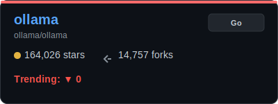
    </td>
    <td width="42%" style="vertical-align: middle; text-align: center;">
      
    </td>
  </tr>
</table>

  <a href="#llm_engines" style="display:inline-block; background:#21262d; color:#8b949e; padding:6px 14px; border-radius:6px; font-size:13px; text-decoration:none; border:1px solid #30363d;">🔼 Back to Section</a>

<table width="100%" cellpadding="0" cellspacing="0" style="border:none;">
  <tr>
    <td width="58%" style="vertical-align: top; padding-right: 20px;">
      <h3 style="margin:0 0 8px 0; font-size:1.15rem;">
        <a href="https://github.com/deepseek-ai/DeepSeek-V3" style="color:#58a6ff; text-decoration:none;">DeepSeek-V3</a> (Vault Mode)
      </h3>
      
No description provided

      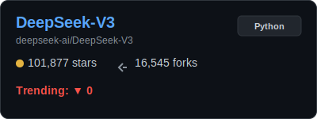
    </td>
    <td width="42%" style="vertical-align: middle; text-align: center;">
      
    </td>
  </tr>
</table>

  <a href="#llm_engines" style="display:inline-block; background:#21262d; color:#8b949e; padding:6px 14px; border-radius:6px; font-size:13px; text-decoration:none; border:1px solid #30363d;">🔼 Back to Section</a>

<table width="100%" cellpadding="0" cellspacing="0" style="border:none;">
  <tr>
    <td width="58%" style="vertical-align: top; padding-right: 20px;">
      <h3 style="margin:0 0 8px 0; font-size:1.15rem;">
        <a href="https://github.com/ggerganov/llama.cpp" style="color:#58a6ff; text-decoration:none;">llama.cpp</a> (Vault Mode)
      </h3>
      
LLM inference in C/C++

      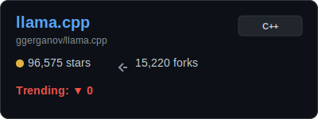
    </td>
    <td width="42%" style="vertical-align: middle; text-align: center;">
      
    </td>
  </tr>
</table>

  <a href="#llm_engines" style="display:inline-block; background:#21262d; color:#8b949e; padding:6px 14px; border-radius:6px; font-size:13px; text-decoration:none; border:1px solid #30363d;">🔼 Back to Section</a>

<table width="100%" cellpadding="0" cellspacing="0" style="border:none;">
  <tr>
    <td width="58%" style="vertical-align: top; padding-right: 20px;">
      <h3 style="margin:0 0 8px 0; font-size:1.15rem;">
        <a href="https://github.com/vllm-project/vllm" style="color:#58a6ff; text-decoration:none;">vllm</a> (Vault Mode)
      </h3>
      
A high-throughput and memory-efficient inference and serving engine for LLMs

      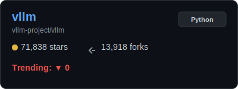
    </td>
    <td width="42%" style="vertical-align: middle; text-align: center;">
      
    </td>
  </tr>
</table>

  <a href="#llm_engines" style="display:inline-block; background:#21262d; color:#8b949e; padding:6px 14px; border-radius:6px; font-size:13px; text-decoration:none; border:1px solid #30363d;">🔼 Back to Section</a>

---

<h2 style="margin:0; font-size:1.25rem; color:#c9d1d9;">🛠️ AI Agents & Orchestration</h2>

<table width="100%" cellpadding="0" cellspacing="0" style="border:none;">
  <tr>
    <td width="58%" style="vertical-align: top; padding-right: 20px;">
      <h3 style="margin:0 0 8px 0; font-size:1.15rem;">
        <a href="https://github.com/openclaw/openclaw" style="color:#58a6ff; text-decoration:none;">openclaw</a> (Vault Mode)
      </h3>
      
Your own personal AI assistant. Any OS. Any Platform. The lobster way. 🦞 

      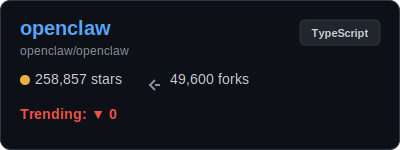
    </td>
    <td width="42%" style="vertical-align: middle; text-align: center;">
      
    </td>
  </tr>
</table>

  <a href="#agents" style="display:inline-block; background:#21262d; color:#8b949e; padding:6px 14px; border-radius:6px; font-size:13px; text-decoration:none; border:1px solid #30363d;">🔼 Back to Section</a>

<table width="100%" cellpadding="0" cellspacing="0" style="border:none;">
  <tr>
    <td width="58%" style="vertical-align: top; padding-right: 20px;">
      <h3 style="margin:0 0 8px 0; font-size:1.15rem;">
        <a href="https://github.com/Significant-Gravitas/AutoGPT" style="color:#58a6ff; text-decoration:none;">AutoGPT</a> (Vault Mode)
      </h3>
      
AutoGPT is the vision of accessible AI for everyone, to use and to build on. Our mission is to provide the tools, so ...

      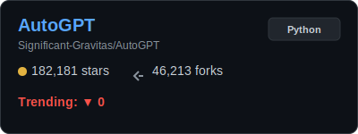
    </td>
    <td width="42%" style="vertical-align: middle; text-align: center;">
      
    </td>
  </tr>
</table>

  <a href="#agents" style="display:inline-block; background:#21262d; color:#8b949e; padding:6px 14px; border-radius:6px; font-size:13px; text-decoration:none; border:1px solid #30363d;">🔼 Back to Section</a>

<table width="100%" cellpadding="0" cellspacing="0" style="border:none;">
  <tr>
    <td width="58%" style="vertical-align: top; padding-right: 20px;">
      <h3 style="margin:0 0 8px 0; font-size:1.15rem;">
        <a href="https://github.com/browser-use/browser-use" style="color:#58a6ff; text-decoration:none;">browser-use</a> (Vault Mode)
      </h3>
      
🌐 Make websites accessible for AI agents. Automate tasks online with ease.

      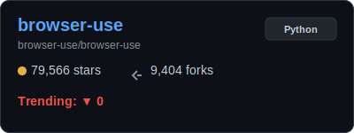
    </td>
    <td width="42%" style="vertical-align: middle; text-align: center;">
      
    </td>
  </tr>
</table>

  <a href="#agents" style="display:inline-block; background:#21262d; color:#8b949e; padding:6px 14px; border-radius:6px; font-size:13px; text-decoration:none; border:1px solid #30363d;">🔼 Back to Section</a>

<table width="100%" cellpadding="0" cellspacing="0" style="border:none;">
  <tr>
    <td width="58%" style="vertical-align: top; padding-right: 20px;">
      <h3 style="margin:0 0 8px 0; font-size:1.15rem;">
        <a href="https://github.com/joaomdmoura/crewAI" style="color:#58a6ff; text-decoration:none;">crewAI</a> (Vault Mode)
      </h3>
      
Framework for orchestrating role-playing, autonomous AI agents. By fostering collaborative intelligence, CrewAI empow...

      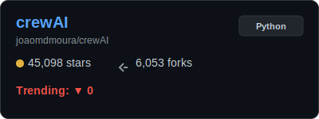
    </td>
    <td width="42%" style="vertical-align: middle; text-align: center;">
      
    </td>
  </tr>
</table>

  <a href="#agents" style="display:inline-block; background:#21262d; color:#8b949e; padding:6px 14px; border-radius:6px; font-size:13px; text-decoration:none; border:1px solid #30363d;">🔼 Back to Section</a>

---

<h2 style="margin:0; font-size:1.25rem; color:#c9d1d9;">💻 AI-Powered CLI & DevTools</h2>

<table width="100%" cellpadding="0" cellspacing="0" style="border:none;">
  <tr>
    <td width="58%" style="vertical-align: top; padding-right: 20px;">
      <h3 style="margin:0 0 8px 0; font-size:1.15rem;">
        <a href="https://github.com/anthropics/claude-code" style="color:#58a6ff; text-decoration:none;">claude-code</a> (Vault Mode)
      </h3>
      
Claude Code is an agentic coding tool that lives in your terminal, understands your codebase, and helps you code fast...

      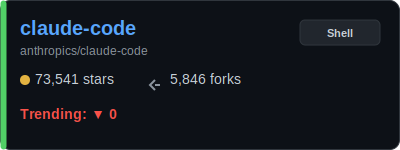
    </td>
    <td width="42%" style="vertical-align: middle; text-align: center;">
      
    </td>
  </tr>
</table>

  <a href="#cli_tools" style="display:inline-block; background:#21262d; color:#8b949e; padding:6px 14px; border-radius:6px; font-size:13px; text-decoration:none; border:1px solid #30363d;">🔼 Back to Section</a>

<table width="100%" cellpadding="0" cellspacing="0" style="border:none;">
  <tr>
    <td width="58%" style="vertical-align: top; padding-right: 20px;">
      <h3 style="margin:0 0 8px 0; font-size:1.15rem;">
        <a href="https://github.com/OpenInterpreter/open-interpreter" style="color:#58a6ff; text-decoration:none;">open-interpreter</a> (Vault Mode)
      </h3>
      
A natural language interface for computers

      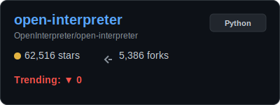
    </td>
    <td width="42%" style="vertical-align: middle; text-align: center;">
      
    </td>
  </tr>
</table>

  <a href="#cli_tools" style="display:inline-block; background:#21262d; color:#8b949e; padding:6px 14px; border-radius:6px; font-size:13px; text-decoration:none; border:1px solid #30363d;">🔼 Back to Section</a>

<table width="100%" cellpadding="0" cellspacing="0" style="border:none;">
  <tr>
    <td width="58%" style="vertical-align: top; padding-right: 20px;">
      <h3 style="margin:0 0 8px 0; font-size:1.15rem;">
        <a href="https://github.com/paul-gauthier/aider" style="color:#58a6ff; text-decoration:none;">aider</a> (Vault Mode)
      </h3>
      
aider is AI pair programming in your terminal

      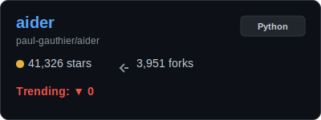
    </td>
    <td width="42%" style="vertical-align: middle; text-align: center;">
      
    </td>
  </tr>
</table>

  <a href="#cli_tools" style="display:inline-block; background:#21262d; color:#8b949e; padding:6px 14px; border-radius:6px; font-size:13px; text-decoration:none; border:1px solid #30363d;">🔼 Back to Section</a>

---

<h2 style="margin:0; font-size:1.25rem; color:#c9d1d9;">🎨 Generative Art & Vision</h2>

<table width="100%" cellpadding="0" cellspacing="0" style="border:none;">
  <tr>
    <td width="58%" style="vertical-align: top; padding-right: 20px;">
      <h3 style="margin:0 0 8px 0; font-size:1.15rem;">
        <a href="https://github.com/AUTOMATIC1111/stable-diffusion-webui" style="color:#58a6ff; text-decoration:none;">stable-diffusion-webui</a> (Vault Mode)
      </h3>
      
Stable Diffusion web UI

      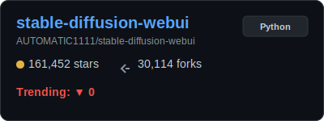
    </td>
    <td width="42%" style="vertical-align: middle; text-align: center;">
      
    </td>
  </tr>
</table>

  <a href="#art_vision" style="display:inline-block; background:#21262d; color:#8b949e; padding:6px 14px; border-radius:6px; font-size:13px; text-decoration:none; border:1px solid #30363d;">🔼 Back to Section</a>

<table width="100%" cellpadding="0" cellspacing="0" style="border:none;">
  <tr>
    <td width="58%" style="vertical-align: top; padding-right: 20px;">
      <h3 style="margin:0 0 8px 0; font-size:1.15rem;">
        <a href="https://github.com/comfyanonymous/ComfyUI" style="color:#58a6ff; text-decoration:none;">ComfyUI</a> (Vault Mode)
      </h3>
      
The most powerful and modular diffusion model GUI, api and backend with a graph/nodes interface.

      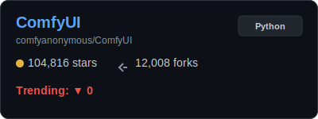
    </td>
    <td width="42%" style="vertical-align: middle; text-align: center;">
      
    </td>
  </tr>
</table>

  <a href="#art_vision" style="display:inline-block; background:#21262d; color:#8b949e; padding:6px 14px; border-radius:6px; font-size:13px; text-decoration:none; border:1px solid #30363d;">🔼 Back to Section</a>

<table width="100%" cellpadding="0" cellspacing="0" style="border:none;">
  <tr>
    <td width="58%" style="vertical-align: top; padding-right: 20px;">
      <h3 style="margin:0 0 8px 0; font-size:1.15rem;">
        <a href="https://github.com/black-forest-labs/flux" style="color:#58a6ff; text-decoration:none;">flux</a> (Vault Mode)
      </h3>
      
Official inference repo for FLUX.1 models

      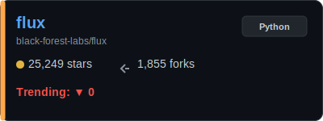
    </td>
    <td width="42%" style="vertical-align: middle; text-align: center;">
      
    </td>
  </tr>
</table>

  <a href="#art_vision" style="display:inline-block; background:#21262d; color:#8b949e; padding:6px 14px; border-radius:6px; font-size:13px; text-decoration:none; border:1px solid #30363d;">🔼 Back to Section</a>

---

<h2 style="margin:0; font-size:1.25rem; color:#c9d1d9;">🧠 Research & Core Frameworks</h2>

<table width="100%" cellpadding="0" cellspacing="0" style="border:none;">
  <tr>
    <td width="58%" style="vertical-align: top; padding-right: 20px;">
      <h3 style="margin:0 0 8px 0; font-size:1.15rem;">
        <a href="https://github.com/huggingface/transformers" style="color:#58a6ff; text-decoration:none;">transformers</a> (Vault Mode)
      </h3>
      
🤗 Transformers: the model-definition framework for state-of-the-art machine learning models in text, vision, audio, a...

      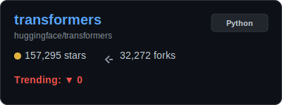
    </td>
    <td width="42%" style="vertical-align: middle; text-align: center;">
      
    </td>
  </tr>
</table>

  <a href="#frameworks" style="display:inline-block; background:#21262d; color:#8b949e; padding:6px 14px; border-radius:6px; font-size:13px; text-decoration:none; border:1px solid #30363d;">🔼 Back to Section</a>

<table width="100%" cellpadding="0" cellspacing="0" style="border:none;">
  <tr>
    <td width="58%" style="vertical-align: top; padding-right: 20px;">
      <h3 style="margin:0 0 8px 0; font-size:1.15rem;">
        <a href="https://github.com/langchain-ai/langchain" style="color:#58a6ff; text-decoration:none;">langchain</a> (Vault Mode)
      </h3>
      
The agent engineering platform

      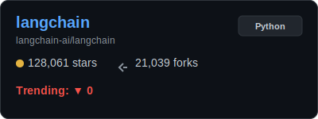
    </td>
    <td width="42%" style="vertical-align: middle; text-align: center;">
      
    </td>
  </tr>
</table>

  <a href="#frameworks" style="display:inline-block; background:#21262d; color:#8b949e; padding:6px 14px; border-radius:6px; font-size:13px; text-decoration:none; border:1px solid #30363d;">🔼 Back to Section</a>

---

---

  <h2 style="margin:0 0 10px 0; font-size:1.25rem; color:#c9d1d9;">🤝 Join the AI Hub Community</h2>
  
GitTrendHub is more than just a dashboard; it's a movement to track the AI revolution as it happens. We believe the best insights come from the community! 🚀

  
<strong>Why Contribute?</strong> Share the pulse · Build the tooling · Stay ahead

<table width="100%" cellpadding="0" cellspacing="0" style="margin:16px 0;">
  <tr>
    <td width="50%" style="vertical-align:top; padding-right:10px;">
      

        <h4 style="margin:0 0 8px 0; color:#c9d1d9;">🔥 Recommend a Viral Repo</h4>
        
Found something blowing up? Add it to the list!

        

          
<b>View Steps (Simple PR)</b>

           
          1. Open <code>GitTrendHub/projects.json</code>. 
          2. Choose a sub-category. 
          3. Add the repo: <code>{ "url_path": "OWNER/REPO", "last_stars": "Hot" }</code>. 
          4. Submit a PR titled <code>Recommend: OWNER/REPO</code>.
        

      

    </td>
    <td width="50%" style="vertical-align:top; padding-left:10px;">
      

        <h4 style="margin:0 0 8px 0; color:#c9d1d9;">🛠️ Improve the Platform</h4>
        
Love Python or Design? Help us code the future.

        

          
<b>View Steps (Dev Focus)</b>

           
          1. Fork & Clone this repo. 
          2. Tweak <code>update_readme.py</code> or styles. 
          3. Run <code>python3 GitTrendHub/update_readme.py</code> to test. 
          4. Submit your Pull Request!
        

      

    </td>
  </tr>
</table>

---

  <h2 style="margin:0 0 8px 0; font-size:1.25rem; color:#c9d1d9;">🌐 AI Resource Navigator</h2>
  
Stay ahead of the curve with these curated AI specialized resources.

  <table width="100%" style="border-collapse:collapse;">
    <tr>
      <td width="50%" style="vertical-align:top; padding:8px 12px 8px 0;">
        

          <strong style="color:#c9d1d9;">🚀 Real-time Trends</strong>
          <ul style="margin:8px 0 0 0; padding-left:20px; color:#8b949e; font-size:14px;">
            <li><a href="https://huggingface.co/trending" style="color:#58a6ff;">Hugging Face Trending</a>: Models & datasets.</li>
            <li><a href="https://github.com/trending/python" style="color:#58a6ff;">GitHub Trending (Python)</a>: Fresh AI code.</li>
            <li><a href="https://paperswithcode.com/" style="color:#58a6ff;">Papers with Code</a>: SOTA & benchmarks.</li>
          </ul>
        

      </td>
      <td width="50%" style="vertical-align:top; padding:8px 0 8px 12px;">
        

          <strong style="color:#c9d1d9;">📰 Insights & News</strong>
          <ul style="margin:8px 0 0 0; padding-left:20px; color:#8b949e; font-size:14px;">
            <li><a href="https://www.therundown.ai/" style="color:#58a6ff;">The Rundown AI</a>: Daily analysis.</li>
            <li><a href="https://alphasignal.ai/" style="color:#58a6ff;">AlphaSignal</a>: Research insights.</li>
            <li><a href="https://tldr.tech/ai" style="color:#58a6ff;">TLDR AI</a>: 5-min summary.</li>
          </ul>
        

      </td>
    </tr>
    <tr>
      <td width="50%" style="vertical-align:top; padding:8px 12px 8px 0;">
        

          <strong style="color:#c9d1d9;">🔍 Tool Search</strong>
          <ul style="margin:8px 0 0 0; padding-left:20px; color:#8b949e; font-size:14px;">
            <li><a href="https://theresanaiforthat.com/" style="color:#58a6ff;">There's An AI For That</a></li>
            <li><a href="https://www.futuretools.io/" style="color:#58a6ff;">FutureTools</a></li>
          </ul>
        

      </td>
      <td width="50%" style="vertical-align:top; padding:8px 0 8px 12px;">
        

          <strong style="color:#c9d1d9;">🎓 Academic</strong>
          <ul style="margin:8px 0 0 0; padding-left:20px; color:#8b949e; font-size:14px;">
            <li><a href="https://hai.stanford.edu/ai-index-report" style="color:#58a6ff;">Stanford HAI</a>: AI index reports.</li>
          </ul>
        

      </td>
    </tr>
  </table>

---

  <h2 style="margin:0 0 8px 0; font-size:1.25rem; color:#c9d1d9;">📝 Data Summary</h2>
  
Data is retrieved using the GitHub REST API and GitHub Actions.

  

    ✨ Last Generated: March 04, 2026 - 05:30 UTC
  

